- [第3章 Python语言基础考察点](#user-content-第3章-python语言基础考察点)
    * [python2和3差异](#user-content-python2和3差异)
    * [python函数](#python函数)
    * [python 异常处理](#python-异常处理)
    * [Python性能剖析与优化,GIL](#Python性能剖析与优化GIL)
    * [python2生成器和协程](#python2生成器和协程)
    * [python单元测试](#python单元测试)
    * [python 深拷贝与浅拷贝](#python-深拷贝与浅拷贝)
- [第4章 Python算法与数据结构考察点](#第4章-python算法与数据结构考察点)
    * [Python常用内置算法与数据结构](#Python常用内置算法与数据结构)
    * [算法常考点](#算法常考点)
    * [Python数据结构](#Python数据结构)
    * [Python白板编程](#Python白板编程)
    * [Python数据结构之链表](#Python数据结构之链表)
    * [Python数据结构之二叉树](#Python数据结构之二叉树)
    * [Python数据结构之栈与队列](#Python数据结构之栈与队列)
    * [Python数据结构之堆](#Python数据结构之堆)
    * [Python字符串常考算法题](#Python字符串常考算法题)
- [第5章 编程范式考察点](#user-content-第5章-编程范式考察点)
    * [面向对象基础及Python 类常考问题](#面向对象基础及Python-类常考问题)
    * [装饰器常考问题](#装饰器常考问题)
    * [创建型模式Python应用题](#创建型模式Python应用题)
    * [结构型模式](#结构型模式)
    * [行为型模式Python应用题](#行为型模式Python应用题)
    * [Python 函数式编程](#Python-函数式编程)
- [第6章 操作系统考察点](#user-content-第6章-操作系统考察点)
    * [常考 linux 命令](#常考-linux-命令)
    * [操作系统线程和进程](#操作系统线程和进程)
    * [操作系统内存管理机制](#操作系统内存管理机制)
    * [Python垃圾回收题](#Python垃圾回收题)
- [第7章 网络编程考察点](#user-content-第7章-网络编程考察点)
    * [网络协议TCP和UDP](#网络协议TCP和UDP)
    * [HTTP](#HTTP)
    * [网络编程](#网络编程)
    * [并发编程IO多路复用常见考题](#并发编程IO多路复用常见考题)
    * [Python并发网络库](#Python并发网络库)
- [第8章 数据库考察点](#user-content-第8章-数据库考察点)
    * [Mysql基础](#Mysql基础)
    * [Mysql索引优化](#Mysql索引优化)
    * [SQL语句编写](#SQL语句编写)
    * [缓存机制及Redis](#缓存机制及Redis)
- [第9章 Python Web 框架考察点](#第9章-Python-Web-框架考察点)
    * [Python WSGI与web框架常考点](#Python-WSGI与web框架常考点)
    * [web安全常考点](#web安全常考点)
    * [前后端分离与 RESTful 常见题](#前后端分离与-RESTful-常见题)
- [第10章 系统设计考察点](#user-content-第10章-系统设计考察点)
    * [系统设计考点解析](#系统设计考点解析)
    * [短网址系统设计(递增序列算法)](#短网址系统设计递增序列算法)
    * [如何设计一个秒杀系统](#如何设计一个秒杀系统)
    
# 第3章 Python语言基础考察点

## Python语言基础

### python 是静态还是动态类型? 是强类型还是弱类型

    动态强类型语言(不少人误以为是弱类型)
    动态/静态指的是:编译期/运行期确定的类型
    强类型指的是不会发送隐式类型转换
    
    举例: 
        js 中 1+"1"="11"  1隐式转成str字符串格式
        python 中 1+"1"="11"  报错 TypeError: unsupported operand type(s) for +: 'int' and 'str'
        
### python 作为后端语言优缺点

    胶水语言,轮子多,应用广泛
    语言灵活,生产力
    性能问题,代码维护问题,python2/3兼容问题
    
    动态语言一时爽,重构代码火葬场
    
### 什么是鸭子类型

    1.当看到一只鸟像鸭子,游起来像鸭子,叫起来也像鸭子,那么这只鸟就可以被称之为鸭子
    2.关注点在对象的行为,而不是类型
    3.比如file,stringio,socket对象都支持read/write方法
    4.再比如定义了__iter__魔术方法的对象可以用for迭代
    
代码

    class Duck:
	def quack(self):
		print("gua gua")

    class Person:
        def quack(self):
            print("我是人类,但我也会 gua gua gua")
    
    
    def in_the_forest(duck):
        duck.quack()
    
    
    def game():
        donald = Duck()
        john = Person()
        in_the_forest(donald)
        in_the_forest(john)
        print(type(donald))
        print(type(john))
    
    game()

输出

    gua gua
    我是人类,但我也会 gua gua gua
    <class '__main__.Duck'>
    <class '__main__.Person'>
    
说明 python 关注点在对象的行为,而不是类型

### 什么是 monkey patch 猴子补丁

什么是 monkey patch 哪些地方用到了,自己如何实现?

    所谓的 monkey patch 猴子补丁 就是运行函数替换
    比如gevent库需要修改内置的socket
    
代码

    import socket
    print(socket.socket)
    print("monkey patch")
    from gevent import monkey
    monkey.patch_socket()
    print(socket.socket)
    
    import select
    print(select.select)
    monkey.patch_select()
    print("monkey patch")
    print(select.select)
    
    import time
    print(time.time())
    
    def _time():
        return 12345
    
    time.time = _time
    
    print(time.time())
    
运行

    <class 'socket.socket'>
    monkey patch
    <class 'gevent._socket3.socket'>
    <built-in function select>
    monkey patch
    <function select at 0x7fb34c52a510>
    
其实替换原有的运行函数!

### 什么是自省 python动态语言是在运行的时候确定类型的

通过 introspection 去确定类型

    运行时判断一个对象的类型的能力
    python一切接对象,用type,id,isinstance获取对象类型信息
    inspect 模块提供了更多获取对象信息的函数
    
代码

    ll = [1,2,3]
    d = dict(a=1)
    
    print(type(ll))
    print(type(d))
    
    print(isinstance(ll, list))
    print(isinstance(d, dict))
    
    # 通过类型进行if判断
    def add(a, b):
        if isinstance(a, int):
            return a + b
        elif isinstance(a, str):
            return a.upper() + b
        
    print(add(1, 2))
    print(add('head', 'tail'))
    
    # 返回变量/对象在内存中地址
    print(id(ll))
    print(id(d))
    
python 可以通过 "is" 判断变量对象是否相同,返回 bool值

    print(ll is ll)
    print(ll is d)
    
### 什么是列表和字典推到

list comprehension

    一种快速生成list/dict/set的方式,用来替代map/filter
    (i for i in range(10) if i % 2 == 0) 返回生成器
    
代码

    # 列表推倒时
    a = ['a', 'b', 'c']
    b = [1, 2, 3]
    
    d = {}
    for i in range(len(a)):
        d[a[i]] = b[i]
    print(d)
    
    d = {k:v for k, v in zip(a, b)}
    print(d)
    
    # 生成器
    l = (i for i in range(10))
    print(type(l))
    
    for i in l:
        print(i)
        
运行

    {'b': 2, 'c': 3, 'a': 1}
    {'b': 2, 'c': 3, 'a': 1}
    <class 'generator'>
    0
    1
    2
    3
        
利用列表推倒时能简化代码复杂性,利用生成器能有效控制内存.

## python2和3差异

python3改进

    print成为函数,python2是关键字
    编码问题,python3不在有 unicode 对象,默认str就是unicode
    除法变化,python3除号返回浮点数,python2会返回整数
    类型注解(type hint)
    优化 super() 方便直接调用父类函数
    高级解包操作
    
代码

    # 类型注解
    def hello(name:str) -> str:
        print(name)
    
    hello('ddd')
    
    
    # 优化 super()
    class Base(object):
        def hello(self):
            print('hello')
    
    # python2写法
    class C(Base):
        def hello(self):
            return super(C, self).hello()
    
    # python3写法
    class C2(Base):
        def hello(self):
            return super().hello()
    
    
    c = C()
    c.hello()
    c2 = C2()
    c2.hello()
    
    # 高级解包操作
    a, b, *c = range(10)
    print(a, b, c)
    
    a, b, *_ = range(10)
    print(a, b)
    
keyword only arguments 限定关键参数

    # 限定关键参数
    def add(a, b, *, c):
        return a + b + c
    
    print(add(1,2,c=3))

chained exceptins python3 重新抛出异常不会丢失栈信息,支持raise from

    def mycopy(source, dest):
        try:
            shutil.copy2(source, dest)
        except OSError:
            raise NotImplementedError('错误') from OSError
    
    
    mycopy('old', 'new')

一切返回迭代器 range zip map dict values etc are all iterators
    
### python3新增

yield from 链接子生成器

asyncio 内置库, async/await 原生协成支持异步编程

新的内置库 enum mock asyncio ipaddress cincurrent.futures 等

### python3改进

生成 pyc文件统一放到 __pycache__

一些内置库的修改,urllib,selector等

性能优化等

### python2/3兼容工具

six模块

2to3等工具转换代码

__future__

## python函数

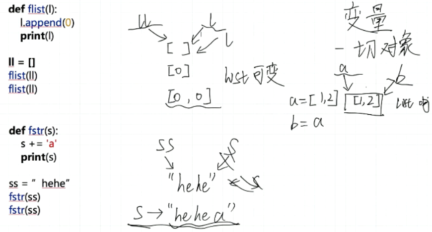

方法flist最后打印出 ll = [0, 0]
方法fstr最后打印出 ss = hehea 

这里就涉及到可变对象和不可变对象!

### python可变/不可变对象

不可变对象

    bool/int/float/tuple/str/frozenset
    
可变对象

    list/set/dict
    
测试代码

    def clear_list(l):
        l = []
    
    ll = [1, 2, 3]
    clear_list(ll)
    print(ll)
    
这里的 l 是 ll的副本,把副本赋值空列表, print(ll) 打印出了原本的信息

### 默认参数值计算一次

    def flist(l=[1]):
        l.append(1)
        print(l)
    
    flist()
    flist()
    
输出

    [1, 1]
    [1, 1, 1]

### 函数传递中 *arg, **kwargs 含义是什么

用于处理可变参数

*arg 被打包成 tuple

*kwargs 被打包成 dict

    def print_all(a, *args, **kwargs):
        print(a)
        if args:
            print(args)
        if kwargs:
            print(kwargs)
    
    
    print_all(1, 2, b=1)
    print_all(1, *[2,4,5,6], **dict(b=1, c=2))
    
输出

    1
    (2,)
    {'b': 1}
    1
    (2, 4, 5, 6)
    {'c': 2, 'b': 1}
    
    
## python 异常处理

使用异常的场景

    网络请求(超时,链接错误等)
    资源访问(权限问题,资源不存在)
    代码逻辑(越界访问,keyerror等)
    
如何处理 python 异常

    try:
        # 可能会抛出异常的代码
        pass
    except (Exception) as e: # 可以捕获多个异常并处理
        # 异常处理的代码
        pass
    else:
        # 异常没有发送的时候代码逻辑
        pass
    finally:
        # 无论异常有没有发送都会执行的代码,一般处理资源的关闭
        pass

如何自定义异常

    继承 Exception 实现自定义异常
    给异常加上一些附加信息
    处理一些业务相关的特定异常(raise myException)
    
代码
   
    class MyException(Exception):
        pass
    
    try:
        raise MyException('my exception')
    except MyException as e:
        print(e)
        
为什么不继承 BaseException, 因为ctrl c 也会捕获

## Python性能剖析与优化GIL

全称 global interpreter lock
    
    cpython 解释器的内存管理并不是线程安全的
    保护多线程情况下对python对象的访问
    cpython 使用简单的锁机制避免多个线程同时执行字节码

GIL的影响

    限制了程序的多核执行
    同一时间只能有一个线程执行字节码
    cpu密集程序难以利用多核优势
    io期间会释放给gil,对io密集程序影响不大
    
    cpu密集--->计算密集
    io密集--->网络传输,请求
    
如何规避GIL影响

    cpu密集可以使用多进程+进程池
    io密集使用多线程/协程
    cython扩展--->python程序转成c代码
    
GIL的实现

测试一下线程安全

    import threading
    
    n = [0]
    
    def foo():
        n[0] = n[0] + 1
        n[0] = n[0] + 1
    
    threads = []
    
    for i in range(5000):
        t = threading.Thread(target=foo)
        threads.append(t)
    
    for t in threads:
        t.start()
    
    print(n)

即使是有了GIL,多测试几次发现,居然出现9998,失去了2条数据,正常情况下是10000

### 为什么有了GIL还要关注线程安全

python中什么操作才是原子的

    一个操作如果是一个字节码指令可以完成就是原子的
    原子的是可以保证线程安全的
    使用dis操作来分析字节码

l[0] = 1 # 赋值操作 原子操作

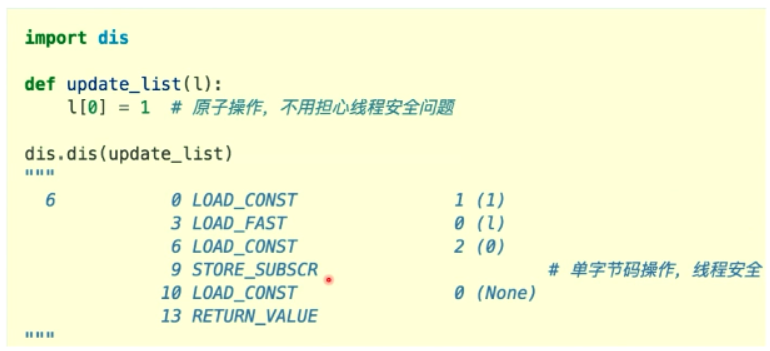

l[0] += 1 # 危险 不是原子操作

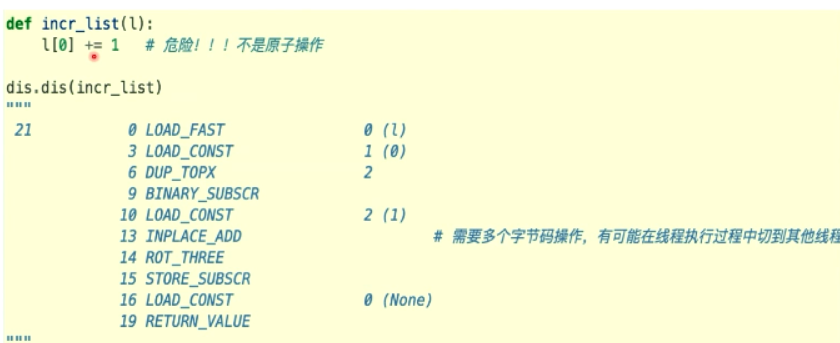

解决方法: with lock:

    import threading
    lock = threading.Lock()
    
    n = [0]
    
    
    def foo():
        with lock:
            n[0] = n[0] + 1
            n[0] = n[0] + 1
    
    threads = []
    
    for i in range(5000):
        t = threading.Thread(target=foo)
        threads.append(t)
    
    for t in threads:
        t.start()
    
    print(n)

### 如何剖析程序的性能
    
使用各种 profile 工具(内置或者第三方)

    28定律,大部分时间耗在少量代码上
    内置的profile/cprofile等工具
    使用pyflame(uber工具)的火焰图工具

### 服务端性能优化措施

web应用一般语言不会成为瓶颈

    数据机构与算法优化
    数据层:索引优化,慢查询消除,批量操作减少io,nosql
    网络io:批量操作,pipline管道操作 减少io
    缓存:使用内存数据库 redis/memcached
    异步:asyncio,celery
    并发:gevent/多线程

## python2生成器和协程

generator

    生成器就是可以生成值的函数
    当一个函数里有了yield关键字就成了生成器
    生成器可以挂起执行并且保存当前执行的状态
    
代码

    def simple_gen():
	yield 'hello'
	yield 'world'

    gen = simple_gen()
    print(type(gen))
    print(next(gen))
    print(next(gen))
    
输出

    <class 'generator'>
    hello
    world
    
### 基于生成器的协程

python3之前没有原生的协程,只有基于生成器的协程

    pep 342 增强生成器功能
    生成器可以通过yield暂停执行和产出数据
    同时支持send()向生成器发送数据和throw()向生成器抛异常
    
代码

    def coro():
        hello = yield 'hello'
        yield hello
    
    c = coro()
    
    print(type(c))
    print(next(c))
    print(c.send('world'))
    
输出
    
    <class 'generator'>
    hello
    world
    
### 协程注意点
协程需要使用send或者next来预激prime才能启动
在yield出协程会暂停执行
单独的 yield value 会产出值给调用方
可以通过 coroutine.send(value)来给协程发送值,发送的值会赋值给yield表达式左边的变量 value = yield
协程执行完成后(没有遇到下一个 yield 语句)会抛出 stoplteration 异常

协程装饰器

    from functools import wraps
    
    
    def coroutine(func):
    
        @wraps(func)
        def primer(a, *args, **kwargs):
            gen = func(a, *args, **kwargs)
            return gen
        next(gen)
        return primer
    
    
    @coroutine
    def coro(a):
        return a
    
    a = (i for i in range(1,20))
    
    f = coro(a=a)
    for i in f:
        print(i)
        
### python3原生协程

    https://www.liaoxuefeng.com/wiki/897692888725344/923057403198272
    https://www.liaoxuefeng.com/wiki/1016959663602400/1017959540289152

## python单元测试

unit testing
    
    针对程序模块进行正确新检验
    一个函数,一个类进行验证
    自底向上爆炸程序正确性
    
为什么要写单元测试

    保证代码逻辑的正确性
    测试影响设计,易测试的代码往往是高内聚低耦合
    回归测试,防止改一处整个服务不可用
    
单元测试的库
    
    nose/pytest 常用
    mock 模块用来模拟替换网络请求等
    coverage 统计测试覆盖率
    
## python 深拷贝与浅拷贝

什么是深拷贝与浅拷贝

•Python中对象的赋值都是进行对象引用（内存地址）传递

•使用copy.copy()，可以进行对象的浅拷贝，它复制了对象，但对于对象中的元素，依然使用原始的引用.

•如果需要复制一个容器对象（例如列表，），以及它里面的所有元素（包含元素的子元素），可以使用copy.deepcopy()进行深拷贝

•对于非容器类型（如数字、字符串、和其他'原子'类型的对象）没有被拷贝一说

•如果元祖变量只包含原子类型对象，则不能深拷贝。

浅拷贝

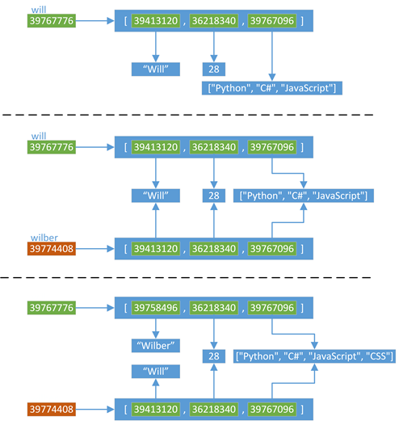

深拷贝

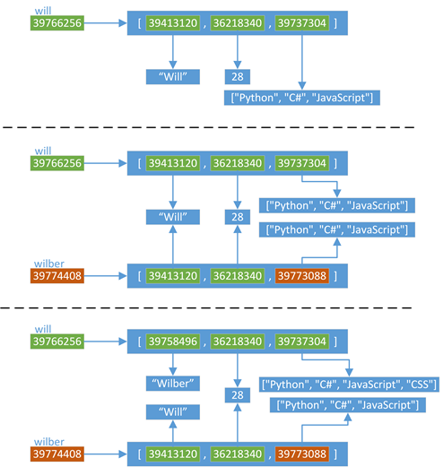

# 第4章 Python算法与数据结构考察点

## Python常用内置算法与数据结构

常用的内置数据结构和算法

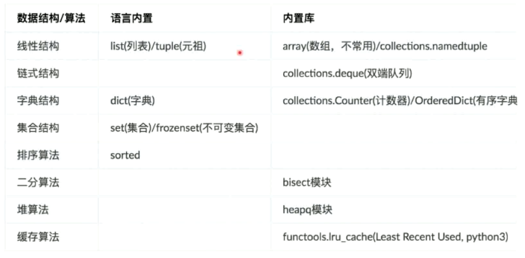

有用过 collections 模块吗,提供了一些内置数据结构的扩展

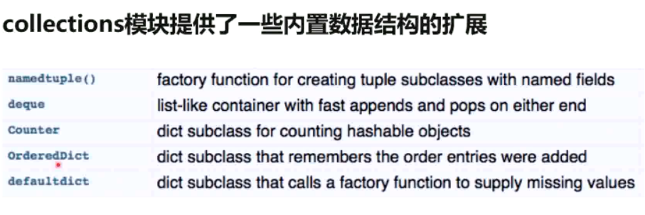

namedtuple()

    import collections
    
    # 常用坐标
    Point = collections.namedtuple('Point', 'x, y')
    point = Point(1, 2)
    print(point.x)
    print(point.y)

deque

    # 双端队列
    de = collections.deque()
    de.append(1)
    de.appendleft(0)
    print(de)
    de.pop()
    de.popleft()
    print(de)

counter

    # 计数,a有几个,b有几个,c有几个
    c = collections.Counter('abacab')
    print(c)
    print(c.most_common())

orderedDict 可以实现一个FIFO（先进先出）的dict，当容量超出限制时，先删除最早添加的Key

    # 记录key插入的顺序 ,可以实现LRUCache
    od = collections.OrderedDict()
    od['c'] = 'c'
    od['a'] = 'a'
    od['b'] = 'b'
    print(list(od.keys()))

defaultdict

    # 带有默认值的字典
    dd = collections.defaultdict(int)
    dd['a'] = 0
    dd['b'] = 1
    dd['c'] = 1
    dd['c'] += 1
    print(dd)
    
### python dict 底层结构

dict 底层使用的哈希表

    为了支持快速查找使用哈希表作为底层结构
    哈希表平均查找时间复杂度o(1)
    cpython 解释器使用二次探查解决哈希冲突问题
    
python list/tuple 区别

    都是线性结构,支持下标访问
    list是可变对象,tuple保存的引用不可变,但是 tuple 中保存list,那list是可变对象
    list没法作为字典的key,tuple可以(可变对象不可hash)
    
什么是 LRUCache, least-Recently-Used 替换掉最近最少使用的对象,当我们缓存空间不够用的时候,选择缓存剔除策略!

    缓存剔除策略,当缓存空间不够用的时候需要一种方式剔除key
    常见的有LRU,LFU等
    LRU通过使用一个循环双端队列不断把最新访问的key放到表头实现
    
原理,首先需要一个双端队列,每次访问将最新使用的表放到最前面,这样实现了没什么访问在最后,每次剔除最后面的就可以了

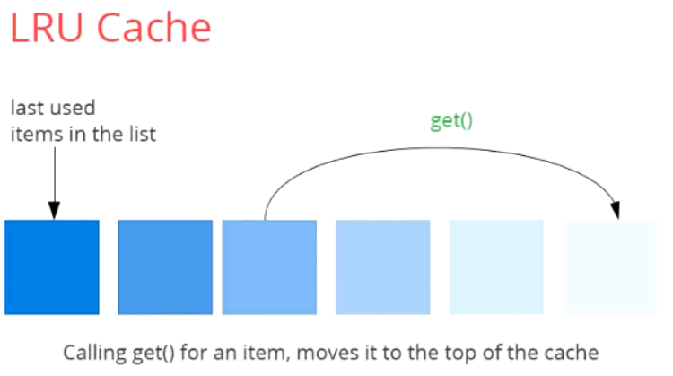

如何实现 LURCache

    字典用来缓存,循环双队列表用来记录访问顺序
    利用 python内置的 dict + collections.OrderedDict() 实现
    dict 用来当做 k/v 键值对的缓存
    orderedDict 用来实现更新最近访问的 key

实现代码

    from collections import OrderedDict
    
    
    class LRUCache:
    
        def __init__(self, capacity=128):
            self.od = OrderedDict()
            self.capacity = capacity
    
        # 访问一个key缓存,存在更新key到最尾部
        def get(self, key):
            if key in self.od:
                val = self.od[key]
                self.od.move_to_end(key)  # 放到最尾部
                return val
            else:
                return -1
    
        # 更新 k/v
        def put(self, key, value):
            if key in self.od:
                del self.od[key]
                self.od[key] = value
            else:
                self.od[key] = value
                if len(self.od) > self.capacity:
                    self.od.popitem(last=False)  # 删除最早的key

## 算法常考点

排序 + 查找,重中之重

    排序算法:冒泡排序,快速排序,归并排序,队排序
    
冒泡排序:算法思想是，重复地遍历要排序的列表，一次比较两个元素，如果他们的顺序错误就把他们交换过来。
遍历列表的工作是重复地进行直到没有再需要交换，也就是说该列表已经排序完成。
    
    li = [10,8,4,7,5]
    for i in range(len(li)-1):
        for j in range(len(li)-1-i):      
            if li[j] > li[j + 1]:      
                li[j], li[j + 1] = li[j + 1], li[j]
    
线性查找:线性查找指按一定的顺序检查数组中每一个元素，直到找到所要寻找的特定值为止。

    def search(arr, n, x): 
      
        for i in range (0, n): 
            if (arr[i] == x): 
                return i; 
        return -1; 
      
    # 在数组 arr 中查找字符 D
    arr = [ 'A', 'B', 'C', 'D', 'E' ]; 
    x = 'D'; 
    n = len(arr); 
    result = search(arr, n, x) 
    if(result == -1): 
        print("元素不在数组中") 
    else: 
        print("元素在数组中的索引为", result);

二分查找二分搜索法、二分搜索、二分探索，是一种在有序数组中查找某一特定元素的搜索算法。搜索过程从数组的中间元素开始，如果中间元素正好是要查找的元素，则搜索过程结束；
如果某一特定元素大于或者小于中间元素，则在数组大于或小于中间元素的那一半中查找，而且跟开始一样从中间元素开始比较。如果在某一步骤数组为空，则代表找不到。
这种搜索算法每一次比较都使搜索范围缩小一半。

    # 返回 x 在 arr 中的索引，如果不存在返回 -1
    def binarySearch (arr, l, r, x): 
      
        # 基本判断
        if r >= l: 
      
            mid = int(l + (r - l)/2)
      
            # 元素整好的中间位置
            if arr[mid] == x: 
                return mid 
              
            # 元素小于中间位置的元素，只需要再比较左边的元素
            elif arr[mid] > x: 
                return binarySearch(arr, l, mid-1, x) 
      
            # 元素大于中间位置的元素，只需要再比较右边的元素
            else: 
                return binarySearch(arr, mid+1, r, x) 
      
        else: 
            # 不存在
            return -1
      
    # 测试数组
    arr = [ 2, 3, 4, 10, 40 ] 
    x = 10
      
    # 函数调用
    result = binarySearch(arr, 0, len(arr)-1, x) 
      
    if result != -1: 
        print ("元素在数组中的索引为 %d" % result )
    else: 
        print ("元素不在数组中")
    
能独立实现代码(手写),能够分析时间空间复杂度

时间复杂度 https://blog.csdn.net/qq_41523096/article/details/82142747

空间复杂度 https://zhuanlan.zhihu.com/p/50479555

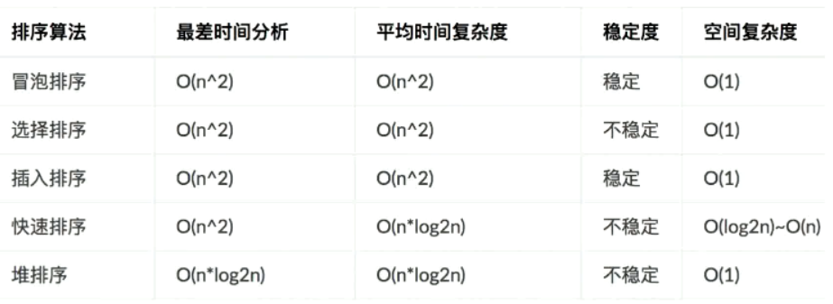

## Python数据结构

### 常见的数据结构链表

    单链表,双链表,循环双端链表
    实现链表常见操作,比如插入节点,反转链表,合并多个链表
    
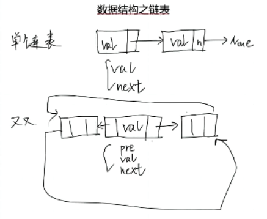

    单链表:节点有个val值和next指向下一个属性直到none
    双链表:与单链表不同,他有3个属性,pre指向上一个属性,val值,next指向下一个属性
    循环双端链表:链表最后一个值next是第一节点,链表的第一个值是pre是最后一个节点
    
实现反转链表

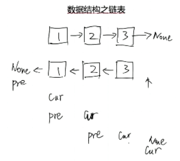

    class Solution:

        def reverseList(self, head):
            pre = None
            cur = head
            while cur:
                nextnode = cur.next
                cur.next = pre
                pre = cur
                cur = nextnode
            return pre

### 数据结构值队列
    
    先进先出,实现队列的apend和pop操作,如何做到先进先出
    使用 python 的 list 或者collection.deque实现队列
    
python实现队列,通过双端队列实现队列(先进先出)

    from collections import deque
    
    class Quene:
    
        def __init__(self):
            self.itmes = deque()
    
        def append(self, val):
            return self.itmes.append(val)
    
        def pop(self):
            return self.itmes.popleft()
    
        def empty(self):
            return len(self.itmes) == 0
    
    def test_queue():
        q = Quene()
        print(q.empty())
        q.append(1)
        print(q.append(2))
        print(q.append(3))
        print(q.pop())
        print(q.itmes)
        print(q.empty())
    
    test_queue()

### 数据结构值之栈

    栈 后进先出
    
python实现队列,通过双端队列实现栈(后进先出)

    from collections import deque
    
    class Quene:
    
        def __init__(self):
            self.itmes = deque()
    
        def append(self, val):
            return self.itmes.append(val)
    
        def pop(self):
            return self.itmes.pop()
    
        def empty(self):
            return len(self.itmes) == 0
    
    def test_queue():
        q = Quene()
        print(q.empty())
        q.append(1)
        print(q.append(2))
        print(q.append(3))
        print(q.pop())
        print(q.itmes)
        print(q.empty())
    
    test_queue()
    
### 数据结构值之字典和集合

    哈希表实现,底层其实就是一个数组
    根据哈希函数快速定位一个元素,平均查找O(1),非常快
    不断加入元素会引起哈希表重新开辟空间,拷贝之前元素到新的数组
    
哈希表如果解决冲突

    元素key冲突之后使用一个链表填充相同的key的元素
    开放寻址法是冲突之后根据一直方式寻找下一个可用的槽
    cpython使用的二次探查
    
### 数据结构值之二叉树

    先(根)序: 先处理根,之后是左子树,然后是右子树
    中(根)序: 先处理左子树,然后是跟,然后是右子树
    后(根)序: 先处理左子树,然后是右子树,最后是根
    
    总结根的先后顺序不同
    

先序遍历
    
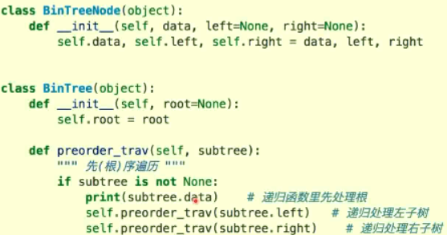

中序遍历

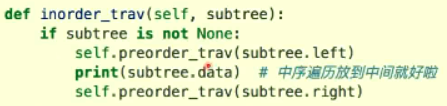

### 数据结构值之堆

    堆其实就是完全二叉树,有最大堆和最小堆
    最大堆:对于每个非叶子节点V,V的值都比它的2个孩子大
    最大堆支持每次 pop 操作获取最大的元素,最小堆获取最小的元素

完全二叉树

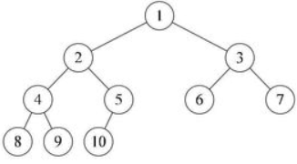

最大堆

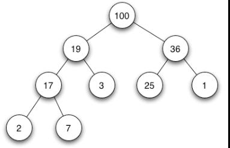

最小堆

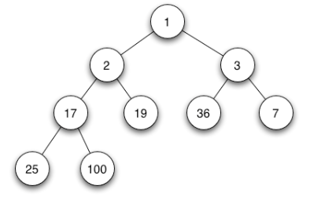

常见问题:用堆来完成topk问题,从海量数字中寻找最大的k个

思路用最小堆解决

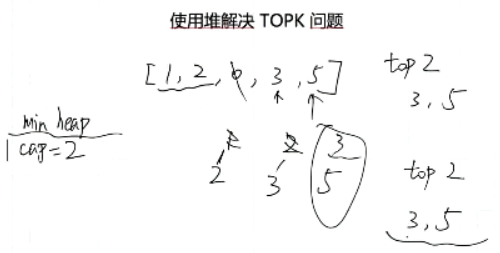

代码实现 heapq --- 堆队列算法

    import heapq
    
    class Topk:
    
        def __init__(self, iterable, K):
            self.minheap = []
            self.capaciyt = K
            self.iterable = iterable
    
        def push(self, val):
            if len(self.minheap) >= self.capaciyt: # 判断堆的深度是否大于10
                min_val = self.minheap[0]
                if val < min_val:
                    pass
                else:
                    heapq.heapreplace(self.minheap, val) # pop堆最小值,推入新的 val 值并调整堆
            else:
                heapq.heappush(self.minheap, val) # 不到深度的k直接放入
    
        def get_topk(self):
            for val in self.iterable:
                self.push(val)
            return self.minheap
    
    
    def detest():
        import random
        i = list(range(1000))
        random.shuffle(i)
        _ = Topk(i, 10)
        print(_.get_topk())
    
    detest()

## Python白板编程
    
    过
    
## Python数据结构之链表

### 问题:一个节点[4,5,1,9],已知node=5,怎么打印出[4,1,9]

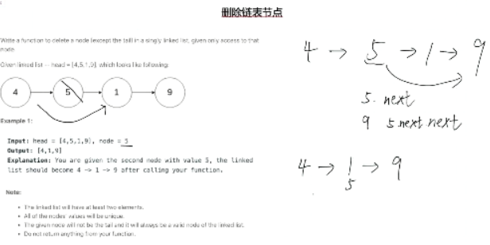
    
思路:

1. node5节点是node,那么1是node.next,9是node.next.next
2. 通过将node.next.val赋值给node.val
3. node.next指向node.next.next

代码

    class Solution:
        
        def deleteNode(self, node):
            
            nextnode = node.next
            after_next_node = node.next.next
            node.val = nextnode.val
            node.next = after_next_node
            
### 合并2个有序链表

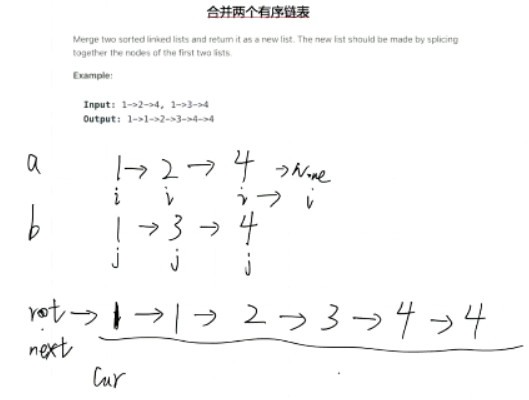

代码

    class ListNode:
        def __init__(self, x):
            self.val = x
            self.next = None
            
        
    class Solution:
        def mergetwolists(self, l1, l2):
            
            root = ListNode(None)
            cur = root
            
            while l1 and l2:
                if l1.val < l2.val:
                    node = ListNode(l1.val)
                    l1 = l1.next # 链表向前移一位
                else:
                    node = ListNode(l2.val)
                    l2 = l2.next # 链表向前移一位
                cur.next = node
                cur = node
            # l1 或者 l2 可能剩余的元素
            cur.next = l1 or l2
            return root.next

## Python数据结构之二叉树

    二叉树的操作很多可以用递归的方式解决
    
二叉树的镜像(反转二叉树)

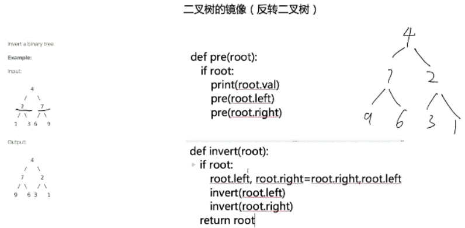

代码

    class Soluttion:
        
        def invertTree(self, root):
            
            if root:
                print(root)
                root.left, root.right = root.right, root.left
                self.invertTree(root.left)
                self.invertTree(root.rigth)
                
            return root

如何层序遍历遍历二叉树(广度优先)

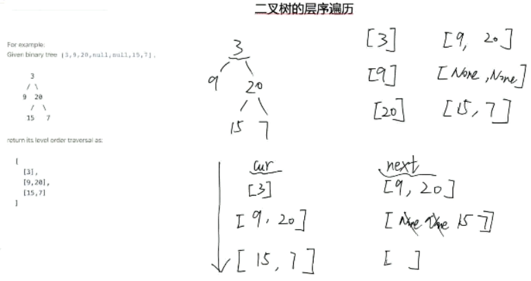

代码实现

    class Solution:
        
        def levelOrder(self, root):
            
            if not root:
                return []
            
            res = []
            cur_nodes = [root]
            next_nodes = []
            res.append([i.val for i in cur_nodes])
            while cur_nodes or next_nodes:
                for node in cur_nodes:
                    if node.left:
                        next_nodes.append(node.left)
                    if node.right:
                        next_nodes.append(node.right)
                        
                if next_nodes:
                    res.append(
                        [i.val for i in next_nodes]
                    )
                
                cur_nodes = next_nodes
                next_nodes = []
            return res

## Python数据结构之栈与队列

用栈实现队列

    栈后进先出
    队列先进先出
    
思路

代码

    from collections import deque
    
    
    class Stack:
    
        def __init__(self):
            self.items = deque()
    
        def push(self, val):
            return self.items.append(val)
    
        def pop(self):
            return self.items.pop()
    
        def top(self):
            return self.items.pop()
    
        def empty(self):
            return len(self.items) == 0
    
    
    class MyQueue:
    
        def __init__(self):
            self.s1 = Stack()
            self.s2 = Stack()
    
        def push(self, x):
            self.s1.push(x)
    
        def pop(self):
            if not self.s2.empty():
                return self.s2.pop()
    
            while not self.s1.empty():
                val = self.s1.pop()
                self.s2.push(val)
    
            return self.s2.pop()
    
        def peek(self):
            if not self.s2.empty():
                return self.s2.pop()
    
            while not self.s1.empty():
                val = self.s1.pop()
                self.s2.push(val)
    
            return self.s2.top()
    
        def empty(self):
            return self.s1.empty() and self.s2.empty()
    
    
    if __name__ == '__main__':
        q = MyQueue()
        q.push(1)
        q.push(2)
        q.push(3)
        print(q.pop())
        print(q.pop())
        print(q.pop())

## Python数据结构之堆

    堆的概念,堆是完全二叉树,有最大堆和最小堆
    会使用 python 内置的 heapq 模块实现堆的操作
    
用堆合并 k 个有序链表

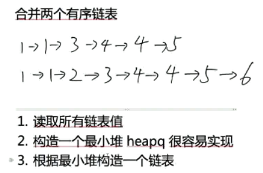

代码

    from heapq import heapify, heappop
    
    class Solution:
        def mergekLists(self, lists):
            
            h = []
            for node in lists:
                while node:
                    h.append(node.val)
                    node = node.next
            
            # 构造一个最小堆
            if not h:
                return None
            heapify(h)
            
            # 构造链表
            root = ListNode(heappop(h)) # 每次弹出一个最小的元素
            curnode = root
            
            while h:
                nextnode = ListNode(heappop(h))
                curnode.next = nextnode
                curnode = nextnode
            
            return root
		
## Python字符串常考算法题

### 翻转字符串 s=["a", "b", "c"]

    s.reverse()

不用内置的 reverse ,思路

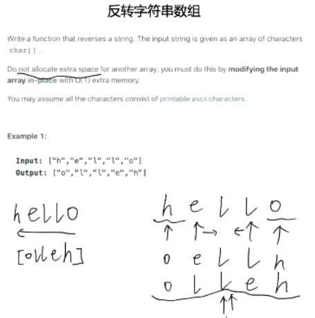

代码

    class Solution:
        
        def revereSting(self, s):
            
            beg = 0
            end = len(s)-1
            while beg < end:
                s[beg], s[end] = s[end], s[beg]
                beg += 1
                end -= 1

### 判断一个数字是否是回文数

    aba是回文数
    abc不是回文数
    
思路

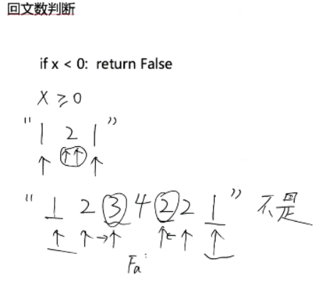

代码

    class Solution:
    
        def isSting(self, s):
            
            if s < 0:
                return False
            s = str(s)
            beg = 0
            end = len(s)-1
            while beg < end:
                if s[beg] == s[end]:
                    beg += 1
                    end -= 1
                else:
                    return False
            return True
           
以上两种字符串都是双端遍历法

### 统计list中各个元素出现的次数

    from collections import Counter
    a = [1, 2, 3, 1, 1, 2]
    result = Counter(a)
    print result

# 第5章 编程范式考察点
## 面向对象基础及Python 类常考问题

什么是面向对象编程 oop

    把对象作为基本单元,把对象抽象成类(class),包含成员和方法
    数据封装,继承,多态(子类重写父类的方法)
    python中使用类的实现.过程式编程(函数),oop(类)
    
代码

    class Person(object):
        def __init__(self, name, age):
            self.name = name
            self.age = age
    
        def print_name(self):
            print('我的类{}'.format(self.name))
    
    
    per = Person('ayf', 12)
    per.print_name()
    
### 组合与继承

    优先使用组合而非继承
    组合是使用其他的类实例作为自己的一个属性(Has-a 关系)
    子类继承父类的属性和方法(is a 关系)
    优先使用组合保存代码简单
    
### 类变量和实例变量的区别

    区分类变量和实例变量
    类变量有所有实例共享
    实例变量有实例单独享有,不同的实例之间不影响
    当我需要在一个类的不同实例之间共享变量的时候使用类变量
    
代码

    class Person:
    
        Country = 'china'  # 类变量
    
        def __init__(self, name):
            self.name = name  # 实例变量
    
        def print_name(self):
            print('我的类{}'.format(self.name))
    
    
    per = Person('ayf')
    perw = Person('ayfw')
    per.print_name()
    perw.print_name()
    print(per.Country)
    print(perw.Country)

### classmetthod/staticmethod 区别 类方法和静态方法

    都可以通过 class.method()方式使用
    classmethod第一参数是cls,可以引用类变量
    staticmethod使用起来和普通函数一样,只不过放在类里面去组织
    
代码 cls是类,self是实例

    class Person:
    
        Country = 'china'  # 类变量
    
        def __init__(self, name):
            self.name = name  # 实例变量
    
        @classmethod
        def print_name(cls):
            print('我的类{}'.format(cls.Country))
    
        @staticmethod
        def join_name(first_name, last_name):
            return first_name + last_name
    
    
    per = Person('ayf')
    perw = Person('ayfw')
    per.print_name()
    perw.print_name()
    print(per.Country)
    print(perw.Country)
    print(per.join_name(1,2))
    
总结: classmethod 就是调用类的属性 staticmethod 就是调用函数纯粹放在类里面,不用实例也能直接调用

### 什么是元类,使用场景

元类是创建类的类

    元类允许我们控制类的生成,比如修改类的属性等
    使用type来定义元类
    元类最常见的一个使用场景orm框架

用type定义一个类

    class Base:
        pass
    
    
    class Child(Base):
        pass
    
    # type元类定义法
    sameChild = type('Child',(Base,), {})
    
加上一个方法

    class ChildWithMethod(Base):
        bar = True
        
        def hello(self):
            print('hello')
            
    
    # type元类定义法
    def hello(self):
        print('hello')
    
    ChildWithMethodw = type(
        'ChildWithMethod', (Base,), {'bar':True, 'hello': hello}
    )
    
__new__ 是生成实例的,__init__初始化实例的

    class LowercasMeta(type):
        """修改类的属性名称为小写的元类"""
        def __new__(mcs, name, bases, attrs):
            lower_attrs = {}
            for k, v in attrs.items():
                # 排除魔术方法
                if not k.startswith('__'):
                    # 小写
                    lower_attrs[k.lower()] = v
                else:
                    lower_attrs[k] = v
    
            return type.__new__(mcs, name, bases, lower_attrs)
    
    class LowercaseClass(metaclass=LowercasMeta):
        BAR = True
    
        def HELLO(self):
            print('hello')
    
    print(dir(LowercaseClass))

## 装饰器常考问题
decorator

    python 中一切皆对象,函数也可以当做参宿传递
    装饰是接收函数作为参数,添加功能后返回一个新的函数的函数(类)
    python 中通过@ 使用装饰器
    
函数装饰器

    import time
    
    
    def log_time(func):
        def _log(*args, **kwargs):
            beg = time.time()
            res = func(*args, **kwargs)
            print(time.time()-beg)
            return res
        return _log
    
    @log_time
    def mysleep():
        time.sleep(1)
    
    mysleep()
    
    def mysleep1():
        time.sleep(1)
    
    newsleep = log_time(mysleep1)
    newsleep()
    
类装饰器

    import time
    
    class LogTime(object):
    
        def __call__(self, func):
            def _log(*args, **kwargs):
                beg = time.time()
                res = func(*args, **kwargs)
                print(time.time() - beg)
                return res
            return _log
    
    @LogTime()
    def mysleep():
        time.sleep(1)
    
    mysleep()
    
__call__ 方法含义

    class Bar:
        def __call__(self, *args, **kwargs):
            print('i am instance method')
    
    b = Bar()  # 实例化
    b()  # 实例对象b 可以作为函数调用 等同于b.__call__ 使用
    
什么时候给装饰器增加一个参数,通过类装饰器更加容易加参数

    import time
    
    
    class LogTime(object):
    
        def __init__(self, use_int=False):
            self.use_int = use_int
    
        def __call__(self, func):
            def _log(*args, **kwargs):
                beg = time.time()
                res = func(*args, **kwargs)
                if self.use_int:
                    print(time.time() - beg + 2)
                else:
                    print(time.time() - beg)
                return res
            return _log
    
    @LogTime(1)
    def mysleep():
        time.sleep(1)
    
    mysleep()

装饰器加上日志,性能测试等功能

## 创建型模式Python应用题

### 工厂模式,解决对象创建问题

    解决对象创建问题
    解耦对象的创建的使用
    包括工厂方法和抽象工厂
    
代码

    class DogToy:
        def speak(self):
            print("wang wang")
            
            
    class CatToy:
        def speak(self):
            print("miao miao")
            
            
    def toy_factory(toy_type):
        if toy_type == 'dog':
            return DogToy()
        elif toy_type == 'miao':
            return CatToy()

### 构造模式,控制复杂对象的创建

    用来控制复杂对象构造
    创建和表示分离,比如你要买电脑,工厂模式直接给你需要的电脑
    但是构造模式允许你自己定义电脑的配置,组装完成后给你
    
代码 @property 把方法变成属性调用的方式

    class Computer:
        def __init__(self, serial_number):
            self.serial = serial_number
            self.memory = None      # in gigabytes
            self.hdd = None         # in gigabytes
            self.gpu = None
    
        def __str__(self):
            info = ('Memory: {}GB'.format(self.memory),
                    'Hard Disk: {}GB'.format(self.hdd),
                    'Graphics Card: {}'.format(self.gpu))
            return '\n'.join(info)
    
    
    class ComputerBuilder:
        def __init__(self):
            self.computer = Computer('AG23385193')
    
        def configure_memory(self, amount):
            self.computer.memory = amount
    
        def configure_hdd(self, amount):
            self.computer.hdd = amount
    
        def configure_gpu(self, gpu_model):
            self.computer.gpu = gpu_model
    
    
    class HardwareEngineer:
        def __init__(self):
            self.builder = None
    
        def construct_computer(self, memory, hdd, gpu):
            self.builder = ComputerBuilder()
            var = [step for step in (self.builder.configure_memory(memory),
                                     self.builder.configure_hdd(hdd),
                                     self.builder.configure_gpu(gpu))]
    
        @property
        def computer(self):
            return self.builder.computer
    
    # 使用buidler，可以创建多个builder类实现不同的组装方式
    engineer = HardwareEngineer()
    engineer.construct_computer(hdd=500, memory=8, gpu='GeForce GTX 650 Ti')
    computer = engineer.computer
    print(computer)

### 原型模式,通过原型的克隆创建新的实例

    通过克隆原型来创建新的实例
    可以使用相同的原型,通过修改部分属性来创建新的示例
    用途:对于一些创建实例开销比较高的地方可以用原型模式
    
    https://python-web-guide.readthedocs.io/zh/latest/design/design.html#the-prototype-pattern
    
### 单利模式,一个类只能创建同一个对象

    一个类只能创建同一个对象
    python的模块其实就是单利,只会导入一次
    使用共享同一个实例的方式来创建单利模式
    
代码

    # __new__ 是创建实例 hasattr() 函数用于判断对象是否包含对应的属性
    
    class Singleton(object):
        def __new__(cls, *args, **kwargs):
            # 如果没有 _instance 实例就创建
            if not hasattr(cls, '_instance'):
                _instance = super().__new__(cls, *args, **kwargs)
                cls._instance = _instance
            return cls._instance
    
    
    class Myclass(Singleton):
        pass
    
    c1 = Myclass()
    c2 = Myclass()
    print(id(c1))
    print(id(c2))

### 对象池模式pool,预先分配同一个类型的一组实例

### 惰性计算模式啊,延迟计算python property

## 结构型模式

装饰器模式,无需子类化扩展对象功能

    import time
    
    
    class LogTime(object):
    
        def __init__(self, use_int=False):
            self.use_int = use_int
    
        def __call__(self, func):
            def _log(*args, **kwargs):
                beg = time.time()
                res = func(*args, **kwargs)
                if self.use_int:
                    print(time.time() - beg + 2)
                else:
                    print(time.time() - beg)
                return res
            return _log
    
    @LogTime(1)
    def mysleep():
        time.sleep(1)
    
    mysleep()

代理模式,把一个对象的操作代理到另一个对象

    把一个对象的操作代理到另一个对象
    这里又要提到我们之间实现的stack/queue,把操作代理到 deque
    通常使用has-a组合关系

适配器模式,通过一个间接适配统一接口

    把不同的对象的接口适配到同一个接口
    想象一个多功能充电头,可以给不同的电器充电,充当适配器
    
代码, object. __getattr__(self, name)是一个对象方法，如果找不到对象的属性时会调用这个方法。这个方法应该返回属性值或者抛出AttributeError异常。
注意，如果通过正常机制能找到对象属性的话，不会调用__getattr__方法。

    class Dog(object):
    
        def __init__(self):
            self.name = "dog"
    
        def bark(self):
            return "woof"
    
    
    class Cat(object):
        def __init__(self):
            self.name = "Cat"
    
        def meow(self):
            return "meow"
    
    
    class Adapter:
        def __init__(self, obj, **kwargs):
            self.obj = obj
    
        def __getattr__(self, attr):  # 如果找不到对象的属性时会调用这个方法。
            return getattr(self.obj, attr)  # 返回一个对象属性值
    
    
    objects = []
    dog = Dog()
    objects.append(Adapter(dog))
    
    cat = Cat()
    objects.append(Adapter(cat))
    
    for obj in objects:
        print("{0}".format(obj.name))

### 外观模式,简化复杂对象的访问问题

### 享元模式,通过对象复用池改善资源利用,比如连接池

### mvc,解耦展示逻辑和业务逻辑

## 行为型模式Python应用题

迭代器模式,通过统一的接口迭代对象,列表list就是一个迭代器

    python内置对迭代器模式的支持
    比如我可以用for遍历各种 iterble 的数据类型
    python里可以实现 __next__ 和 __iter__ 实现迭代器
    
    list = [1,2,3,4]
    for i in list:
        print(i)

观察者模式,对象发送改变的时候,观察者执行相应动作

    发布订阅是一种最常用的实现方式
    发布订阅用于解耦逻辑
    可以通过回调等方式实现,当发生事件时,调用相应的回调函数
    
    文档 https://blog.csdn.net/nirendao/article/details/51723782

策略模式,针对不同的规模输入使用不同的策略

    根据不同的输入采用不同的策略
    对外暴露统一的接口,内部采用不同的策略计算
    
## Python 函数式编程

高阶函数 map

    # 将可迭代对象给到fun
    a = map(lambda x:x*2, range(10))
    print(list(a))

reduce

    # 求和0~9
    from functools import reduce
    b = reduce(lambda x,y: x+y, range(10))
    print(b)
    
filter

    # 为真取返回数据
    c = list(filter(lambda x: x%2==0, range(10)))
    print(c)
    
闭包

    引用了外部自由变量的函数,
    自由变量不在当前函数定义的变量
    特性自由变量会和闭包函数同时存在
    
# 第6章 操作系统考察点

## 常考 linux 命令

tldr 更加友好的命令查询用法工具

    pip install tldr

掌握常见的文件操作工具

    chown/chmod/chgrp
    ls/rm/cd/mv/touch/rename/ln

    ln myfile xxx
    硬链接： 与普通文件没什么不同，inode 都指向同一个文件在硬盘中的区块
    软链接： 保存了其代表的文件的绝对路径，是另外一种文件，在硬盘上有独立的区块，访问时替换自身路径。
    
文件或者日志查看

    编辑器 vi/nane
    cat/head/tail 查看文件
    more/less 交互式查看文件

进程操作工具

    ps 查看进程
    kill 杀死进程
    top/htop 监控进程
    
内存操作命令

    free查看可用内存
    
网络工具

    ifconfig 查看网卡信息
    lsof/netstat 查看端口信息
    ssh/scp 远程登录/复制 
    tcpdump抓包
    
## 操作系统线程和进程

进程和线程对比

    进程是对运行时程序的封装,是系统资源调用和分配的基本单位
    线程是进程的子任务,cpu调度和分配的基本单位,实现进程内并发
    一个进程可以包含多个线程,线程依赖进程存在,并共享进程内存
    
线程安全是因为共享进程的数据,才会出现线程安全

    一个操作可以在多线程环境中安全使用,获取正确的结果
    线程安全的操作好比线程是顺序执行而不是并发执行的(i += 1)
    一般如果涉及到写操作需要考虑如何让多个线程安全访问数据
    
保证线程安全,线程同步的方式

    互斥锁:通过互斥机制防止多个线程同时访问公共资源
    信号量:控制同一时刻多个线程访问同一个资源的线程数
    事件:通过通知的方式保存多个线程同步
    
进程间通信的方式

    管道/匿名管道/有名管理pipe
    信号:比如用户使用ctrl+c 产生 sigint 程序终止信号
    消息队列(message) kafuka
    共享内存
    信号量
    套接字
    
多线程一般是io密集型

    import threading
    lock = threading.Lock()
    
    n = [0]
    
    
    def foo():
        with lock:
            n[0] = n[0] + 1
            n[0] = n[0] + 1
    
    threads = []
    
    for i in range(5000):
        t = threading.Thread(target=foo)
        threads.append(t)
    
    for t in threads:
        t.start()
    
    print(n)
    
多进程一般是cup密集型

    muitiprocessing 多进程模块
    muitiprocessing.Process 类实现多进程
    
代码

    import multiprocessing
    
    def fib(n):
        if n <= 1:
            return 1
        return fib(n-1) + fib(n-2)
    
    if __name__ == '__main__':
        jobs = []
        for i in range(10, 20):
            p = multiprocessing.Process(target=fib, args=(i,))
            jobs.append(p)
            p.start()
            
## 操作系统内存管理机制

逻辑地址和物理地址分离的内存分配管理方案

    程序的逻辑地址划分为固定大小的页
    物理地址划分为同样大小的帧
    通过页表对应逻辑地址和物理地址
    
什么是分页机制

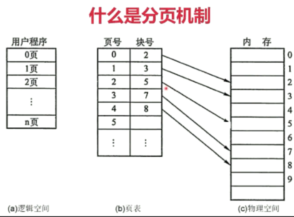

什么是分段机制
    
    为了满足代码的一些逻辑需求
    数据共享,数据保护,动态链接
    通过段表实现逻辑地址无物理地址的映射关系
    每个段内部是连续内存分配,段和段之间是离散分配的
    
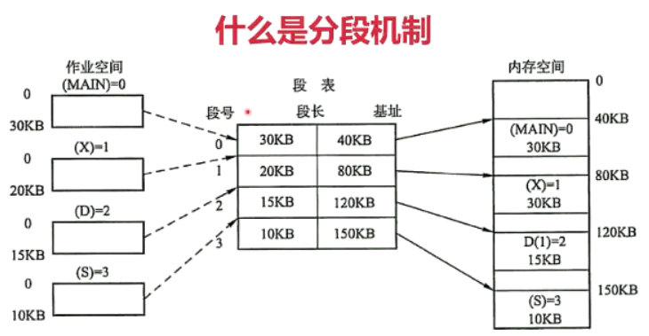

分页vs分段
    
    页是出于内存利用率的角度提出的离散分配机制
    段是出于用户角度,用于数据保护,数据隔离等用途的管理机制
    页的大小是固定,操作系统决定;段大小不确定,用户程序决定
    
什么是虚拟内存

    局部性原理,程序运行时候只有部分必要的消息装入内存
    内存中暂时不需要的内容放在硬盘上
    系统似乎提供了比实际内存大的多的容量,称之为虚拟内存
    
什么是内存抖动

    频繁的页调度,进程不断产生缺页中断
    置换一个页,又不断再次需要这个页
    运行程序太多,页面替换策略不好,终止进程或者增加物理内存
    
## Python垃圾回收题

引用计数
    
    引用计数为主(无法解决循环引用问题)
    引入标记清除和分代回收解决引用计数的问题
    引用计数为主+标记清除和分代回收为辅
    
    del 减少对象的引用计数
    a = 1 , b = a  , b = None a的引用计数就会减少
    
循环引用

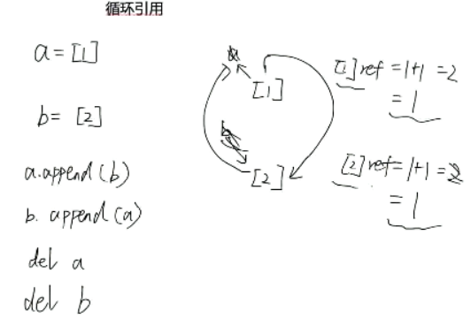

如何解决循环引用,python引入了标记清除

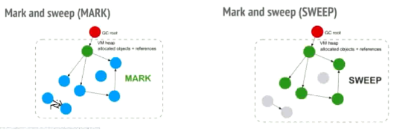

分代回收

    分代技术是一种典型的以空间换时间的技术，这也正是java里的关键技术。这种思想简单点说就是：对象存在时间越长，越可能不是垃圾，应该越少去收集。
    这样的思想，可以减少标记-清除机制所带来的额外操作。分代就是将回收对象分成数个代，每个代就是一个链表（集合），代进行标记-清除的时间与代内对象
    存活时间成正比例关系。
    从上面代码可以看出python里一共有三代，每个代的threshold值表示该代最多容纳对象的个数。默认情况下，当0代超过700,或1，2代超过10，垃圾回收机制将触发。
    0代触发将清理所有三代，1代触发会清理1,2代，2代触发后只会清理自己。

# 第7章 网络编程考察点
## 网络协议TCP和UDP

浏览器输入一个url中间经历的过程

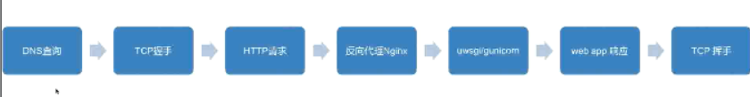

1. dns缓存 --> 本地dns服务器 --> 域名服务器 --> ip地址
2. 调用socket函数 --> tcp三次握手 --> http请求
3. 反向代理nginx
4. wsgi
5. web app 响应
6. tcp四次挥手

tcp的三次握手

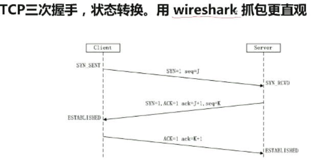

    客户端发送报文,序列号,
    服务器返回报文,客户端序列号+1,服务器序列号,
    客户端发送报文,序列号,服务端序列号+1

tcp四次挥手

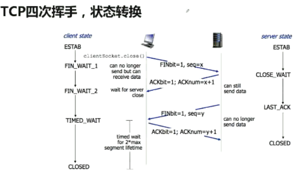

tcp/udp的区别

    面向链接,可靠的,基于字节流
    无连接,不可靠,面向报文
    
## HTTP

http 请求组成

    状态行
    请求头
    消息主体
    
http 响应的组成

    状态行
    响应头
    响应正文
    
http 状态码
    
    1.. 信息
    2.. 成功
    3.. 重定向
    4.. 客户端错误
    5.. 服务端错误
    
http 常见方法

    get 获取
    post 创建
    put 更新
    delete 删除
 
get和post区别

    restful 语义上一个是获取,一个是创建
    get 是幂等的,post 非幂等 (影响数据库数据所以非幂等)
    get请求参数放到url明文,长度限制,post放在请求体
    
什么是幂等性

    幂等方法是的无论调用多少次都得到相同的结果 http 方法
    例如 a=4 是幂等的,但是a += 4就是非幂等的
    幂等的方法客户端可以安全的重发请求
    
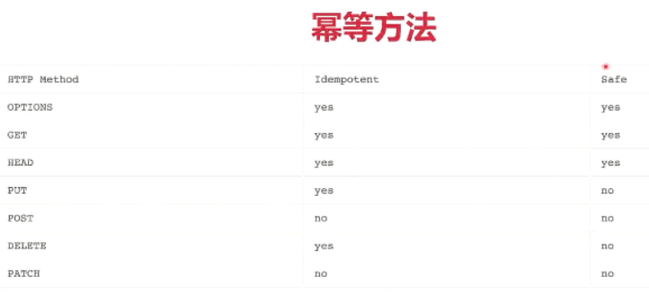
    
什么是 http 长链接
    
    短链接:建立链接...数据传输...关闭链接(连接建立和关闭开销大)
    长连接:请求头 connection:keep-alive 保持tcp连接不断开
    如何区分不同的http请求呢? content-length | transfer-dncoding:chunked
    
cookie和session区别

    session 一般是服务器生成之后给客户端
    cookie 是实现 session 的一种机制
    session 通过在服务器保持 sessionid识别用户,cookie存储在客户端
    
## 网络编程

了解tcp socket编程的原理

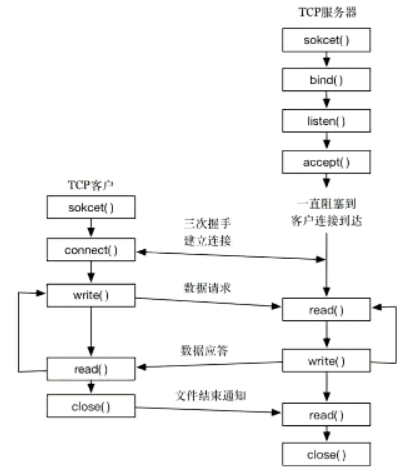

了解udp编程的原理

了解如果发生http请求
    
    使用socket接口发生http请求
    http建立在tcp基础之上
    http是基于文本的协议
    
## 并发编程IO多路复用常见考题

5种网络模型
    
    阻塞 io
    非阻塞 io
    io 多路复用
    信号 io
    异步 io
    
如何提升并发能力

    多线程模型 存在性能资源消耗大
    多进程模型 存在性能资源消耗大
    io多路复用
    
什么是io多路复用?
    
    为了实现高并发需要一直机制并发处理多个socket
    linux常见的是 select/poll/epoll
    可以使用单线程单进程处理多个socket
    
阻塞式 io

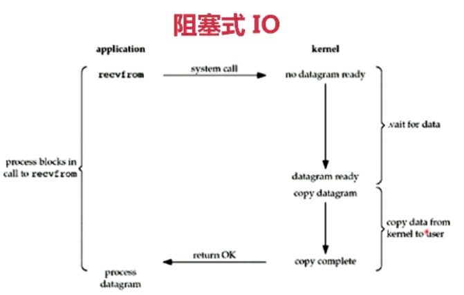

什么是io多路复用

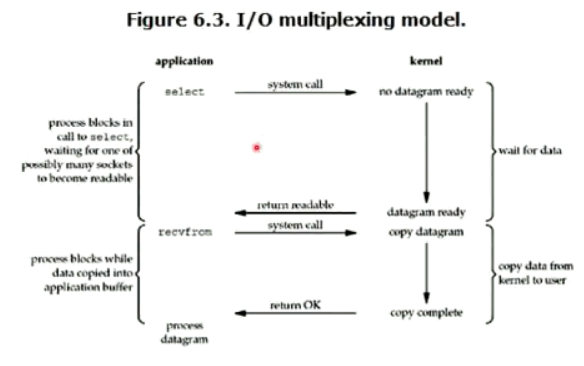

select/poll/epoll区别

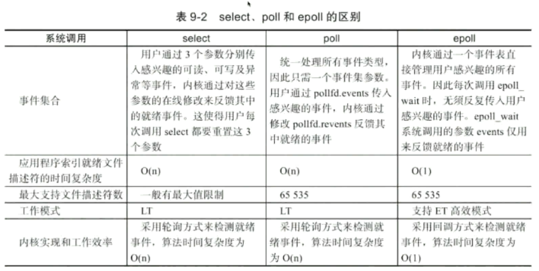

python 如何实现io多路复用

    python的io多路复用基于操作系统实现(select/poll/epoll)
    python2 select模块
    python3 selectors 模块

    文档 https://www.cnblogs.com/guobaoyuan/p/6841904.html
    
## Python并发网络库

实际上python io 并发库也是用的io多路复用的机制

    tornado 并发网络库和同时也是一个web微框架
    gevent 绿色线程实现并发,猴子补丁修改内置socket
    asyncio python3 内置的并发网络库,基于原生的协程
    
tornado

    import tornado.ioloop
    import tornado.web
    from tornado.httpclient import AsyncHTTPClient
    
    
    class MainHandler(tornado.web.RequestHandler):
        async def get(self):
            url = 'http://www.baidu.com/'
            http_client = AsyncHTTPClient()
            resp = await http_client.fetch(url)
            print(resp.body)
            return resp.body
    
    def make_app():
        return tornado.web.Application([
            (r"/api", MainHandler),
        ])
    
    if __name__ == "__main__":
        app = make_app()
        app.listen(8888)
        tornado.ioloop.IOLoop.current().start()

gevent 注意要修改非阻塞

    基于轻量级绿色线程实现并发
    需要注意 monkey patch (猴子补丁), gevent 修改了内置的socket改为非阻塞
    配合 gunicorn 和 gevent 部署作为 wsgi server
    
    import gevent.monkey
    gevent.monkey.patch_all() # 修改内置的一些库非阻塞
    
    import gevent
    import requests
    
    
    def fetch(i):
        url = 'http://httpbin.org/get'
        resp = requests.get(url)
        print(len(resp.text), i)
    
    
    def asynchronous():
        threads = []
        for i in range(1, 10):
            threads.append(gevent.spawn(fetch, i))
        gevent.joinall(threads)
    
    print('asynchronous:')
    asynchronous()
    
asyncio

    python3 引入到内置库, 协程+事件循环
    生态不够完善,没有大规模生产环境检验
    目前应用不够广泛,基于aiohttp可以实现一些小的服务
    
# 第8章 数据库考察点
    
## Mysql基础

### 事务

事物的原理,特性,事务并发控制

    事务是数据库并发控制的基本单位
    事务可以看作是一系列sql语句的集合
    事务必须要么全部执行成功,要么全部执行失败(回滚)
    事务四个acid基本特性
        原子性:一个事务中所有操作全部完成或失败
        一致性:事务开始和结束之后数据完整性没有被破坏
        隔离性:允许锁哥事务同时对数据库的修改和读写
        持久性:事务结束之后,修改是永久不会丢失
        
事务并发产生的问题

    幻读: 一个事务第二次查出现第一次没有的结果
    非重复读:一个事务重复读取2次得到的不同的结果
    脏读:一个事务读取到另一个事务没有提交的修改
    丢失修改:并发写入造成其中一个修改丢失
    
事务隔离级别

    读未提交:别的事务可以读取到未提交改变
    读已提交:只能读取已经提交的数据
    可重复读:同一个事务先后查询结果一样
    串行化:事务完全串行化的执行,隔离级别最高,执行效率最低
    
如何解决高并发场景下的插入重复

    使用数据库的唯一索引 (分库,分表情况下不行)
    使用队列异步写入
    使用 redis 等实现分布式锁
    
乐观锁个悲观锁

    悲观锁是先获取锁在进行操作,一锁,二查三更新(冲突频率高适用)
    乐观锁先修改,更新的时候发现数据已经变了就回滚(冲突频率低适用)
    按照需求响应速度,冲突频率,重试代价来判断
    
### 常用数据库引擎之间区别

innodb vs myisam

    myisam不支持事务,innodb支持事务
    myisam不支持外建,innodb支持外建
    myisam只支持表锁,innodb支持行锁和表锁
    
## Mysql索引优化

### 什么是索引

    索引是数据表中一个或者多个列进行排序的数据结构
    索引能够大幅提升检索的速度
    创建,更新索引本身也会耗费空间和时间
    
### B-Tree

可视化网站 https://www.cs.usfca.edu/~galles/visualization/Algorithms.html

二叉查找树.从根节点开始，若插入的值比根节点的值小，则将其插入根节点的左子树；若比根节点的值大，则将其插入根节点的右子树。该操作可使用递归进行实现。
发现到最后也是出现线性查找结果

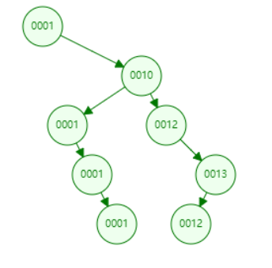

平衡树,但是节点非常多时候树高度也会加大,一个父节点有2个子节点

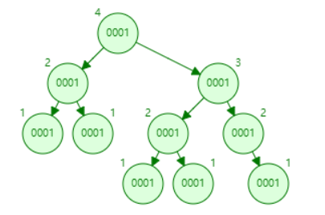

什么是B-tree

    多路平衡查找树(每个节点最多m>=2)个孩子,称为m阶或者度
    页节点具有相同的深度
    节点中的数据key从左到右是递增的
    
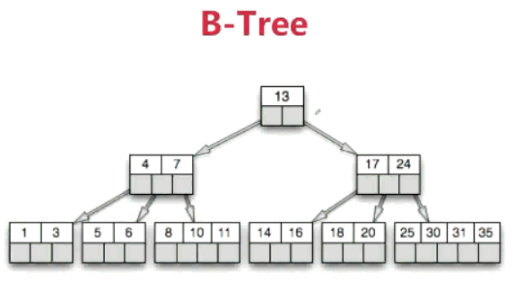
   
B+tree 是 B-tree的变形

    mysql实际使用的 B+tree 作为索引的数据结构
    只在叶子节点带有指向记录的指针(可以增加树的度)区别
    叶子节点通过指针相连(实现范围查询)区别
    
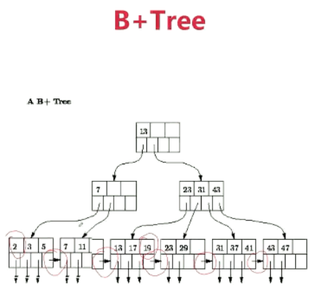
    
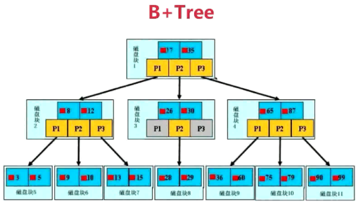

这里有个问题是不是阶越多越好?

为了让操作系统更好加载缓存,阶的大小由硬盘大小决定

### mysql索引的类型

    普通索引
    唯一索引
    多列索引
    主键索引
    全文索引--->倒排索引,不支持innodb
    
### 什么时候创建索引

    经常用作查询条件的字段
    经常用作表连接的字段
    经常出现在 order by , groyp by 之后的字段
    
    create index 取个名字 on mytable(username(length))；
    
### 创建索引由哪些需要注意

索引在B+tree中是key存在的,这里其实很好理解B+tree的key如果是int那就非常容易比较,字符串就不好比较了.

    非空字段 not null, B+tree对空值无法比较
    区分度高,离散度大,作为索引的字段只尽量不要由大量的相同值
    索引的长度不要太长(比较耗费时间)
    
### 什么时候索引失效

    模糊匹配\类型隐转\最左匹配
    
模糊搜索,以%开头的like语句
    
    因为所有key就没有办法比较了
    
出现隐式类型转换(在python这种动态语言查询中需要注意),

    python动态语言,类型会在运行中转换,也是key没有办法比较的问题

没有满足最左前缀原则

   如果key是(1,2,3)第二个key(3,2,1),那B+tree去比较1和3开头就不好比了.
   
### 什么是聚集索引和非聚集索引

    聚集还是非聚集指的是B+tree 叶节点存的是指针还是数据记录
    myisam索引和数据分离,使用的是非聚集索引
    innodb数据文件就是索引文件,主键索引就是聚集索引

非聚集索引,我们可以看到页节点的索引key指向的是地址,地址指向的是数据文件
 
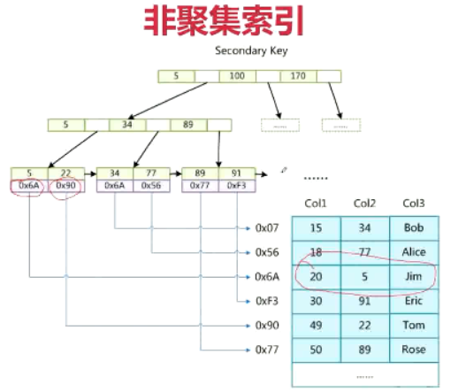

聚集索引,我们可以看到页节点的索引key和内容在一起

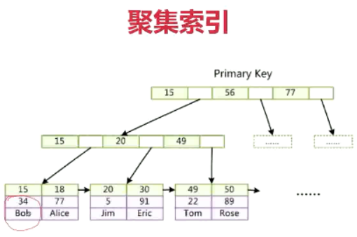

创建表看看结果

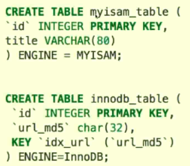

查看数据表存储文件的地方

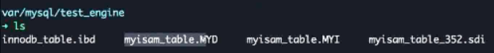

同样证实了上面设想!区别在于 B+tree 的叶节点存储数据

### 聚集索引和辅助索引

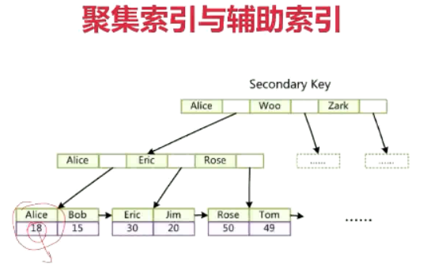

innodb的辅助索引是在叶节点添加了主键,先找到主键在去找数据
 
### 如何排查慢查询

慢查询通常是缺少索引,索引不合理或者业务代码实现导致

    slow_query_log_file 开启并且查询慢查询日志
    通过 explain 排序索引的问题
    调整数据修改索引,业务代码层限制不合理的访问

## SQL语句编写

sql语句已简单为主,复杂的语句导致高并发性能问题,尽量以逻辑代码编写

内链接(inner join):2个表都存在匹配时,才会返回匹配行

    将左表和右表能够关联起来的数据连接后返回
    类似于求2个表的交集
    
    select * from A inner join B on a.id=b.id
    查询 * from a表 inner join b表 on a的条件=b的条件
   

外连接(left/right join):返回一个表的行,即使另一个没有匹配

    左连接返回左表中所有的记录,即使右表中没有匹配的记录
        select * from A inner left join B on a.id=b.id
    右连接返回右表中所有记录,即使左表中没有匹配的记录
        select * from A inner right join B on a.id=b.id
    没有匹配的字段会设置成 null
    
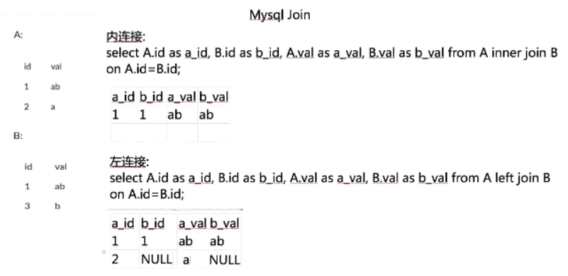

全连接(full join):只要某个表存在匹配就返回
    
    SQL FULL JOIN结合的左，右外连接的结果。

	连接表将包含的所有记录来自两个表，并使用NULL值作为两侧缺失匹配结果
    
## 缓存机制及Redis

### 为什么要使用缓存,使用场景

    缓解关系数据库(常见的是mysql)并发访问压力,热点数据
    减少响应时间:内存io速度比磁盘快
    提升吞吐量:redis等内存数据库单机就可以支撑很大并发

操作时间对比

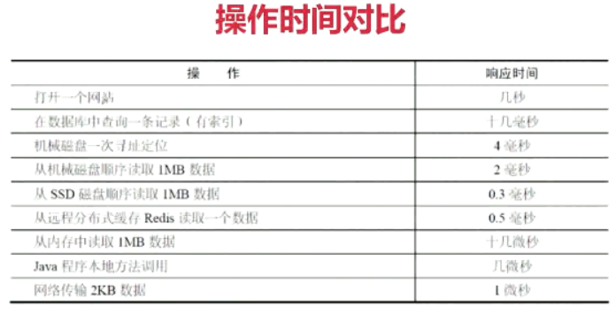

redis 和memchached主要区别

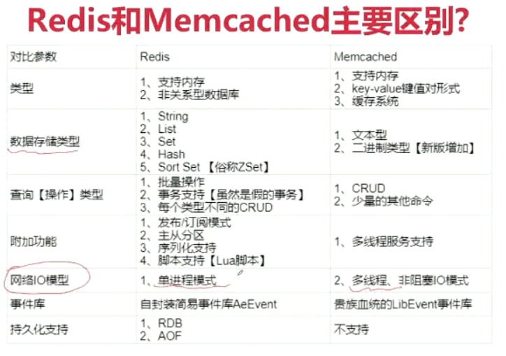

redis单进程也能高并发,原理就是linux底层的io多路复用机制

### redis常用的数据类型

    string 字符串:用来实现简单的kv键值对存储,比如计数器
    list链表:实现双向链表,比如用户的关注,粉丝列表
    hash哈希表,用来存储彼此相关信息的键值对
    set集合,存储不重复,比如用户的关注着
    sorted set 有序集合 实时信息排行榜
    
redis内置实现

    redis各种类型的c底层实现方式
    string 整数或者sds
    list:ziplist(压缩列表) 或者 双端链表
    hash:ziplisth(压缩列表) 或者 hashtable
    set: intest 或者 hashtable
    sorted set : skiplist 跳跃表
    
redis 跳跃表原理

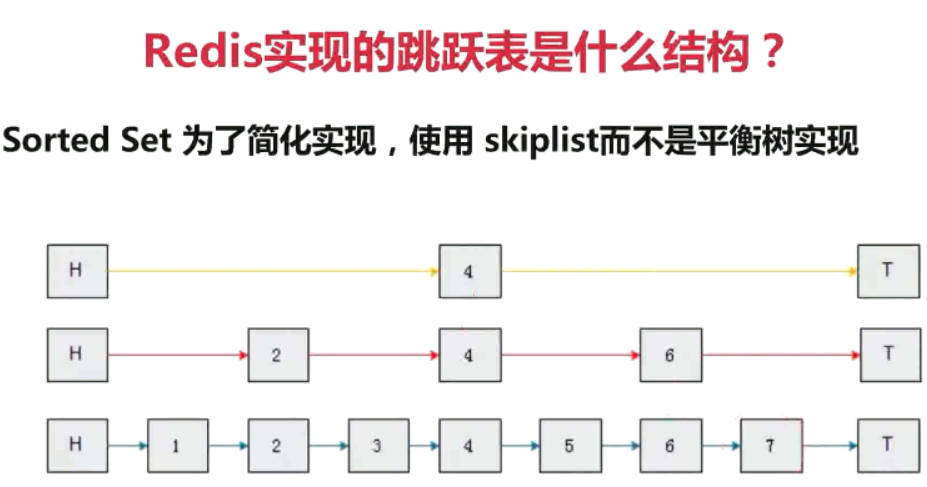

    链表不能进行随意查找,不能进行二分查找,redis用的是跳跃查找算法,我们要目标7,找到4,7大于4,右表,在找到6,最后跳到7

### redis支持两种方式实现持久化

    快照方式:把数据快照放在磁盘二进制文件中,dump.rdb
    AOF:每一个写命令追加到appendonly.aof中(文件配置大)
    可以通过修改 redis 配置实现
    
### 什么是redis事务

    将多个请求打包,一次性,按序执行多个命令的机制
    redis 通过multi exec watch等命令实现事务功能
    python redis-py pipeltine=conn.pipeline(transction=True)
    
        原子性:没有回滚机制
        一致性:watch监听,失败就停止
        隔离性:单进程执行的隔离很好
        持久化:严格没有来说实现
        
### redis如何实现分布式锁
我们想一下在python线程安全问题我们可以使用锁机制,但是这是在单机上面,如果在不同的机器上,如果实现,就可以用
redis,不同的机器去请求redis,redis返回数据.

    使用setnx实现加锁,可以同时通过expire添加超时时间
    锁的value值可以使用一个随机的uuid或者特定的命名
    释放锁的时候,通过uuid判断释放是该锁,是则执行delete释放锁
    
### 缓存使用问题:数据一致性问题,缓存穿透,击穿,雪崩问题
    
    cache aside 同时更新缓存和数据库
    read/write through 先更新数据库,缓存负责同步更新数据库
    write behind caching 先更新缓存,缓存定期异步更新数据库
    
数据一致性问题

    先更新数据库,删除缓存,在重建缓存!

如何解决缓存穿透(比如爬虫遍历id抓取数据,有些id是不存在的.就会打到数据库中)

    由于大量缓存查不到就去数据库取,数据库也没有要的数据
    解决:对于没有查到返回为none的数据也缓存
    插入数据的时候删除相应的缓存,或者设置较短的超时时间
    
如何解决缓存击穿(比如微博明细离婚,而刚好这个页面key缓存过期了,这时大量请求过来,就挂了)

    由于非常热点的数据 key 过期,大量请求打到后端数据库
    热点数据key失效导致大量请求打到数据库增加数据库压力
    分布式锁:获取锁的线程从数据库拉数据更新缓存,其他线程等待
    异步后台更新:后台任务针对过期的key自动刷新
    
缓存雪崩(某几台服务器挂了,大量请求打到同一台数据库,导致缓存雪崩)

    多级缓存:不同级别的key设置不同的超时时间
    随机超时:key的超时时间随机设置,防止同时超时
    架构层:提升系统可用性,监控\报警完善
    
# 第9章 Python-Web-框架考察点

## Python WSGI与web框架常考点

什么是wsgi

    python web 服务器网关接口,提供了web应用和web服务中间提供一个标准的接口
    解决了 python web server 乱像
    描述了 web server如何与web框架交互,web框架如果处理请求  

常用的 python web框架 django/flask/tornado 对比

    django: 大而全,内置orm,admin等组件,第三方插件较多
    flask: 微框架,插件机制,比较灵活
    tornado:异步支持的微框架和异步网络库

什么是mvc

    模型model.试图view,控制器,controller
    
    model:负责业务对象和数据库的交互orm
    view:负责与用户的交互展示
    controller:接收请求参数调用模型和试图完成请求
    

什么是orm
    
    用于实现业务对象与数据表中的字段映射
    数据模型都在一个地方定义，更容易更新和维护，也利于重用代码
    基于 ORM 的业务代码比较简单，代码量少，语义性好，容易理解
    
## web安全常考点

什么是sql注入

    通过构造特殊的输入参数传入web应用,导致后端执行了恶意sql
    通常由于程序员未对输入进行过滤,直接动态拼接sql产生
    可以使用开源的工具 sqlmap, sqlninja 检测
    
如何防范sql注入

    对输入参数做好检查(类型和范围),过滤和转义特殊字符
    不要直接拼接sql,使用orm
    数据层,做好权限管理配置,不要明文存储敏感信息
    
什么是xss攻击

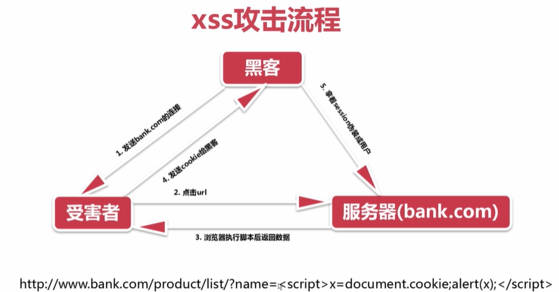

csrf攻击与防范(django在模板页面表单中设置csrf)

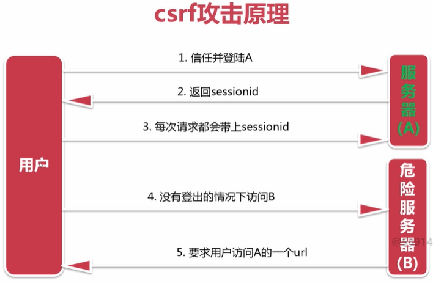
    

## 前后端分离与 RESTful 常见题

什么是前后端分离,优点

    前后端解耦,接口复用,减少开发量
    歌司其职,前后端同步开放,提升工作效率,定义好接口规范
    更有利于调试,测试和运维部署
    
什么是restful

    文档 http://www.ruanyifeng.com/blog/2014/05/restful_api.html

什么是http

    HTTP 是基于 TCP/IP 协议的应用层协议。它不涉及数据包（packet）传输，主要规定了客户端和服务器之间的通信格式，默认使用80端口。
    
什么是https

    HTTPS就是将HTTP协议数据包放到SSL/TLS层加密后，在TCP/IP层组成IP数据报去传输，以此保证传输数据的安全；
    而对于接收端，在SSL/TLS将接收的数据包解密之后，将数据传给HTTP协议层，就是普通的HTTP数据。
    HTTP和SSL/TLS都处于OSI模型的应用层。

# 第10章 系统设计考察点

## 系统设计考点解析

    系统设计是一个定义系统架构,模块,接口和数据满足特定需求的过程
    比如设计一个短网址服务,评论服务,feed流系统,抢红包系统
    微服务架构很多系统被按照业务拆分,需要单独设计一个系统服务
    
系统设计的难点

    需要具备相关领域,算法的经验,有一定的架构设计能力
    熟悉后端技术组件,比如消息队列,缓存,数据库,框架
    具备文档撰写,流程图绘制,架构设计,编码实现等综合能力
    
系统设计的三要素

    1.使用场景和限制条件:用户估计多少,并发qps,峰值qbs,平均qbs
    2.数据存储设计:那些字段,使用什么类型,是否持久化,关系型还是nosql
    3.算法模块设计:接口设计,算法或者模型
    扩展问题:用户多了,数据存储,故障如果处理
    
## 短网址系统设计递增序列算法

    功能:一个长网址转成短网址并存储,根据短网址还原长url
    要求短网址的后缀不超过7位(大小写字母和数字)
    预估插入请求数量级:数百,查询请求数量级数千
    
数据存储设计

    mysql
    需要字段:id,短网址,url,创建时间
    索引需求:查询需求只有通过短网址查长寻长网址
    
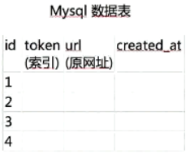
    
算法实现设计

    2个api:long2short_url, short2long_url
    
10转二进制表示,不断取余,倒序输出

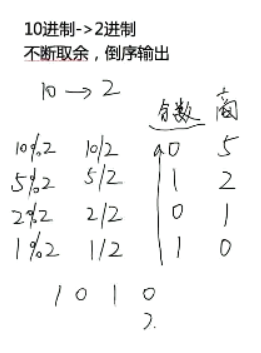

案例代码10转二进制

    def mybin(num):
        if num == 0:
            return 0
        res = []
        while num:
            num, rem = divmod(num, 2) 
            res.append(str(rem))
        return ''.join(reversed(res))
    
    print(mybin(10))

这里如果用MD5(生成32位的字符,要求是7位),能不能用自增的id生成一个token

这里的 CHARS 有62位,映射余数实现伪的10进制转成64进制

    CHARS = "abcdefghijklmnopqrstuvwxyz0123456789ABCDEFGHIJKLMNOPQRSTUVWXYZ"
    
    def encode(num):
        if num == 0:
            return CHARS[0]
        res = []
        while num:
            num, rem = divmod(num, 62)
            res.append(CHARS[rem])
        return ''.join(reversed(res))
    
    
    print(encode(100))

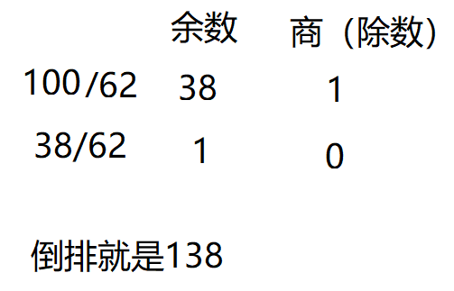

flask 实现一下

    from flask import Flask, jsonify, render_template, request
    from flask_mysqldb import MySQL
    from flask.ext.redis import FlaskRedis
    
    app = Flask(__name__)
    app.config['MYSQL_USER'] = 'root'
    app.config['MYSQL_PASSWORD'] = 'xxx'
    app.config['MYSQL_DB'] = 'xxx'
    app.config['MYSQL_CURSORCLASS'] = 'xxx'
    
    mysql = MySQL(app)
    redis_store = FlaskRedis(app)
    
    CHARS = "abcdefghijklmnopqrstuvwxyz0123456789ABCDEFGHIJKLMNOPQRSTUVWXYZ"
    
    def encode(num):
        if num == 0:
            return CHARS[0]
        res = []
        while num:
            num, rem = divmod(num, 62)
            res.append(CHARS[rem])
        return ''.join(reversed(res))
    
    @app.route('/shorten', methods=['POST'])
    def shorten_url():
        long_url = request.json['url']
        index = int(redis_store.incr('SHORT_CNT'))
        token = encode(index)
        sql = "insert into short_url(token, url) VALUES (%s, %s)"
        cur = mysql.connection.cursor()
        cur.execute(sql,(token, long_url))
        mysql.connection.commit()
        shorten_url = 'https://short.com/' + token
        return jsonify(url=shorten_url)
    
    @app.route('/')
    def index():
        return render_template('index.html')
    
    
    if __name__ == '__main__':
        app.run(dubug=1)

## 如何设计一个秒杀系统

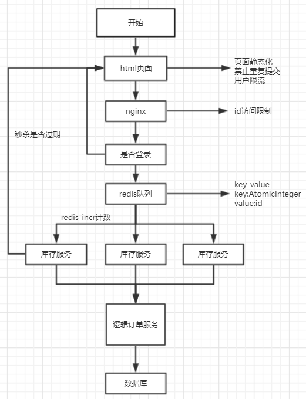

参考: https://blog.csdn.net/suifeng3051/article/details/52607544