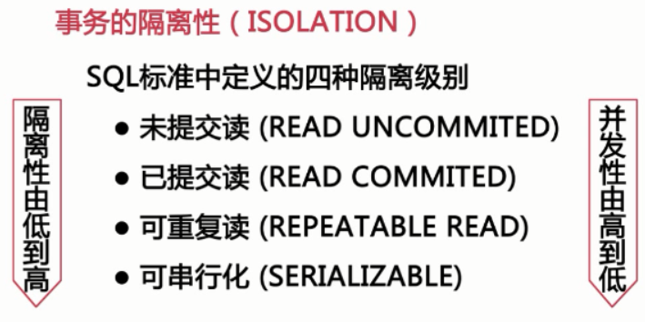

# 第1章 实例和故事

    QPS:每秒处理的查询量
    Tps:每秒处理的事务数

## 在大促中什么影响了数据库性能

### 大表
    
    记录行数巨大,单表超过千万行
    表数据文件巨大,表数据文件超过10G
    
### 大表对查询的影响

    慢查询:很难在一定的时间内过滤出所需要的数据

### 建立索引需要很长时间

    mysql版本<5.5建立索引会锁表
    mysql版本>=5.5虽然不会锁表但会引起主从延迟
        
### 修改表结构需要长时间锁表

    会造成时间的主从延迟
    影响正常的数据操作
 
## 如何处理数据库中的大表

### 分库分表
    
    分表的主键的选择
    分表后跨分区数据的查询和统计
    
### 大表的历史数据归档
    
    减少对前后端业务的影响
    归档时间点的选择
    如何进行归档操作
    
## 大事务带来的问题
    
    事务是一组具有原子性的sql语句,或是一个独立的工作单元
    
### 原子性

    一个事务必须被视为一个不可分割的最小工作单位,整个事务中的所有操作要么全部提交成功,要么全部失败.
    
### 一致性

    在事务开始之前和事务结束后数据库中数据的完整没有被破坏
    
### 隔离性
    
    一个事务堆数据库中数据的修改,在未提交完成钱对于其他事务的是不可见的
    
#### 未提交读(read uncommited)

    脏读,不推荐用
    
#### 已提交读(不可重复读)(read commited)
    
    一个事务堆数据库中数据的修改,在未提交完成钱对于其他事务的是不可见的
    
#### 可重复读(repeatable read)

    2个事务在一起开始运行,其中一个已经运行成功commit,第二个事务这时能读取其数据,而"已提交读"无法读取.
    
#### 可串行化(serializable)

    序列化
    
innodb 默认隔离级别是"可重复读"

性能对比

### 持久性

    一旦事务提交,则其所做的修改就会永久保持到数据库

## 什么是大事务

    运行时间比较长,操作的数据比较多的是事务
    锁定大量的数据,造成大量的阻塞和锁超时
    回滚是所需时间较长
    执行时间长,容易造成主从延迟
    
避免一次处理太多的数据

移除不必要在事务中的select操作

# 第2章 什么影响了MySQL性能

## 影响性能的几个方面

    服务器硬件
    服务器的操作系统
    存储引擎
    数据库配置参数
    数据库结构设计和sql语句
    
## CPU资源和可用内存大小

cpu资源和可用内存大小

    目前多cpu对同一sql并发处理是不支持的,但可用一个cpu操作一条sql,多个就能操作多条
    cpu64位
    内存:innodb会在内存中缓存索引,缓冲数据查询
    内存缓存:比如将写入操作缓存到内存中,计数器达到100,一次性写入数据库
    内存的主频:频率越高效果好,单条内存大
    
## 磁盘的配置和选择

    传统机器硬盘:存储容量,传输速度,访问时间,主轴转速,物理尺寸
    
## 使用RAID增加传统机器硬盘的性能

    raid是磁盘冗余队列的简称,简单来说reid的作用就是可以吧多个容量较小的磁盘组成一组容量更大的磁盘,并提供数据冗余来保证数据完整性的技术
    
raid级别的选择

## 使用固态存储SSD或PCIe卡

    比机械磁盘有更好的随机读写性能
    有更好的固态磁盘能更好的支持并发
    更容易损坏
    
固态硬盘分为 ssd和pcie

    适用于存在大量随机i/0的场景
    适用于解决单线程负载的I/O瓶颈
    
## 使用网络存储SAN和NAS

    是2种外部文件存储设备加载到服务器上的方法
    san设备通过光纤连接到服务器,设备通过块接口访问,服务器可以将其当左硬盘使用
    nas设备使用网络连接,通过基于文件协议如nfs或smb来访问
    
网络存储适用的场景

    数据库备份
    
## 总结:

cpu

    64位的cpu一定要工作在64位的系统下
    对于并发比较更好的场景cpu的数量比频率重要
    对于cpu密集性场景和复杂sql则频率越高越好
    
内存
    
    选择主板所能使用的最高频率的内存
    内存的大小堆性能很重要,所以尽可能的大

i/o子系统

    pcie-->ssd-->raid-->磁盘-->san
    
## 操作系统对性能的影响-MySQL适合的操作系统

mysql适合的操作系统

    windows freebsd solaris linux
    
## CentOS系统参数优化

内核相关参数(/etc/sysctl.cnf)

网络相关的参数

    net.core.somaxconn=65535 # 监听队列的长度
    net.core.netdev_max_backlog=65535 # 每个网络接口接收数据包的速率比内核处理速率快的时候,允许被发送到队列中的最大数目
    net.ipv4.tvp_max_syn_backlog=65535 # 还未获得最大请求,保存在队列中最大数目
    
    net.ipv4.tcp_fin_timeout=10 # 加快tcp链接的回收
    net.ipv4.tcp_tw_reuse = 1 
    net.ipv4.tcp_tw_recycle = 1 

# 第3章 MySQL基准测试

# 第4章 MySQL数据库结构优化

    减少数据冗余
    尽量避免数据维护中出现更新,插入和删除异常
    节约数据存储空间
    提高查询效率

## 数据库结构设计

数据库设计的第一范式

    数据库表中的所有字段都是只具有单一属性
    单一属性的列是由基本的数据类型所构成的
    设计出来的表都是简单的二维表
    
数据库设计的第二范式

    要求一个表中只具有一个业务主键
    
数据库设计的第三范式

    指每一个非主属性既不部分依赖与也不传递依赖与业务主键
    
## 需求分析及逻辑设计

