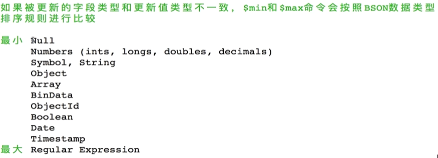
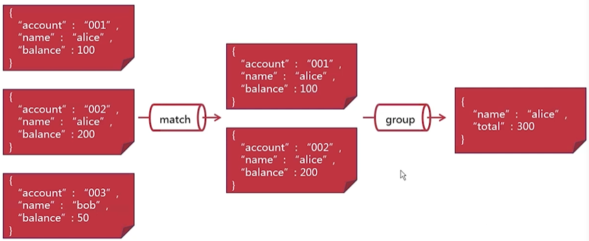

# 第1章 课程导学

## 开启MongoDB入门之旅

    文档 http://www.mongoing.com/
    
# 第2章 初见MongoDB

## MongoDB是什么

非关系数据库

    redis 键值存储
    Cassandra 列存储
    objectivity/db 对象存储
    neo4j 图形存储
    mongodb 文档存储
    
mongo数据库结构,同一个集合的文档可以完成不同的字段

    数据库-->集合-->文档(json)
    
## Docker中运行MongoDB

    docker pull mongo:4
    docker images
    
启动mongo
    
    docker run --name mymongo -v /mymongo/data:/data/db -d mongo:4
    
查看容器

    docker ps
    
查看数据库日志

    docker logs mymongo
    
mongo express是基于网络的mongodb数据库管理界面

    docker pull mongo-express
    docker run --link mymongo:mongo -p 8081:8081 mongo-express

浏览器这样打开mongo express

    ip地址:8081
    
## 初见mongo shell:最靠谱的客户端

mongo基于JavaScript的客户端工具

    docker exec -it mymongo mongo
    
## mongo shell的共同语言 :盟友JavaScript

    mongo shell可以接受JavaScript的语法
    
    print("hello")
    exit # 退出
    
# 第3章 MongoDB基本操作之CRUD

## 原来MongoDB文档长这样

基本操作
    
    create 创建
    read 读取
    update 更新
    belete 删除
    
文档主键_id,每一篇文档必有字段

    文档主键的唯一性
    支持所有数据类型(数组除外)
    复合主键
    
对象主键objectid

    默认生成文档主键
    可以快速生成的12字节id
    包含创建时间
    
注意事项:对象主键objectid
    
    如果多个文档同一秒中存入数据中,顺序存在不同情况
    对象主键是客户端驱动生成的,如果客户端的系统时间不同,也会影响文档顺序
    
创建文档

    db.collection.insert()
    db.collection.save()

## 我的第一篇MongoDB文档insertOne和insertMany

使用test数据库

    use test
    
查看test数据库中的集合

    show collections
    
### 创建第一个文档

    db.collection.insertOne()
    
    db.<collection>.insertOne(
        <document>,
        {
            writeConcern:<document>
        }
    )
    
    <collection>要替换成文档将要写入的集合
    <document>要替换成将要写入的文档本身
    writeConcern文档定义了本次文档创建操作的安全写级别
        简单的说,安全写级别用来判断一次数据库写入操作是否成功;
        安全写级别越高,丢失数据的风险就越低,然而写入操作的延迟也可能更高;
        如果不提供writeConcern文档,mongodb使用默认的安全写级别
        
准备写入数据库的文档

    {
        _id:"account1",
        name:"alice",
        balance:100
    }
    
将文档写入accounts集合,这里没有writeConcern,我们使用默认安全写级别

    db.accounts.insertOne(
        {
            _id:"account1",
            name:"alice",
            balance:100
        }
    )
        
返回结果
    
    { "acknowledged" : true, "insertedId" : "account1" }
    
    acknowledged : true 表示安全写级别被启用,默认的安全写级别
    insertedId显示了被写入的文档的_id
    
等一下,我们并没有创建过accounts集合啊

查看一下现在的集合列表

    show collections
    
    打印,会自动创建相应的集合
    accounts
    
如果使用重复的_id创建一个新的文档会造成错误

    db.accounts.insertOne(
        {
            _id:"account1",
            name:"bob",
            balance:50
        }
    )
    
打印出的错误信息

    2019-08-03T15:14:28.613+0000 E QUERY    [js] WriteError: E11000 duplicate key error collection: test.accounts index: _id_ dup key: { : "account1" } :
    WriteError({
        "index" : 0,
        "code" : 11000,
        "errmsg" : "E11000 duplicate key error collection: test.accounts index: _id_ dup key: { : \"account1\" }",
        "op" : {
            "_id" : "account1",
            "name" : "bob",
            "balance" : 50
        }
    })
    WriteError@src/mongo/shell/bulk_api.js:461:48
    Bulk/mergeBatchResults@src/mongo/shell/bulk_api.js:841:49
    Bulk/executeBatch@src/mongo/shell/bulk_api.js:906:13
    Bulk/this.execute@src/mongo/shell/bulk_api.js:1150:21
    DBCollection.prototype.insertOne@src/mongo/shell/crud_api.js:252:9
    @(shell):1:1

这样的错误信息有点凌乱!

    try{
            db.accounts.insertOne(
                {
                    _id:"account1",
                    name:"bob",
                    balance:50
                }
            )
        } catch(e){
            print(e)
        }
        
返回,可以看见尝试写入的文档信息,并报错duplicate key重复的文档主键

    WriteError({
        "index" : 0,
        "code" : 11000,
        "errmsg" : "E11000 duplicate key error collection: test.accounts index: _id_ dup key: { : \"account1\" }",
        "op" : {
            "_id" : "account1",
            "name" : "bob",
            "balance" : 50
        }
    })

其实自动生成_id主键,省去自己去实现主键_id

    db.accounts.insertOne(
        {
            name:"bob",
            balance:50
        }
    )
    
生成,mongodb自动生成了主键ObjectId("5d45a6153f559e4e1a7c6a5b")

    {
        "acknowledged" : true,
        "insertedId" : ObjectId("5d45a6153f559e4e1a7c6a5b")
    }

### 创建多个文档

    db.collection.insertMany()
    
    db.<collection>.insertMany(
        [<document1>,<document2>, ...]
        {
            writeConcern:<document>,
            ordered: <boolean>
        }
    )
    
    将多个文档作文一个数组传入 db.collection.insertMany()
    ordered:参数用来决定mongodb是否要按顺序来写入这些文档
        如果将ordered参数设置位false,mongodb可以打乱文档写入的顺序,以便优化写入操作的性能
        默认是true,那么mongodb会严格按照我们插入的顺序
        
准备写入数据库的文档
    
    {
        name: "charlie",
        balance: 500
    }
    
    {
        name: "david",
        balance: 200
    }
    
将文档写入accounts集合

    db.accounts.insertMany([
        {
            name: "charlie",
            balance: 500
        },
        
        {
            name: "david",
            balance: 200
        }
    ])
    
返回值

    {
        "acknowledged" : true,
        "insertedIds" : [
            ObjectId("5d45aa393f559e4e1a7c6a5c"),
            ObjectId("5d45aa393f559e4e1a7c6a5d")
        ]
    }

如果运行一个错误shell语法

    try{
            db.accounts.insertMany([
                {
                    _id:"account1",
                    name: "charlie",
                    balance: 500
                },
                
                {
                    name: "david",
                    balance: 200
                }]
            )
        } catch(e){
            print(e)
        }
        
返回错误 duplicate key,

    BulkWriteError({
        "writeErrors" : [
            {
                "index" : 0,
                "code" : 11000,
                "errmsg" : "E11000 duplicate key error collection: test.accounts index: _id_ dup key: { : \"account1\" }",
                "op" : {
                    "_id" : "account1",
                    "name" : "charlie",
                    "balance" : 500
                }
            }
        ],
        "writeConcernErrors" : [ ],
        "nInserted" : 0,
        "nUpserted" : 0,
        "nMatched" : 0,
        "nModified" : 0,
        "nRemoved" : 0,
        "upserted" : [ ]
    })

这里比单文档插入,返回的错误信息多了

        "writeConcernErrors" : [ ],
        "nInserted" : 0, # 创建多个文档的操作,写入了多少的文档为0个
        "nUpserted" : 0, # 
        "nMatched" : 0,
        "nModified" : 0,
        "nRemoved" : 0,
        "upserted" : [ ]
        
如果这里我们用 ordered: false 改变写入的顺序为"乱序写入"

    try{
            db.accounts.insertMany([
                {
                    _id:"account1",
                    name: "charlie",
                    balance: 500
                },
                
                {
                    name: "david",
                    balance: 200
                }],
                {
                    ordered: false
                }
            )
        } catch(e){
            print(e)
        }
        
返回的信息 "nInserted" : 1,

	"writeConcernErrors" : [ ],
	"nInserted" : 1,
	"nUpserted" : 0,
	"nMatched" : 0,
	"nModified" : 0,
	"nRemoved" : 0,
	"upserted" : [ ]

居然有其中1片文档写入了数据库.

总结:
    
    在顺序写入时,一旦遇到错误,操作便会退出,剩余的文档无论正确与否,都不会写入
    在乱序写入时,ordered: false 改变写入的顺序为"乱序写入",可保证正确的文档内容能插入数据库

## 创建新文档的更多姿势

### insert命令

db.<collection>.insert()既可以写入一个单独的文档,也可以写入多个文档

    db.<collection>.insert(
        <document or array of documents>,
        {
            writeConcern:<document>,
            ordered: <boolean>
        }
    )
    
将文档写入accounts集合

    db.accounts.insert(
        {
            name: "george",
            balance: 10000
        }
    )
    
返回写入文档数量

    WriteResult({ "nInserted" : 1 })
    
如果是错误的文档命令

    try{
            db.accounts.insert([
                {
                    _id:"account1",
                    name: "charlie",
                    balance: 500
                },
                
                {
                    name: "david",
                    balance: 200
                }]
            )
        } catch(e){
            print(e)
        }
        
返回的错误信息

    BulkWriteResult({
        "writeErrors" : [
            {
                "index" : 0,
                "code" : 11000,
                "errmsg" : "E11000 duplicate key error collection: test.accounts index: _id_ dup key: { : \"account1\" }",
                "op" : {
                    "_id" : "account1",
                    "name" : "charlie",
                    "balance" : 500
                }
            }
        ],
        "writeConcernErrors" : [ ],
        "nInserted" : 0,
        "nUpserted" : 0,
        "nMatched" : 0,
        "nModified" : 0,
        "nRemoved" : 0,
        "upserted" : [ ]
    })

### insertOne和insertMany和insert的区别

1. 三个命令返回的结果文档格式不一样如上显示效果

2. insertOne和insertMany命令不支持db.collection.explain()命令,insert支持

### save命令可以用来创建文档

    db.<collection>.save(
        <document>,
        {
            writeConcern:<document>
        }
    )
    
当save命令处理一个新文档的时候,它会调用insert()命令完成写入文档操作

所有db.<collection>.save()返回的结果文档与db.<collection>.insert()是一样的

### 文档主键_id

默认的对象主键objectId

我们可以创建一个objectId对象主键

    ObjectId()

也可以指定值创建一个对象主键

    ObjectId("5d45b4a87ef311e8c18bdd7f")
    
提取ObjectId的创建时间

    ObjectId("5d45b4a87ef311e8c18bdd7f").getTimestamp()
    
### 复合主键

可以使用文档作为文档主键

    db.accounts.insert(
        {
            _id:{accountNo: "001", type: "savings" },
            name: "george",
            balance: 10000
        }
    )
    
返回

    WriteResult({ "nInserted" : 1 })

这样创建是完成没有问题的,但是任然要满足主键的唯一性

但是我们如果调换复合主键内容顺序如下

    db.accounts.insert(
        {
            _id:{ type: "savings", accountNo: "001"},
            name: "irenne",
            balance: 80
        }
    )

返回

    WriteResult({ "nInserted" : 1 })

发现没有问题!

## 关于读取文档

读取文档

    db.collection.find() 
        #匹配查询
        #操作符
        
游标

    查询操作返回的接货游标
    游标的迭代与操作
    
投射

    只返回部分字段
    内嵌文档的投射
    数组的投射
    
## 最直接的匹配查询和比较操作符

开始读取文档 db.collection.find()
  
    db.collection.find(<query>, <projection>)
    
    <query>文档定义了读取操作时筛选文档条件
    <projection>文档定义了堆读取结果进行投射操作
    
既不筛选,也不投射

    db.accounts.find()
    
让读取的文档格式化,更清楚的显示文档

    db.accounts.find().pretty()

###匹配查询

    db.accounts.find({"name" : "alice"})
    db.accounts.find({"name" : "alice", "balance" : 100})
    db.accounts.find({"_id.type": "savings"}) # 复合主键查询
    
###比较操作符

语法:{<field>:{$<operator>:<value>}}

    $eq 匹配字段值相等
    $ne 匹配字段值不等
    $gt 匹配字段值大于
    $gte 匹配字段值大于或等于
    $lt 匹配字段值小于查询值
    $lte 匹配字段值小于或等于查询值
    
读取alice的银行账户文档

    db.accounts.find({"name" : {$eq: "alice"}})
    
读取不属于alice的银行账户文档

    db.accounts.find({"name" : {$ne: "alice"}})
    
读取余额不等于100的文档,这里要注意的是$ne操作符也会输出不存在该字段的文档

    db.accounts.find({"balance" : {$ne: "100"}})
    
读取余额大于100的银行账户文档

    db.accounts.find({"balance" : {$gt: 100}})
    
读取用户名字排在fred之前的银行账户文档

    db.accounts.find({"name" : {$lt: "george"}})
    
$in 匹配字段值与任意查询值相等,类似python in操作

    db.accounts.find({name:{$in:["alice", "bob"]}})

$nin 匹配字段值与任何查询值都不等类似python not in操作

    db.accounts.find({name:{$nin:["alice", "bob"]}})
    
读取账户类型不是储蓄账户的银行文档

    db.accounts.find({"_id.type": {$nin: ["savings"]}}) # 复合主键查询
    
## 逻辑操作符

$not 匹配筛选条件不成立的文档

    语法:{<field>:{$not: {<operator-expression>}}}
    
    读取余额不小于500的银行账户文档
    
        db.accounts.find({"balance": {$not: {$lt:500}}})
    
    $not也会筛选出并不包含查询字段的文档
    
        db.accounts.find({"_id.type": {$not: {$eq: "savings"}}}) # 复合主键查询

$and 匹配多个筛选条件全部成立的文档

    语法:{$and:[{<expression1>}, {<expression12>}, {<expression3>}]}
    
    读取余额大于100并且用户姓名排在fred之后的银行文档
    
        db.accounts.find({$and: 
                [{"balance": {$gt:100}}, 
                {"name" : {$gt: "george"}}]
            })
            
    当筛选条件应用在不同的字段上时,可以省略$and操作符
        
        db.accounts.find({
            "balance": {$gt:100}, 
            "name" : {$gt: "alice"}
         })
         
    当筛选条件应用在同一个字段上时,也可以简化命令,读取余额大于100并且小于500的银行账户文档
    
        db.accounts.find({
            "balance": {$gt:100, $lt: 500}
         })

$or 匹配至少一个筛选条件成立的文档

    语法: {$or:[{<expression1>}, {<expression12>}, {<expression3>}]}

    读取属于alice或者charlie的银行账户文档
    
        db.accounts.find({$or: 
                [{"name": {$eq: "alice"}}, 
                {"name" : {$eq: "george"}}]
            })
            
    当所有筛选条件使用的都是$eq操作符时,$or和$in的效果是相同的
    
        db.accounts.find({
            "name": {$in: ["alice", "george"]}
         })
         
    读取余额小于100或者大于500的银行账户文档
    
        db.accounts.find({$or: [
            {balance:{$lt:100}},
            {balance:{$gt:500}}
        ]})

$nor 匹配多个筛选条件全部不成立的文档

    语法: {$nor:[{<expression1>}, {<expression12>}, {<expression3>}]}
    
    读取不属于alice和charlie且余额不小于100的银行账户文档
    
        db.accounts.find({$nor: [
            {name: "alice"},
            {name: "george"},
            {balance:{$gt:500}}
        ]})
        
    $nor也会查询出并不包含查询字段的文档
    
        db.accounts.find({$nor: [
            {"_id.type": "savings"},
            {balance: {$gt: 500}}
        ]})

## 字段操作符

$exists 匹配包含查询字段的文档

    语法:{field: {$exists: <boolean>}}
    
    读取包含账户类型字段的银行账户文档
    
        db.accounts.find({
            "_id.type": {$exists: true}
        })
        
    回想一下,之前的查询会返回并不包含查询字段的文档,$exists能更加准确返回结果
    
        db.accounts.find({
            "_id.type": {
                $ne: "alice",
                $exists: true
            }
        })

$type 匹配字段类型符合查询值的文档

    语法: 
        {field: {$type: <BSON type>}}
        {field: {$type: [<BSON type1>, <BSON type2>, <BSON type3>]}}
        
    读取文档主键是字符串的银行账户文档
    
        db.accounts.find({
            _id:{$type: "string"}
        })
    
    读取文档主键是对象主键或者是符合主键的银行账户文档
    
        db.accounts.find({
            _id:{$type: [
                "object", # 对象
                "objectId" # 对象主键
            ]}
        })   
    
    读取用户姓名是null的银行账户文档
    
        db.accounts.find({name: {$type: "null"}})
    
    也可以使用对应的bson类型序号作为$type操作符的参数
    
        db.accounts.find({name: {$type: 2}})
    
## 数组操作符

数组操作符$all

    语法 {<field>:{$all: [<valie1>, <valie2>]}}
    
    创建包含数组和嵌套数组的文档
    
        db.accounts.insert([
            {
                name: "jack",
                balance:20000,
                contact: [1000000, "Alabama", "US"]
            },{
                name: "karen",
                balance: 2500,
                contact: [["22222222", "3333333"], "Beijing", "China"]
            }
        ])
    
    读取联系地址位于中国北京的银行账户的文档
        db.accounts.find({contact: {$all:["China", "Beijing"]}})
        
    读取联系电话包含22222222和3333333的银行账户的文档
        db.accounts.find({contact: {$all:[["22222222", "3333333"]]}})
    
数组操作符 $elemMatch

    语法 {<field>:{$elemMatch: [<query1>, <query2>]}}
    
    读取联系电话范围在10000000~20000000之间银行账户的文档
        db.accounts.find({contact: {$elemMatch:{$gt: 100000, $lt: 20000000}}})
        
    注意点
        字符串之间比较各个字符的ascii值
        
    读取包含一个在1000000至2000000之间,和一个在20000000至30000000之间的联系电话的银行账户文档
    
        db.accounts.find(
            contact:{$all:[
                {$elemMatch:{$gt: "100000", $lt: "200000"}},
                {$elemMatch:{$gt: "200000", $lt: "300000"}},
            ]}
        )

## 运算操作符

    $regex 匹配满足正则表达式的文档
    
    语法:
        {<field>: {: /pattgern/,: '<options>'}}
        {<field>: {: /pattgern/<options>}}
        
    兼容 pcre v8.41正则表达式库
    
    在和$in操作符一起使用是,只能使用/pattgern/<options>
    
    读取用户姓名以c或者j开头的银行账户的文档
        db.accounts.find({name:{$in:[ /^c/, /^j/ ]}})
        
    读取用户姓名包含LIE(不区分大小写)的银行账户文档
        db.accounts.find({name:{$regex: /LIE/, $options: 'i'}})
        
## 文档游标

db.collection.find()返回一个文档集合游标

在不迭代游标的情况下,只列出前20个文档

    var myCursor = db.accounts.find()
    
    myCursor
        myCursor是一个变量
    
    打印出前20个文档
    
    { "_id" : "account1", "name" : "alice", "balance" : 100 }
    { "_id" : ObjectId("5d45a6153f559e4e1a7c6a5b"), "name" : "bob", "balance" : 50 }
    { "_id" : ObjectId("5d45aa393f559e4e1a7c6a5c"), "name" : "charlie", "balance" : 500 }
    { "_id" : ObjectId("5d45aa393f559e4e1a7c6a5d"), "name" : "david", "balance" : 200 }
    { "_id" : ObjectId("5d45ac6d3f559e4e1a7c6a5f"), "name" : "david", "balance" : 200 }
    { "_id" : ObjectId("5d45af2d3f559e4e1a7c6a60"), "name" : "george", "balance" : 10000 }
    { "_id" : { "accountNo" : "001", "type" : "savings" }, "name" : "george", "balance" : 10000 }
    { "_id" : { "type" : "savings", "accountNo" : "001" }, "name" : "irenne", "balance" : 80 }
    { "_id" : ObjectId("5d469d60e11da07278ffcb7b"), "name" : "jack", "balance" : 20000, "contact" : [ "1111111", "Alabama", "US" ] }
    { "_id" : ObjectId("5d469d60e11da07278ffcb7c"), "name" : "karen", "balance" : 2500, "contact" : [ [ "22222222", "3333333" ], "Beijing", "China" ] }
    { "_id" : ObjectId("5d46a26db5af1b6338cbc574"), "name" : "jack", "balance" : 20000, "contact" : [ 1000000, "Alabama", "US" ] }
    { "_id" : ObjectId("5d46a26db5af1b6338cbc575"), "name" : "karen", "balance" : 2500, "contact" : [ [ "22222222", "3333333" ], "Beijing", "China" ] }

我们也可以使用游标的下标直接访问文档集合中的某个文档

    var myCursor = db.accounts.find()
    myCursor[1]
    
    {
        "_id" : ObjectId("5d45a6153f559e4e1a7c6a5b"),
        "name" : "bob",
        "balance" : 50
    }

游标遍历完所有的文档后,或者在10分钟之后,游标便会自动关闭

可以使用 noCursorTimeout()函数来保持游标一直有效

    var myCursor = db.accounts.find().noCursorTimeout()
    
在这之后,在不遍历游标的情况下,你需要主动关闭游标

    myCursor.close()
    
## 文档游标函数

cursor.hasNext() 是否有下一个游标

cursor.next() 下一个游标

遍历游标

    var myCursor = db.accounts.find({name: "george"});
    while( myCursor.hasNext()){
        printjson(myCursor.next());
    }
    
更方便的遍历游标 cursor.forEach(<function>)

    var myCursor = db.accounts.find({name: "george"});
    myCursor.forEach(printjson)
    
cursor.limit(<number>)只是返回要求的文档

    db.accounts.find({name: "george"}).limit(1);

cursor.skip(<offset>)跳过第一篇,返回第一篇之后的文档

    db.accounts.find({name: "george"}).skip(1);
    
使用cursor.limit(0)会返回什么结果呢?
    
    db.accounts.find({name: "george"}).limit(0);
    
    证明:不使用limit操作
    
cursor.count(<applySkipLimit>)

默认情况下,<applySkipLimit>为false,即cursor.count()不会考虑cursor.skip和cursor.limit的效果

    db.accounts.find({name: "george"}).limit(1).count();
    返回
        2
    db.accounts.find({name: "george"}).limit(1).count(true);
    返回
        1
        
在不提供筛选条件时, cursor.count()会从集合的元数据Metedate中取得结果

    db.accounts.find().count();
    
当数据库分布式结构较为复杂时,元数据中的文档数量可能不准确,在这种情况下,应该避免应用不提供筛选条件的cursor.count()函数,而使用聚合管道来计算的文档数量

cursor.sort(<document>)排序

    这里的<document>定义了排序的要求
    语法: {field: ordering} 1表示有小及大的正向排序, -1表示逆向排序
    
    按照余额从到小,用户姓名按字母排序的方式排列银行账户文档
        db.accounts.find().sort({balance: -1, name: 1});
    
    读取余额最大的银行账户文档
        db.accounts.find().sort({balance: -1}).limit(1);
        
这里要提到的是执行顺序

    cursor.skip(), 
    cursor.limit(),
    cursor.sort()
    
cursor.skip()在cursor.limit()之前执行

    db.accounts.find().limit(5).skip(3)
    
    按照正常执行顺序应该返回2篇文档,但是这里返回了5篇文档
    
cursor.sort()在cursor.skip()和cursor.limit()之前执行

    db.accounts.find().limit(5).skip(3).sort({balance: -1})
    
    其实执行顺序是
    
    db.accounts.find().sort({balance: -1}).skip(3).limit(5)
    
## 文档投影

db.accounts.find(<query>, <projection>)

不使用投影文档,db.accounts.find()返回符合筛选条件的完整的文档,而使用投影可以有选择的返回文档中的部分字段

语法:{field: inclusion}

1.表示返回字段, 0表示不返回字段

只返回银行账户文档中的用户姓名

    db.accounts.find({}, {name: 1})
    
只返回银行账户文档中的用户姓名(不包括主键)

    db.accounts.find({}, {name: 1, _id:0})
    
不返回银行账户文档中的用户姓名(不返回主键)

    db.accounts.find({}, {name: 0, _id:0})
    
注意点

    db.accounts.find({}, {name: 1, balance: 0 _id:0})
    报错
    除了文档主键之外,我们不可以在投影文档中混合使用包含和不包含这两种投影操作.
    
在数组字段上使用投影$slice

    $slice操作符可以返回数组字段中的部分元素
    
    db.accounts.find({}, {_id: 0, name:1, contact: 1})
    
    返回数组中第一个元素slice: 1
    db.accounts.find({}, {_id: 0, name:1, contact: {$slice: 1}})
    
    返回数组中倒数一个元素slice: -1
    db.accounts.find({}, {_id: 0, name:1, contact: {$slice: -1}})
    
    返回数组中倒数2个元素slice: -2
    db.accounts.find({}, {_id: 0, name:1, contact: {$slice: -2}})
    
    slice: [1, 2] 1是skip操作, 2是limit操作
    db.accounts.find({}, {_id: 0, name:1, contact: {$slice: [1, 2]}})
    
在数组字段上使用投影$elemMatch

    $elemMatch和$操作符可以返回数组字段中满足筛选条件的第一个元素
        db.accounts.find({}, {
            _id:0, name:1,
            contact: {$elemMatch:{$gt: "Alabama"}}
        })
    
    一般情况下我们会先定义筛选条件,在投影时没有新的筛选条件,就可以用$,不需要自定义$elemMatch筛选
        db.accounts.find(
            {contact: {$gt: "Alabama"}}, 
            { _id:0, name:1,"contact.$": 1}
        )
        
## 更新文档

### 更新整篇文档

db.collection.update()

语法:db.<collection>.update(<query>, <update>, <options>)

    <query> 文档定义了更新操作筛选文档的条件
    <update> 文档定义了更新的内容
    <options> 文档声明了一些更新操作的参数
    
将alice的账户余额更改为123

    db.accounts.update({name: "alice"}, {name: "alice", balance:123})
    返回数据
    WriteResult({ "nMatched" : 1, "nUpserted" : 0, "nModified" : 1 })
        nMatched 符合更新的文档多少篇
        nModified 更新了多少文档
        
几个需要注意的问题

    文档主键_id是不可以更改的
    我们之前使用的<update>文档并没有包含_id字段
    在这种情况下,文档的_id字段自然不会被更改
    如果我们在<update>文档包含_id字段,则_id值一定要和被更新的文档_id值保持一致
    
查询账户余额在20到80之间的文档

    db.accounts.find({balance:{$gt:20, $lt: 500}})
        发现查询出5篇文档
    
    在更新文档试试
    db.accounts.update({balance:{$gt:20, $lt: 500}}, {name: "bill", balance: 50, gender: "M"})
        发现只更新了1篇文档
        
    也就是说更新整片文档的操作只能应用在单一文档上
    
### 更新特定字段

    $set 更新或新增字段
    $unset 删除字段
    $rename 重命名字段
    $inc 加减字段值
    $mul 相乘字段值
    $min 比较减小字段值
    $max 比较增大字段值
    
$set 更新或新增字段

语法: {$set: {<field1>:<values1>, ....}}

    查看jack的银行账户文档
    db.accounts.find({name: "jack"}).pretty()
    
    更新jack的银行账户余额和开户信息
    db.accounts.update(
            {name: "jack"},
            {$set: {
                balance: 3000,
                info: {
                    dateOpened: new Date("2016-05-18T16:00:00Z"),
                    branch: "branch1"
                }
            }}
        )
        
    返回
    WriteResult({ "nMatched" : 1, "nUpserted" : 0, "nModified" : 1 })
    
    更新或新增内嵌文档的字段,更新jack的银行账户的开户时间
    db.accounts.update(
        {name: "jack"},
        {$set: {
            "info.dateOpened": new Date("2017-05-18T16:00:00Z"),
        }}
    )
    
    更新或新增数组内字段
    db.accounts.update(
        {name: "jack"},
        {$set: {
            "contact.0": "66666666",
        }}
    )
    
    新增数组内字段
    db.accounts.update(
        {name: "jack"},
        {$set: {
            "contact.3": "new contact",
        }}
    )
    
    如果数组元素是5 contact.5
    db.accounts.update(
        {name: "jack"},
        {$set: {
            "contact.5": "new contact",
        }}
    )
    
        返回 ,发现是长度是6位,但是地5位是null
            "contact" : [
                "66666666",
                "Alabama",
                "US",
                "new contact",
                null,
                "new contact"
            ],

如果像现有数组字段范围以外的位置添加新值,数组字段的长度会扩大.未被赋值的数组成员将被设置为null

$unset 删除字段

语法: {$unset: {<field1>: "", ....}}

    删除jack的银行余额和开户地点
    
        db.accounts.update(
            {name: "jack"},
            {$unset: {
                balance: "",
                "info.branch": ""
            }}
        )
    
        其实$unset命令中赋值""对操作结果并没有任何影响
    
        "info.branch": "dasdada" 也会删除这个字段
    
        如果$unset命令中字段根本不存在,那么文档内容将保持不变
    
    删除数组内的字段
    
        db.accounts.update(
            {name: "jack"},
            {$unset: {
                "contact.0": ""
            }}
        )
        
        当使用$unset 删除字段数组字段中的某一个元素时,这个元素不会被删除,只会被赋以null值,而数组的长度不会改变
        
$rename 重命名字段

语法: {$rename: {<field1>: <newName1>, <field1>: <newName2>, ....}}

    如果 $rename 命令要重命名的字段并不存在,那么文档内容不会被改变
    
        db.accounts.update(
            {name: "jack"},
            {$rename: {
                "notExist": "name"
            }}
        )
        
    如果新的字段已经存在,那么原有的这个字段会被覆盖
    
        db.accounts.update(
            {name: "jack"},
            {$rename: {
                "name": "contact"
            }}
        )
        
    返回
    
        > db.accounts.find({contact: "jack"}).pretty()
        {
            "_id" : ObjectId("5d469d60e11da07278ffcb7b"),
            "contact" : "jack",
            "info" : {
                "dateOpened" : ISODate("2017-05-18T16:00:00Z")
            }
        }
        > 
        
    当$rename命令中的新字段存在的时候,$rename命令会先$unset新旧字段,然后在$set新字段

    重命名内嵌文档的字段
    
    更新karen的银行账户的开户时间和联系方式
    
        db.accounts.update(
            {name: "karen"},
            {$set:{
                info: {
                    "dateOpened" : new Date("2017-05-18T16:00:00Z"),
                    "branch" : "branch1"
                },
                "contact.3": {
                    primaryEmail: "xxx@gmail.com",
                    secondaryEmail: "yyy@gmail.com"
                }
            }}
        )
        
        db.accounts.find({name: "karen"}).pretty()
        
    更新账户余额和开户地点字段在文档中的位置
    
        db.accounts.update(
            {name: "karen"},
            { $rename:
                {
                    "info.branch": "branch",
                    "balance": "info.balance"
                }
            }
        )
    
    重命名数组中内嵌文档的字段,发现$rename命令中的旧字段和新字段都不可以指向数组元素.
    
        db.accounts.update(
            {name: "karen"},
            { $rename:
                {
                    "contact.3.primaryEmail": "primaryEmail"
                }
            }
        )
        
    返回报错
        The source field cannot be an array element,

$inc 加减字段值

语法: {$inc: {<field1>: <amount1>, ....}}

    
    更新david的账户余额

        db.accounts.update(
            {name: "david"},
            {$inc:{
                balance: -0.5
            }}
        )
        
    返回
    
        > db.accounts.find({name: "david"}).pretty()
        {
            "_id" : ObjectId("5d45aa393f559e4e1a7c6a5d"),
            "name" : "david",
            "balance" : 199.5
        }
        
    $inc如果在非数字字段上会报错
    
    $inc如果更新的字段不存在,会更新加入文档中
        
$mul 相乘字段值

语法:{$mul: {<field1>: <number1>, ....}}

    更新david的账户余额

        db.accounts.update(
            {name: "david"},
            {$mul:{
                balance: -0.5
            }}
        )
    
    返回
    
        > db.accounts.find({name: "david"}).pretty()
        {
            "_id" : ObjectId("5d45aa393f559e4e1a7c6a5d"),
            "name" : "david",
            "balance" : -99.75
        }

    $mul如果在非数字字段上会报错
    
    $mul如果更新的字段不存在,会更新加入文档中

$min 比较减小字段值

语法:{$mul: {<field1>: <value1>, ....}}

    原数据:

    > db.accounts.find({name: "david"}).pretty()
    {
        "_id" : ObjectId("5d45aa393f559e4e1a7c6a5d"),
        "name" : "david",
        "balance" : -99.75
    }

    更新karen的银行账户文档
    
        db.accounts.update(
            {name: "david"},
            {$min:{
                balance: 5000
            }}
        )
        
    返回不变5000大于-99.75
    
    如果被更新的字段不存在,$min命令会创建字段,并且将字段值设为命令中更新值

$max 比较增大字段值

    db.accounts.update(
        {name: "david"},
        {$max:{
            balance: 5000
        }}
    )
    
    返回 balance: 5000
    
    如果被更新的字段不存在,$max命令会创建字段,并且将字段值设为命令中更新值

特殊情况

    db.accounts.update(
        {name: "david"},
        {$max:{
            balance: null
        }}
    )
    
    返回 balance: null

##数组更新操作符

#第4章 MongoDB基本操作进阶之聚合

聚合操作是指: 将一系列不同的操作按照一定顺序应用到数据库的文档中

数据库有4篇文档要知道多少篇文档 count

文档属于哪些客户distinct

文档属于alice文档中余额总和

    单一用途的聚合方法
    Map Reduce
    聚合管道 db.collection.aggregate()
    
聚合表达式

    用来操作输入文档的"公式"
    经聚合表达式计算出的值可以被赋予输出文档中的字段
    字段路径,系统变量,文本,表达式对象,操作符
    
聚合阶段

    聚合阶段有顺序的排列在聚合管道中
    绝大多数聚合阶段反复出现($out和$geoNear除外)
    数据库层面和集合层面
    
聚合操作符

    用来构建聚合表达式
    {<operator>:[<argument1>, <argument2> ....]}
    {<operator>:<argument1>}
    

#第5章 论MongoDB中索引的重要性

#第10章 MongoDB之数据安全

#第11章 MongoDB之管理工具

#第12章 MongoDB之故障诊断