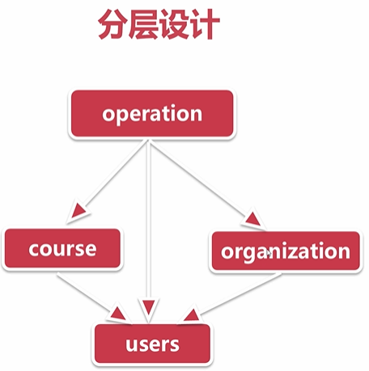

*   [pycharm中常用的快捷键](#pycharm中常用的快捷键)
*   [第6章 留言板快速开发](#第6章-留言板快速开发)
    *   [配置url和静态文件](#配置url和静态文件)
    *   [orm和model表设计](#orm和model表设计)
    *   [model进行增-删-改-查](#model进行增-删-改-查)
    *   [从前端html页面提取出数据并保存到数据库中](#从前端html页面提取出数据并保存到数据库中)
    *   [django的template数据展示](#django的template数据展示)
*   [第7章 需求分析和表结构设计](#第7章-需求分析和表结构设计)
    *   [新建项目和apps](#新建项目和apps)
    *   [自定义userprofile表覆盖默认的user表](#自定义userprofile表覆盖默认的user表)
    *   [如何避免循环import不同apps中的model](#如何避免循环import不同apps中的model)
    *   [course相关的表结构设计](#course相关的表结构设计)
    *   [课程机构相关的表结构设计](#课程机构相关的表结构设计)
    *   [operations相关表结构设计](#operations相关表结构设计)
    *   [通过migrate生成表和本章小结](#通过migrate生成表和本章小结)
*   [第8章 xadmin快速搭建后台管理系统](#第8章-xadmin快速搭建后台管理系统)
    *   [通过django的admin快速搭建后台管理系统](#通过django的admin快速搭建后台管理系统)
    *   [更加强大的后台管理系统-xadmin的配置](#更加强大的后台管理系统-xadmin的配置)
    *   [解决xadmin新建用户出现手机号码重复的问题](#解决xadmin新建用户出现手机号码重复的问题)
    *   [xadmin快速配置列表-搜索-过滤等功能](#xadmin快速配置列表-搜索-过滤等功能)
    *   [快速注册model到xadmin中](#快速注册model到xadmin中)
    *   [xadmin全局配置和本章总结](#xadmin全局配置和本章总结)
*   [第9章 登录和注册功能开发-短信动态验证码登录](#第9章-登录和注册功能开发-短信动态验证码登录)
    *   [通过django内置的login完成登录](#通过django内置的login完成登录)
    *   [登录成功之后的思考](#登录成功之后的思考)
    *   [通过form表单对登录框进行验证](#通过form表单对登录框进行验证)
    *   [退出登录接口开发](#退出登录接口开发)
    *   [通过云片网发送短信验证码](#通过云片网发送短信验证码)
    *   [通过django-simple-captcha显示图片验证码](#通过django-simple-captcha显示图片验证码)
    *   [图片验证码是如何显示在前端页面中的](#图片验证码是如何显示在前端页面中的)
    *   [ajax方式完成短信验证码的发送](#ajax方式完成短信验证码的发送)
    *   [通过redis记录发送的验证码](#通过redis记录发送的验证码)
    *   [手机验证码动态登录](#手机验证码动态登录)
    *   [手机注册功能](#手机注册功能)
        *   [前端显示验证码](#前端显示验证码)
        *   [实现注册逻辑](#实现注册逻辑)
    *   [cookie和session的登录原理和区别](#cookie和session的登录原理和区别)
*   [第10章 课程机构相关功能开发](#第10章-课程机构相关功能开发)
    *   [使用template的static重新引入静态文件](#使用template的static重新引入静态文件)
    *   [通过django的template继承机制重构html页面](#通过django的template继承机制重构html页面)
    *   [显示课程机构列表页数据](#显示课程机构列表页数据)
    *   [课程机构经典课程展示-通过model反向去外键关联数据](#课程机构经典课程展示-通过model反向去外键关联数据)
    *   [课程机构分页](#课程机构分页)
    *   [课程机构的筛选-通过order_by对课程机构排序](#课程机构的筛选-通过order_by对课程机构排序)
    *   [授课机构排名 \- 通过forloop显示索引](#授课机构排名-通过forloop显示索引)
    *   [通过url的include机制重新设计url](#通过url的include机制重新设计url)
    *   [通过modelform完成用户咨询提交](#通过modelform完成用户咨询提交)
    *   [课程机构详情页](#课程机构详情页)
    *   [机构讲师列表](#机构讲师列表)
    *   [机构课程和机构介绍页面开发](#机构课程和机构介绍页面开发)
    *   [课程机构收藏](#课程机构收藏)
*   [第11章 课程相关功能开发](#第11章-课程相关功能开发)
    *   [课程列表页开发-热门课程推荐](#课程列表页开发-热门课程推荐)
    *   [课程详情页面显示-课程详情页的收藏和相关课程推荐](#课程详情页面显示-课程详情页的收藏和相关课程推荐)
    *   [课程章节信息展示-学过该课程的同学还学习过的课程](#课程章节信息展示-学过该课程的同学还学习过的课程)
    *   [如何控制一个view必须登录之后才能访问](#如何控制一个view必须登录之后才能访问)
    *   [课程评论页面开发](#课程评论页面开发)
    *   [视频播放](#视频播放)
*   [第12章 讲师相关功能开发](#第12章-讲师相关功能开发)
    *   [讲师列表页开发](#讲师列表页开发)
*   [第13章 个人中心相关功能开发](#第13章-个人中心相关功能开发)
    *   [通过django的modelform处理头像修改](#通过django的modelform处理头像修改)
    *   [修改个人信息](#修改个人信息)
    *   [修改密码](#修改密码)
    *   [修改手机号码](#修改手机号码)
    *   [多种方式实现我的课程页面](#多种方式实现我的课程页面)
    *   [我的收藏-课程机构](#我的收藏-课程机构)
    *   [全局消息提示和个人消息中心](#全局消息提示和个人消息中心)
*   [第14章 首页-全局搜索和全局错误页面配置](#第14章-首页-全局搜索和全局错误页面配置)
    *   [首页](#首页)
    *   [全局搜索功能 CourseListView](#全局搜索功能-CourseListView)
    *   [如何快速找到所有的连接并快速的配置](#如何快速找到所有的连接并快速的配置)
    *   [课程详情页显示学习用户](#课程详情页显示学习用户)
    *   [自定义用户验证模块](#自定义用户验证模块)
    *   [自定义404-500页面](#自定义404-500页面)
*   [第15章 常见web攻击](#第15章-常见web攻击)
*   [第16章 xadmin更进阶的开发](#第16章-xadmin更进阶的开发)
*   [第17章 生产环境部署-阿里云](#第17章-生产环境部署-阿里云)

## pycharm中常用的快捷键

快捷键目录 setting -> keymap -> eclipse 

删除代码 ctrl + d 

代码回跳 alt + 左/右箭头

代码上下位置更换 alt + 上/下箭头

注释代码 ctrl + /

缩进 tab

缩进 shift + tab

全局搜索 ctrl + h

# 第6章 留言板快速开发

## 配置url和静态文件

配置url

    from apps.message_form.views import message_form
    
    urlpatterns = [
        path('admin/', admin.site.urls),
        path('message_form/', message_form),
    ]
    
视图

    def message_form(request):
        return render(request, "message_form.html")
        
setting,默认的django会找每个app下的静态文件,以下配置不会影响默认配置,默认配置后期需要收集静态文件.

    STATICFILES_DIRS = [
        os.path.join(BASE_DIR, 'static')
    ]
    
## orm和model表设计

setting 配置数据库

    DATABASES = {
        'default': {
            'ENGINE': 'django.db.backends.mysql',
            'NAME': 'mxonline2',
            'USER': 'root',
            'PASSWORD': '123456',
            'HOST': '192.168.153.159',
            'PORT': 3306,
        }
    }

model表设计

    from django.db import models
    
    # Create your models here.
    
    class Message(models.Model):
    
        name = models.CharField(max_length=20, verbose_name="姓名")
        email = models.EmailField(verbose_name='邮箱')
        address = models.CharField(max_length=100, verbose_name='联系地址')
        message = models.TextField(verbose_name="留言信息")
    
        class Meta:
            verbose_name = "留言信息"
            verbose_name_plural = verbose_name

## model进行增-删-改-查

    def message_form(request):
        
        # 切片
        all_messages = Message.objects.all()[:1]
        print(all_messages.query)  # 打印sql语句
        
        # filter 过滤
        all_messages = Message.objects.filter(name='ayf')
        
        # get 方法,返回是一个对象,数据不存在或者右多条数据存在会抛出异常
        message = Message.objects.get(name='ayf')
        # 删除数据,会执行sql语句
        message.delete()
        print(message.name)
        
        for message in all_messages:
            print(message)
            
        # 进行数据插入操作,save方法如果存在更新,如果不存在则插入
        message = Message()
        message.name = 'ayf1'
        message.email = 'ayf@qq.com'
        message.address = 'hanzhou'
        message.message = 'chaor'
        message.save()
        
        return render(request, "message_form.html")
        
## 从前端html页面提取出数据并保存到数据库中

    from django.shortcuts import render
    from apps.message_form.models import Message
    
    # Create your views here.
    
    def message_form(request):
    
        if request.method == 'POST':
    
            name = request.POST.get('name', '')
            email = request.POST.get('email', '')
            address = request.POST.get('address', '')
            messagestr = request.POST.get('message', '')
    
            message = Message()
            message.name = name
            message.email = email
            message.address = address
            message.message = messagestr
            message.save()
    
        return render(request, "message_form.html")
        
## django的template数据展示

视图

	if request.method == 'GET':

		message = Message.objects.filter()
		if message:
			message = message[0]
			return render(request, "message_form.html", {
				"message": message
			})
		else:
			return render(request, "message_form.html")
			
前端

    {{ message.name }}
    
# 第7章 需求分析和表结构设计

## 新建项目和apps

    python manage.py startapp users
    python manage.py startapp courses
    python manage.py startapp operations
    python manage.py startapp organizations
    
## 自定义userprofile表覆盖默认的user表

model 这里的 unique=True 不能重复, pload_to="head_image/%Y/%m"上传的路径

    class UserProfile(AbstractUser):
        GENDER_CHOICES = (
            ("male", "男"),
            ("female", "女")
        )
        nick_name = models.CharField(max_length=50, verbose_name="昵称", default='')
        birthday = models.DateField(verbose_name="生日", null=True, blank=True)
        gender = models.CharField(verbose_name="性别", choices=GENDER_CHOICES, max_length=6)
        address = models.CharField(max_length=100, verbose_name="地址", default="")
        mobile = models.CharField(max_length=11, unique=True, verbose_name="手机号码")
        image = models.ImageField(upload_to="head_image/%Y/%m", default="default.jpg")
    
    
        class Meta:
            verbose_name = "用户信息"
            verbose_name_plural = verbose_name
    
        def __str__(self):
            if self.nick_name:
                return self.nick_name
            return self.username

配置setting覆盖默认的user表

    AUTH_USER_MODEL = "users.UserProfile"
    
这里会提示安装 Pillow

    pip install Pillow
    
## 如何避免循环import不同apps中的model

## course相关的表结构设计

这里定义课程本身的内容表结构,用户操作的数据在operations中

重要的点

    1. 一个课程有多个章节
    2. 一个章节有多个视频内容
    3. 一个课程有多个课程资源
    4. 实体的具体字段是
    5. 每个字段的类型,是否必填
    
    
model

    from datetime import datetime
    
    from django.db import models
    
    from DjangoUeditor.models import UEditorField
    
    
    # Create your models here.
    class BaseModel(models.Model):
        add_time = models.DateTimeField(default=datetime.now, verbose_name="添加时间")
    
        class Meta:
            abstract = True
    
    
    class Course(BaseModel):
        # teacher = models.ForeignKey(Teacher, on_delete=models.CASCADE, verbose_name="讲师")
        # course_org = models.ForeignKey(CourseOrg, null=True, blank=True, on_delete=models.CASCADE, verbose_name="课程机构")
        name = models.CharField(verbose_name="课程名", max_length=50)
        desc = models.CharField(verbose_name="课程描述", max_length=300)
        learn_times = models.IntegerField(default=0, verbose_name="学习时长(分钟数)")
        degree = models.CharField(verbose_name="难度", choices=(("cj", "初级"), ("zj", "中级"), ("gj", "高级")), max_length=2)
        students = models.IntegerField(default=0, verbose_name='学习人数')
        fav_nums = models.IntegerField(default=0, verbose_name='收藏人数')
        click_nums = models.IntegerField(default=0, verbose_name="点击数")
        notice = models.CharField(verbose_name="课程公告", max_length=300, default="")
        category = models.CharField(default=u"后端开发", max_length=20, verbose_name="课程类别")
        tag = models.CharField(default="", verbose_name="课程标签", max_length=10)
        youneed_know = models.CharField(default="", max_length=300, verbose_name="课程须知")
        teacher_tell = models.CharField(default="", max_length=300, verbose_name="老师告诉你")
        is_classics = models.BooleanField(default=False, verbose_name="是否经典")
        detail = UEditorField(verbose_name="课程详情", width=600, height=300, imagePath="courses/ueditor/images/",
                              filePath="courses/ueditor/files/", default="")
        is_banner = models.BooleanField(default=False, verbose_name="是否广告位")
        image = models.ImageField(upload_to="courses/%Y/%m", verbose_name="封面图", max_length=100)
    
        class Meta:
            verbose_name = "课程信息"
            verbose_name_plural = verbose_name
    
    
    class Lesson(BaseModel):
        course = models.ForeignKey(Course, on_delete=models.CASCADE)
        name = models.CharField(max_length=100, verbose_name="章节名")
        learn_times = models.IntegerField(default=0, verbose_name="学习时长(分钟数)")
    
        class Meta:
            verbose_name = "课程章节"
            verbose_name_plural = verbose_name
    
        def __str__(self):
            return self.name
    
    
    class Video(BaseModel):
        lesson = models.ForeignKey(Lesson, verbose_name="章节", on_delete=models.CASCADE)
        name = models.CharField(max_length=100, verbose_name=u"视频名")
        learn_times = models.IntegerField(default=0, verbose_name=u"学习时长(分钟数)")
        url = models.CharField(max_length=1000, verbose_name=u"访问地址")
    
        class Meta:
            verbose_name = "视频"
            verbose_name_plural = verbose_name
    
        def __str__(self):
            return self.name
    
    
    class CourseResource(BaseModel):
        course = models.ForeignKey(Course, on_delete=models.CASCADE, verbose_name="课程")
        name = models.CharField(max_length=100, verbose_name=u"名称")
        file = models.FileField(upload_to="course/resourse/%Y/%m", verbose_name="下载地址", max_length=200)
    
        class Meta:
            verbose_name = "课程资源"
            verbose_name_plural = verbose_name
    
        def __str__(self):
            return self.name

## 课程机构相关的表结构设计

    from django.db import models
    
    from DjangoUeditor.models import UEditorField
    
    # Create your models here.
    from apps.courses.models import BaseModel
    
    
    class City(BaseModel):
        name = models.CharField(max_length=20, verbose_name=u"城市名")
        desc = models.CharField(max_length=200, verbose_name=u"描述")
    
        class Meta:
            verbose_name = "城市"
            verbose_name_plural = verbose_name
    
        def __str__(self):
            return self.name
    
    
    class CourseOrg(BaseModel):
        name = models.CharField(max_length=50, verbose_name="机构名称")
        desc = UEditorField(verbose_name="描述", width=600, height=300, imagePath="courses/ueditor/images/",
                            filePath="courses/ueditor/files/", default="")
        tag = models.CharField(default="全国知名", max_length=10, verbose_name="机构标签")
        category = models.CharField(default="pxjg", verbose_name="机构类别", max_length=4,
                                    choices=(("pxjg", "培训机构"), ("gr", "个人"), ("gx", "高校")))
        click_nums = models.IntegerField(default=0, verbose_name="点击数")
        fav_nums = models.IntegerField(default=0, verbose_name="收藏数")
        image = models.ImageField(upload_to="org/%Y/%m", verbose_name="logo", max_length=100)
        address = models.CharField(max_length=150, verbose_name="机构地址")
        students = models.IntegerField(default=0, verbose_name="学习人数")
        course_nums = models.IntegerField(default=0, verbose_name="课程数")
    
        is_auth = models.BooleanField(default=False, verbose_name="是否认证")
        is_gold = models.BooleanField(default=False, verbose_name="是否金牌")
    
        city = models.ForeignKey(City, on_delete=models.CASCADE, verbose_name="所在城市")
    
        def courses(self):
            courses = self.course_set.filter(is_classics=True)[:3]
            return courses
    
        class Meta:
            verbose_name = "课程机构"
            verbose_name_plural = verbose_name
    
    
    class Teacher(BaseModel):
        user = models.OneToOneField(UserProfile, on_delete=models.SET_NULL, null=True, blank=True, verbose_name="用户")
        org = models.ForeignKey(CourseOrg, on_delete=models.CASCADE, verbose_name="所属机构")
        name = models.CharField(max_length=50, verbose_name=u"教师名")
        work_years = models.IntegerField(default=0, verbose_name="工作年限")
        work_company = models.CharField(max_length=50, verbose_name="就职公司")
        work_position = models.CharField(max_length=50, verbose_name="公司职位")
        points = models.CharField(max_length=50, verbose_name="教学特点")
        click_nums = models.IntegerField(default=0, verbose_name="点击数")
        fav_nums = models.IntegerField(default=0, verbose_name="收藏数")
        age = models.IntegerField(default=18, verbose_name="年龄")
        image = models.ImageField(upload_to="teacher/%Y/%m", verbose_name="头像", max_length=100)
    
        class Meta:
            verbose_name = "教师"
            verbose_name_plural = verbose_name
    
        def __str__(self):
            return self.name
    
        def course_nums(self):
            return self.course_set.all().count()
            
## operations相关表结构设计

    from django.db import models
    
    from apps.users.models import UserProfile
    from apps.courses.models import BaseModel
    from apps.courses.models import Course
    # Create your models here.
    
    
    class Banner(BaseModel):
        title = models.CharField(max_length=100, verbose_name="标题")
        image = models.ImageField(upload_to="banner/%Y/%m", max_length=200, verbose_name="轮播图")
        url = models.URLField(max_length=200, verbose_name="访问地址")
        index = models.IntegerField(default=0, verbose_name="顺序")
    
        class Meta:
            verbose_name = "轮播图"
            verbose_name_plural = verbose_name
    
        def __str__(self):
            return self.title
    
    
    class UserAsk(BaseModel):
        name = models.CharField(max_length=20, verbose_name="姓名")
        mobile = models.CharField(max_length=11, verbose_name="手机")
        course_name = models.CharField(max_length=50, verbose_name="课程名")
    
        class Meta:
            verbose_name = "用户咨询"
            verbose_name_plural = verbose_name
    
        def __str__(self):
            return "{name}_{course}({mobile})".format(name=self.name, course=self.course_name, mobile=self.mobile)
    
    
    class CourseComments(BaseModel):
        user = models.ForeignKey(UserProfile, on_delete=models.CASCADE, verbose_name="用户")
        course = models.ForeignKey(Course, on_delete=models.CASCADE, verbose_name="课程")
        comments = models.CharField(max_length=200, verbose_name="评论内容")
    
        class Meta:
            verbose_name = "课程评论"
            verbose_name_plural = verbose_name
    
        def __str__(self):
            return self.comments
    
    
    class UserFavorite(BaseModel):
        user = models.ForeignKey(UserProfile, on_delete=models.CASCADE, verbose_name="用户")
        fav_id = models.IntegerField(verbose_name="数据id")
        fav_type = models.IntegerField(choices=((1,"课程"),(2,"课程机构"),(3,"讲师")), default=1, verbose_name="收藏类型")
    
        class Meta:
            verbose_name = "用户收藏"
            verbose_name_plural = verbose_name
    
        def __str__(self):
            return "{user}_{id}".format(user=self.user.username, id=self.fav_id)
    
    
    class UserMessage(BaseModel):
        user = models.ForeignKey(UserProfile, on_delete=models.CASCADE, verbose_name="用户")
        message = models.CharField(max_length=200, verbose_name="消息内容")
        has_read = models.BooleanField(default=False, verbose_name="是否已读")
    
        class Meta:
            verbose_name = "用户消息"
            verbose_name_plural = verbose_name
    
        def __str__(self):
            return self.message
    
    
    class UserCourse(BaseModel):
        user = models.ForeignKey(UserProfile, on_delete=models.CASCADE, verbose_name="用户")
        course = models.ForeignKey(Course, on_delete=models.CASCADE, verbose_name="课程")
    
        class Meta:
            verbose_name = "用户课程"
            verbose_name_plural = verbose_name
    
        def __str__(self):
            return self.course.name
            
## 通过migrate生成表和本章小结

django_migrations 数据库表修改记录表

model设计的分层

user表引入django内置方法

    from django.contrib.auth import get_user_model
    
    UserProfile = get_user_model()
    
# 第8章 xadmin快速搭建后台管理系统

## 通过django的admin快速搭建后台管理系统

创建用户

    python manage.py createsuperuser
    
将 UserPorfile 注册进后台 admin.py

    from django.contrib import admin
    from django.contrib.auth.admin import UserAdmin
    # Register your models here.
    from apps.users.models import UserProfile
    
    
    # model的管理器
    class UserPorfileAdmin(admin.ModelAdmin):
        pass
    
    # 关联注册
    admin.site.register(UserProfile, UserAdmin)
    
这里用 UserProfile注册到UserAdmin,解决了密码明文,但是会出现字段填写不完整报错

## 更加强大的后台管理系统-xadmin的配置
    
1. 下载xadmin源码

    
    官方文档：https://sshwsfc.github.io/xadmin/#

2. 在settings的INSTALLED_APPS中添加

    INSTALLED_APPS = [
        'django.contrib.admin',
        'django.contrib.auth',
        'django.contrib.contenttypes',
        'django.contrib.sessions',
        'django.contrib.messages',
        'django.contrib.staticfiles',
        'apps.courses',
        'apps.users',
        'apps.operations',
        'apps.organizations',
        'extra_apps.xadmin',
        'crispy_forms',
        'extra_apps.DjangoUeditor',
    ]
    
    
3. 安装xadmin的依赖包

    django-crispy-forms
    django-import-export
    django-reversion
    django-formtools
    future
    httplib2
    six
    xlwt
    xlsxwriter
    requests

4. 通过migrate生成xadmin需要的表

    python manage.py makemigrations
    python manage.py migrate

## 解决xadmin新建用户出现手机号码重复的问题

报错 (1062, "Duplicate entry '' for key 'mobile'")

修改model 删除 unique=True,

    mobile = models.CharField(max_length=11, unique=True, verbose_name="手机号码")
    
    修改
    
    mobile = models.CharField(max_length=11, verbose_name="手机号码")
    
## xadmin快速配置列表-搜索-过滤等功能

注册courses,xadmin.py

    import xadmin
    
    from apps.courses.models import Course
    
    
    class CourseAdmin(object):
        pass
    
    xadmin.site.register(Course, CourseAdmin)

修改侧边栏中文显示

    from django.apps import AppConfig
    
    
    class CoursesConfig(AppConfig):
        name = 'apps.courses'
        verbose_name = "课程管理"

注意这样setting的app必须导入Configlei类

    'apps.courses.apps.CoursesConfig',
    'apps.users.apps.UsersConfig',
    'apps.organizations.apps.OrganizationsConfig',
    'apps.operations.apps.OperationsConfig',
    
xadmin后端自定义设置 list_editable是列表页面直接修改

    import xadmin
    
    from apps.organizations.models import Teacher, CourseOrg, City
    
    
    class TeacherAdmin(object):
        list_display = ['org', 'name', 'work_years', 'work_company']
        search_fields = ['org', 'name', 'work_years', 'work_company']
        list_filter = ['org', 'name', 'work_years', 'work_company']
    
    
    class CourseOrgAdmin(object):
        list_display = ['name', 'desc', 'click_nums', 'fav_nums']
        search_fields = ['name', 'desc', 'click_nums', 'fav_nums']
        list_filter = ['name', 'desc', 'click_nums', 'fav_nums']
        style_fields = {
            "desc": "ueditor"
        }
    
    
    class CityAdmin(object):
        list_display = ["id", "name", "desc"]
        search_fields = ["name", "desc"]
        list_filter = ["name", "desc", "add_time"]
        list_editable = ["name", "desc"]
    
    
    xadmin.site.register(Teacher, TeacherAdmin)
    xadmin.site.register(CourseOrg, CourseOrgAdmin)
    xadmin.site.register(City, CityAdmin)
    
## 快速注册model到xadmin中

    逻辑同上
    
    teacher__name 可以实现过滤
    
## xadmin全局配置和本章总结

后台标题显示页尾

    class GlobalSettings(object):
        site_title = "后台管理系统"
        site_footer = "在线网"
        # menu_style = "accordion"
        
    xadmin.site.register(xadmin.views.CommAdminView, GlobalSettings)
    
主题设置

    class BaseSettings(object):
        enable_themes = True
        use_bootswatch = True
        
    xadmin.site.register(xadmin.views.BaseAdminView, BaseSettings)

# 第9章 登录和注册功能开发-短信动态验证码登录

## 通过django内置的login完成登录

视图

    class LoginView(View):
    
        def get(self, request, *args, **kwargs):
            return render(request, 'login.html')
    
        def post(self, request, *args, **kwargs):
            user_name = request.POST.get("username", "")
            password = request.POST.get("password", "")
    
            # 用于通过用户和密码查询用户是否存在
            user = authenticate(username = user_name, password=password)
            if user is not None:
                # 查询到用户
                login(request, user)
                # 登录成功之后应该怎么返回页面
                return HttpResponseRedirect(reverse("index"))
                # next = request.GET.get("next", "")
            else:
                # 未查询到用户
                return render(request, 'login.html', {"msg": "用户名或密码错误"})
                
urls

    path('login/', LoginView.as_view(), name="login"),
    
## 登录成功之后的思考

login(request, user) 做了什么?

在django setting中上下文传递的全局变量

    'django.template.context_processors.request',
    
前端模板语法可以通过,判断用户是否登录

    

并且这里涉及到session和cookie

    'django.contrib.sessions.middleware.SessionMiddleware',
    
## 通过form表单对登录框进行验证

涉及到表单提交都要进行验证操作

form.py

    from django import forms
    
    
    class LoginForm(forms.Form):
        username = forms.CharField(required=True, min_length=2)
        password = forms.CharField(required=True, min_length=3)

这里还涉及到一个功能,就是将用户传递过来的数据显示回去

视图

    class LoginView(View):
    
        def get(self, request, *args, **kwargs):
            return render(request, 'login.html')
    
        def post(self, request, *args, **kwargs):
            # 表单验证
            login_form = LoginForm(request.POST)
    
            if login_form.is_valid():
    
                # 用于通过用户和密码查询用户是否存在
                user_name = login_form.cleaned_data["username"]
                password = login_form.cleaned_data["password"]
                user = authenticate(username=user_name, password=password)
                if user is not None:
                    # 查询到用户
                    login(request, user)
                    # 登录成功之后应该怎么返回页面
                    return HttpResponseRedirect(reverse("index"))
                    # next = request.GET.get("next", "")
                else:
                    # 未查询到用户
                    return render(request, 'login.html', {"msg": "用户名或密码错误", "login_form": login_form})
            else:
                # 验证失败
                return render(request, 'login.html', {"login_form": login_form})
                
                
## 退出登录接口开发

视图,如果用户已经登录重定向index页面

    class LoginView(View):
    
        def get(self, request, *args, **kwargs):
            if request.user.is_authenticated:
                return HttpResponseRedirect(reverse("index"))
            return render(request, 'login.html')

视图,退出

    class LogoutView(View):
        def get(self, request, *args, **kwargs):
            logout(request)
            return HttpResponseRedirect(reverse("index"))
            
前端

    <a class="fr" href="">退出</a>
    
路由

    path('logout/', LogoutView.as_view(), name="logout"),
    
## 通过云片网发送短信验证码

    import requests
    import json
    
    def send_single_sms(apikey, code, mobile):
        #发送单条短信
        url = "https://sms.yunpian.com/v2/sms/single_send.json"
        text = "【慕学生鲜】您的验证码是{}。如非本人操作，请忽略本短信".format(code)
    
        res = requests.post(url, data={
            "apikey": apikey,
            "mobile": mobile,
            "text": text
        })
        re_json = json.loads(res.text)
        return re_json
    
    
    if __name__ == "__main__":
        res = send_single_sms("d6c4ddbf50ab36611d2f52041a0b949e", "123456",          "18782902568")
        res_json = json.loads(res.text)
        code = res_json["code"]
        msg = res_json["msg"]
        if code == 0:
            print("发送成功")
        else:
            print("发送失败: {}".format(msg))
        print(res.text)
    
## 通过django-simple-captcha显示图片验证码

    pip install django-simple-captcha
    
setting

    INSTALLED_APPS = [
        'captcha'
        ]
        
生成表

    python manage.py migrate
    
urls

    url(r'^captcha/', include('captcha.urls')),
    
form

    from captcha.fields import CaptchaField
    class DynamicLoginForm(forms.Form):
        mobile = forms.CharField(required=True, min_length=11, max_length=11)
        captcha = CaptchaField()
        
视图

    class LoginView(View):
    
        def get(self, request, *args, **kwargs):
            if request.user.is_authenticated:
                return HttpResponseRedirect(reverse("index"))
    
            # 表单验证
            login_form_2 = DynamicLoginForm(request.POST)
    
            return render(request, 'login.html',{
                "login_form_2": login_form_2
            })

前端

    {{ login_form_2.captcha }}
    
## 图片验证码是如何显示在前端页面中的

js 事件点击,请求验证码接口

    login.js
    
## ajax方式完成短信验证码的发送

urls  csrf_exempt不启用csrf-tekon验证

    from django.views.decorators.csrf import csrf_exempt

    url(r'^send_sms/', csrf_exempt(SendSmsView.as_view()), name="send_sms"),
    
视图

    class SendSmsView(View):
        def post(self, request, *args, **kwargs):
            send_sms_form = DynamicLoginForm(request.POST)
            re_dict = {}
            if send_sms_form.is_valid():
                mobile = send_sms_form.cleaned_data["mobile"]
                # 随机生成数字验证码
                code = generate_random(4, 0)
                re_json = send_single_sms(yp_apikey, code, mobile=mobile)
                if re_json["code"] == 0:
                    re_dict["status"] = "success"
                else:
                    re_dict["msg"] = re_json["msg"]
            else:
                for key, value in send_sms_form.errors.items():
                    re_dict[key] = value[0]
    
            return JsonResponse(re_dict)
            
form.py

    class DynamicLoginForm(forms.Form):
        mobile = forms.CharField(required=True, min_length=11, max_length=11)
        captcha = CaptchaField()

## 通过redis记录发送的验证码

为了持久化验证码,方便后期查询,这里将手机验证码存入redis

    class SendSmsView(View):
        def post(self, request, *args, **kwargs):
            send_sms_form = DynamicLoginForm(request.POST)
            re_dict = {}
            if send_sms_form.is_valid():
                mobile = send_sms_form.cleaned_data["mobile"]
                # 随机生成数字验证码
                code = generate_random(4, 0)
                re_json = send_single_sms(yp_apikey, code, mobile=mobile)
                if re_json["code"] == 0:
                    re_dict["status"] = "success"
                    r = redis.Redis(host=REDIS_HOST, port=REDIS_PORT, db=0, charset="utf8", decode_responses=True)
                    r.set(str(mobile), code)
                    r.expire(str(mobile), 60 * 5)  # 设置验证码五分钟过期
                else:
                    re_dict["msg"] = re_json["msg"]
            else:
                for key, value in send_sms_form.errors.items():
                    re_dict[key] = value[0]
    
            return JsonResponse(re_dict)
            
## 手机验证码动态登录

urls

    path('d_login/', DynamicLoginView.as_view(), name="d_login"),
    
视图 d_form = DynamicLoginForm()

    class DynamicLoginView(View):
        def post(self, request, *args, **kwargs):
            login_form = DynamicLoginPostForm(request.POST)
            dynamic_login = True
            banners = Banner.objects.all()[:3]
            if login_form.is_valid():
                # 没有注册账号依然可以登录
                mobile = login_form.cleaned_data["mobile"]
                existed_users = UserProfile.objects.filter(mobile=mobile)
                if existed_users:
                    user = existed_users[0]
                else:
                    # 新建一个用户
                    user = UserProfile(username=mobile)
                    password = generate_random(10, 2)
                    user.set_password(password)
                    user.mobile = mobile
                    user.save()
                login(request, user)
                next = request.GET.get("next", "")
                if next:
                    return HttpResponseRedirect(next)
                return HttpResponseRedirect(reverse("index"))
            else:
                d_form = DynamicLoginForm()
                return render(request, "login.html", {"login_form": login_form,
                                                      "d_form": d_form,
                                                      "banners": banners,
                                                      "dynamic_login": dynamic_login})
                                                      
form 这里的 clean_code 验证了手机验证码是否正确

    class DynamicLoginPostForm(forms.Form):
        mobile = forms.CharField(required=True, min_length=11, max_length=11)
        code = forms.CharField(required=True, min_length=4, max_length=4)
    
        def clean_code(self):
            mobile = self.data.get("mobile")
            code = self.data.get("code")
            r = redis.Redis(host=REDIS_HOST, port=REDIS_PORT, db=0, charset="utf8", decode_responses=True)
            redis_code = r.get(str(mobile))
            if code != redis_code:
                raise forms.ValidationError("验证码不正确")
            return self.cleaned_data
            
            
## 手机注册功能

### 前端显示验证码

路由

    path('register/', RegisterView.as_view(), name="register"),
    
视图

    class RegisterView(View):
        def get(self, request, *args, **kwargs):
            register_get_form = RegisterGetForm()
            return render(request, "register.html", {
                "register_get_form": register_get_form
            })
    
        def post(self, request, *args, **kwargs):
            return render(request, "register.html")
            
前端

    {{ register_get_form.captcha }}
    
form

    class RegisterGetForm(forms.Form):
        captcha = CaptchaField()
        
### 实现注册逻辑

视图

    class RegisterView(View):
        def get(self, request, *args, **kwargs):
            register_get_form = RegisterGetForm()
            return render(request, "register.html", {
                "register_get_form": register_get_form
            })
    
        def post(self, request, *args, **kwargs):
            register_post_form = RegisterPostForm(request.POST)
            if register_post_form.is_valid():
                mobile = register_post_form.cleaned_data["mobile"]
                password = register_post_form.cleaned_data["password"]
                # 新建一个用户
                user = UserProfile(username=mobile)
                user.set_password(password)
                user.mobile = mobile
                user.save()
                login(request, user)
                return HttpResponseRedirect(reverse("index"))
            else:
                register_get_form = RegisterGetForm()
                return render(request, "register.html", {
                    "register_get_form": register_get_form,
                    "register_post_form": register_post_form
                })
                
form

    class RegisterPostForm(forms.Form):
        mobile = forms.CharField(required=True, min_length=11, max_length=11)
        code = forms.CharField(required=True, min_length=4, max_length=4)
        password = forms.CharField(required=True)
    
        def clean_mobile(self):
            mobile = self.data.get("mobile")
            # 验证手机号码是否已经注册
            users = UserProfile.objects.filter(mobile=mobile)
            if users:
                raise forms.ValidationError("该手机号码已注册")
            return mobile
    
        def clean_code(self):
            mobile = self.data.get("mobile")
            code = self.data.get("code")
            r = redis.Redis(host=REDIS_HOST, port=REDIS_PORT, db=0, charset="utf8", decode_responses=True)
            redis_code = r.get(str(mobile))
            if code != redis_code:
                raise forms.ValidationError("验证码不正确")
    
            return code
            
## cookie和session的登录原理和区别

https://www.zhihu.com/question/19786827

MIDDLEWARE中涉及到组件

    'django.contrib.sessions.middleware.SessionMiddleware',
    'django.contrib.auth.middleware.AuthenticationMiddleware',

# 第10章 课程机构相关功能开发

## 使用template的static重新引入静态文件

模板头部

    

用到的地方

    
    
## 通过django的template继承机制重构html页面

文档 https://docs.djangoproject.com/zh-hans/2.2/ref/templates/builtins/#extends

## 显示课程机构列表页数据

    pass
    
## 课程机构经典课程展示-通过model反向去外键关联数据

model

	is_auth = models.BooleanField(default=False, verbose_name="是否认证")
	is_gold = models.BooleanField(default=False, verbose_name="是否金牌")
	
经典课程

model

    is_classics = models.BooleanField(default=False, verbose_name="是否经典")
    
CourseOrg类通过model反向去外键关联数据

	def courses(self):
		courses = self.course_set.filter(is_classics=True)[:3]
		return courses
    
## 课程机构分页

    文档 https://github.com/jamespacileo/django-pure-pagination
    
## 课程机构的筛选-通过order_by对课程机构排序

    class OrgView(View):
        def get(self, request, *args, **kwargs):
            #从数据库中获取数据
            all_orgs = CourseOrg.objects.all()
            all_citys = City.objects.all()
            hot_orgs = all_orgs.order_by("-click_nums")[:3]
    
            keywords = request.GET.get("keywords", "")
            s_type = "org"
            if keywords:
                all_orgs = all_orgs.filter(Q(name__icontains=keywords) | Q(desc__icontains=keywords))
    
            #通过机构类别对课程机构进行筛选
            category = request.GET.get("ct", "")
            if category:
                all_orgs = all_orgs.filter(category=category)
    
            #通过所在城市对课程机构进行筛选
            city_id = request.GET.get("city", "")
            if city_id:
                if city_id.isdigit():
                    all_orgs = all_orgs.filter(city_id=int(city_id))
    
            #对机构进行排序
            sort = request.GET.get("sort", "")
            if sort == "students":
                all_orgs = all_orgs.order_by("-students")
            elif sort == "courses":
                all_orgs = all_orgs.order_by("-course_nums")
    
            org_nums = all_orgs.count()
            # 对课程机构数据进行分页
            try:
                page = request.GET.get('page', 1)
            except PageNotAnInteger:
                page = 1
    
            p = Paginator(all_orgs, per_page=1, request=request)
            orgs = p.page(page)
            return render(request, "org-list.html",{
                "all_orgs":orgs,
                "org_nums":org_nums,
                "all_citys":all_citys,
                "category":category,
                "city_id":city_id,
                "sort":sort,
                "hot_orgs":hot_orgs,
                "keywords": keywords,
                "s_type": s_type
            })
            
##  授课机构排名-通过forloop显示索引

模板页面显示1-3数据,

    {{ forloop.counter }}

模板页面显示0-3数据,

    {{ forloop.counter0 }}
    
## 通过url的include机制重新设计url

    # 机构相关页面
    url(r'^org/', include(('apps.organizations.urls', "organizations"), namespace="org")),
    
## 通过modelform完成用户咨询提交

继承了 ModelForm 会按照我们定义model进行验证,但是ModelForm对应的是表,比如控制最小长度min就没有

    class AddAskForm(forms.ModelForm):
        mobile = forms.CharField(max_length=11, min_length=11, required=True)
        class Meta:
            model = UserAsk
            fields = ["name", "mobile", "course_name"]
    
        def clean_mobile(self):
            """
            验证手机号码是否合法
            :return:
            """
            mobile = self.cleaned_data["mobile"]
            regex_mobile = "^1[358]\d{9}$|^147\d{8}$|^176\d{8}$"
            p = re.compile(regex_mobile)
            if p.match(mobile):
                return mobile
            else:
                raise forms.ValidationError("手机号码非法", code="mobile_invalid")
    
用 userask_form.save(commit=True) 进行提交

    class AddAskView(View):
        """
        处理用户的咨询
        """
        def post(self, request, *args, **kwargs):
            userask_form = AddAskForm(request.POST)
            if userask_form.is_valid():
                userask_form.save(commit=True)
                return JsonResponse({
                    "status":"success"
                })
            else:
                return JsonResponse({
                    "status": "fail",
                    "msg":"添加出错"
                })
                
## 课程机构详情页

urls

    url(r'^(?P<org_id>\d+)/$', OrgHomeView.as_view(), name="home"),
    
视图

    class OrgHomeView(View):
        def get(self, request, org_id, *args, **kwargs):
            current_page = "home"
            course_org = CourseOrg.objects.get(id=int(org_id))
            course_org.click_nums += 1
            course_org.save()
    
            has_fav = False
            if request.user.is_authenticated:
                if UserFavorite.objects.filter(user=request.user, fav_id=course_org.id, fav_type=2):
                    has_fav = True
    
            all_courses = course_org.course_set.all()[:3]
            all_teacher = course_org.teacher_set.all()[:1]
    
            return render(request, "org-detail-homepage.html", {
                "all_courses":all_courses,
                "all_teacher":all_teacher,
                "course_org":course_org,
                "current_page": current_page,
                "has_fav":has_fav
            })
            
## 机构讲师列表

    url(r'^(?P<org_id>\d+)/teacher/$', OrgTeacherView.as_view(), name="teacher"),
    
    class OrgTeacherView(View):
        def get(self, request, org_id, *args, **kwargs):
            current_page = "teacher"
            course_org = CourseOrg.objects.get(id=int(org_id))
            course_org.click_nums += 1
            course_org.save()
    
            has_fav = False
            if request.user.is_authenticated:
                if UserFavorite.objects.filter(user=request.user, fav_id=course_org.id, fav_type=2):
                    has_fav = True
    
            all_teacher = course_org.teacher_set.all()
            return render(request, "org-detail-teachers.html", {
                "all_teacher": all_teacher,
                "course_org": course_org,
                "current_page":current_page,
                "has_fav":has_fav
            })
            
## 机构课程和机构介绍页面开发
    url(r'^(?P<org_id>\d+)/course/$', OrgCourseView.as_view(), name="course"),
    url(r'^(?P<org_id>\d+)/desc/$', OrgDescView.as_view(), name="desc"),
    
    class OrgDescView(View):
        def get(self, request, org_id, *args, **kwargs):
            current_page = "desc"
            course_org = CourseOrg.objects.get(id=int(org_id))
            course_org.click_nums += 1
            course_org.save()
    
            has_fav = False
            if request.user.is_authenticated:
                if UserFavorite.objects.filter(user=request.user, fav_id=course_org.id, fav_type=2):
                    has_fav = True
    
            return render(request, "org-detail-desc.html", {
                "course_org": course_org,
                "current_page":current_page,
                "has_fav":has_fav
            })
    
    
    class OrgCourseView(View):
        def get(self, request, org_id, *args, **kwargs):
            current_page = "course"
            course_org = CourseOrg.objects.get(id=int(org_id))
            course_org.click_nums += 1
            course_org.save()
    
            all_courses = course_org.course_set.all()
    
            has_fav = False
            if request.user.is_authenticated:
                if UserFavorite.objects.filter(user=request.user, fav_id=course_org.id, fav_type=2):
                    has_fav = True
    
            # 对课程机构数据进行分页
            try:
                page = request.GET.get('page', 1)
            except PageNotAnInteger:
                page = 1
    
            p = Paginator(all_courses, per_page=1, request=request)
            courses = p.page(page)
    
            return render(request, "org-detail-course.html", {
                "all_courses": courses,
                "course_org": course_org,
                "current_page":current_page,
                "has_fav":has_fav
            })

## 课程机构收藏

ajax 获取 csrf_token

    beforeSend:function(xhr, settings){
                xhr.setRequestHeader("X-CSRFToken", "{{ csrf_token }}");
            },

urls

    url(r'^fav/$', AddFavView.as_view(), name="fav"),
    
视图

    class AddFavView(View):
        def post(self, request, *args, **kwargs):
            """
            用户收藏，取消收藏
            """
            #先判断用户是否登录
            if not request.user.is_authenticated:
                return JsonResponse({
                    "status":"fail",
                    "msg":"用户未登录"
                })
    
            user_fav_form = UserFavForm(request.POST)
            if user_fav_form.is_valid():
                fav_id = user_fav_form.cleaned_data["fav_id"]
                fav_type = user_fav_form.cleaned_data["fav_type"]
    
                #是否已经收藏
                existed_records = UserFavorite.objects.filter(user=request.user, fav_id=fav_id, fav_type=fav_type)
                if existed_records:
                    existed_records.delete()
    
                    if fav_type == 1:
                        course = Course.objects.get(id=fav_id)
                        course.fav_nums -= 1
                        course.save()
                    elif fav_type == 2:
                        course_org = CourseOrg.objects.get(id=fav_id)
                        course_org.fav_nums -= 1
                        course_org.save()
                    elif fav_type == 3:
                        teacher = Teacher.objects.get(id=fav_id)
                        teacher.fav_nums -= 1
                        teacher.save()
    
                    return JsonResponse({
                        "status": "success",
                        "msg": "收藏"
                    })
                else:
                    user_fav = UserFavorite()
                    user_fav.fav_id = fav_id
                    user_fav.fav_type = fav_type
                    user_fav.user = request.user
                    user_fav.save()
    
                    return JsonResponse({
                        "status": "success",
                        "msg": "已收藏"
                    })
            else:
                return JsonResponse({
                    "status": "fail",
                    "msg": "参数错误"
                })
                
# 第11章 课程相关功能开发

## 课程列表页开发-热门课程推荐

视图

    class CourseListView(View):
        def get(self, request, *args, **kwargs):
            """获取课程列表信息"""
            all_courses = Course.objects.order_by("-add_time")
            hot_courses = Course.objects.order_by("-click_nums")[:3]
    
            #搜索关键词
            keywords = request.GET.get("keywords", "")
            s_type = "course"
            if keywords:
                all_courses = all_courses.filter(Q(name__icontains=keywords)|Q(desc__icontains=keywords)|Q(desc__icontains=keywords))
    
            #课程排序
            sort = request.GET.get("sort", "")
            if sort == "students":
                all_courses = all_courses.order_by("-students")
            elif sort == "hot":
                all_courses = all_courses.order_by("-click_nums")
    
            # 对课程机构数据进行分页
            try:
                page = request.GET.get('page', 1)
            except PageNotAnInteger:
                page = 1
    
            p = Paginator(all_courses, per_page=1, request=request)
            courses = p.page(page)
    
            return render(request, "course-list.html", {
                "all_courses":courses,
                "sort":sort,
                "hot_courses":hot_courses,
                "keywords":keywords,
                "s_type":s_type
            })
            
uls

    url(r'^list/$', CourseListView.as_view(), name="list"),
    
## 课程详情页面显示-课程详情页的收藏和相关课程推荐

urls

    url(r'^(?P<course_id>\d+)/$', CourseDetailView.as_view(), name="detail"),
    
视图 exclude排除数据

    class CourseDetailView(View):
        def get(self, request, course_id, *args, **kwargs):
            """
            获取课程详情
            """
            course = Course.objects.get(id=int(course_id))
            course.click_nums += 1
            course.save()
    
            #获取收藏状态
            has_fav_course = False
            has_fav_org = False
            if request.user.is_authenticated:
                if UserFavorite.objects.filter(user=request.user, fav_id=course.id, fav_type=1):
                    has_fav_course = True
                if UserFavorite.objects.filter(user=request.user, fav_id=course.course_org.id, fav_type=2):
                    has_fav_org = True
    
            #通过课程的tag做课程的推荐
            # tag = course.tag
            # related_courses = []
            # if tag:
            #     related_courses = Course.objects.filter(tag=tag).exclude(id__in=[course.id])[:3]
    
            tags = course.coursetag_set.all()
            tag_list = [tag.tag for tag in tags]
    
            course_tags = CourseTag.objects.filter(tag__in=tag_list).exclude(course__id=course.id)
            related_courses = set()
            for course_tag in course_tags:
                related_courses.add(course_tag.course)
    
            return render(request, "course-detail.html", {
                "course":course,
                "has_fav_course":has_fav_course,
                "has_fav_org":has_fav_org,
                "related_courses":related_courses
            })

## 课程章节信息展示-学过该课程的同学还学习过的课程

urls

    url(r'^(?P<course_id>\d+)/lesson/$', CourseLessonView.as_view(), name="lesson"),
    
视图

    class CourseLessonView(LoginRequiredMixin, View):
        login_url = "/login/"
    
        def get(self, request, course_id, *args, **kwargs):
            """
            获取课程章节信息
            """
            course = Course.objects.get(id=int(course_id))
            course.click_nums += 1
            course.save()
    
            #1. 用户和课程之间的关联
            #2. 对view进行login登录的验证
            #3. 其他课程
    
            #查询用户是否已经关联了该课程
            user_courses = UserCourse.objects.filter(user=request.user, course=course)
            if not user_courses:
                user_course = UserCourse(user=request.user, course=course)
                user_course.save()
    
                course.students += 1
                course.save()
    
            #学习过该课程的所有同学
            user_courses = UserCourse.objects.filter(course=course)
            user_ids = [user_course.user.id for user_course in user_courses]
            all_courses = UserCourse.objects.filter(user_id__in=user_ids).order_by("-course__click_nums")[:5]
            # related_courses = [user_course.course for user_course in all_courses if user_course.course.id != course.id]
            related_courses = []
            for item in all_courses:
                if item.course.id != course.id:
                    related_courses.append(item.course)
    
            course_resources = CourseResource.objects.filter(course=course)
    
            return render(request, "course-video.html", {
                "course": course,
                "course_resources":course_resources,
                "related_courses":related_courses
            })

## 如何控制一个view必须登录之后才能访问

    from django.contrib.auth.mixins import LoginRequiredMixin
    
    login_url = "/login/"
    
登录之后调回需要登录的页面

    next = request.GET.get("next", "")
    if next:
        return HttpResponseRedirect(next)
        
## 课程评论页面开发

    class CourseCommentsView(LoginRequiredMixin, View):
        login_url = "/login/"
    
        def get(self, request, course_id, *args, **kwargs):
            course = Course.objects.get(id=int(course_id))
            course.click_nums += 1
            course.save()
    
            comments = CourseComments.objects.filter(course=course)
    
            # 查询用户是否已经关联了该课程
            user_courses = UserCourse.objects.filter(user=request.user, course=course)
            if not user_courses:
                user_course = UserCourse(user=request.user, course=course)
                user_course.save()
    
                course.students += 1
                course.save()
    
            # 学习过该课程的所有同学
            user_courses = UserCourse.objects.filter(course=course)
            user_ids = [user_course.user.id for user_course in user_courses]
            all_courses = UserCourse.objects.filter(user_id__in=user_ids).order_by("-course__click_nums")[:5]
            # related_courses = [user_course.course for user_course in all_courses if user_course.course.id != course.id]
            related_courses = []
            for item in all_courses:
                if item.course.id != course.id:
                    related_courses.append(item.course)
    
            course_resources = CourseResource.objects.filter(course=course)
    
            return render(request, "course-comment.html", {
                "course": course,
                "course_resources": course_resources,
                "related_courses": related_courses,
                "comments":comments
            })
            
urls

    url(r'^(?P<course_id>\d+)/comments/$', CourseCommentsView.as_view(), name="comments"),
    
## 视频播放

    class VideoView(LoginRequiredMixin, View):
        login_url = "/login/"
    
        def get(self, request, course_id, video_id, *args, **kwargs):
            """
            获取课程章节信息
            """
            course = Course.objects.get(id=int(course_id))
            course.click_nums += 1
            course.save()
    
            video = Video.objects.get(id=int(video_id))
    
            #查询用户是否已经关联了该课程
            user_courses = UserCourse.objects.filter(user=request.user, course=course)
            if not user_courses:
                user_course = UserCourse(user=request.user, course=course)
                user_course.save()
    
                course.students += 1
                course.save()
    
            #学习过该课程的所有同学
            user_courses = UserCourse.objects.filter(course=course)
            user_ids = [user_course.user.id for user_course in user_courses]
            all_courses = UserCourse.objects.filter(user_id__in=user_ids).order_by("-course__click_nums")[:5]
            # related_courses = [user_course.course for user_course in all_courses if user_course.course.id != course.id]
            related_courses = []
            for item in all_courses:
                if item.course.id != course.id:
                    related_courses.append(item.course)
    
            course_resources = CourseResource.objects.filter(course=course)
    
            return render(request, "course-play.html", {
                "course": course,
                "course_resources":course_resources,
                "related_courses":related_courses,
                "video":video,
            })
            
urls

    url(r'^(?P<course_id>\d+)/video/(?P<video_id>\d+)$', VideoView.as_view(), name="video"),
    
# 第12章 讲师相关功能开发

## 讲师列表页开发

    class TeacherDetailView(View):
        def get(self, request, teacher_id, *args, **kwargs):
            teacher = Teacher.objects.get(id=int(teacher_id))
    
            teacher_fav = False
            org_fav = False
            if request.user.is_authenticated:
                if UserFavorite.objects.filter(user=request.user, fav_type=3, fav_id=teacher.id):
                    teacher_fav = True
                if UserFavorite.objects.filter(user=request.user, fav_type=2, fav_id=teacher.org.id):
                    org_fav = True
    
            hot_teachers = Teacher.objects.all().order_by("-click_nums")[:3]
            return render(request, "teacher-detail.html", {
                "teacher":teacher,
                "teacher_fav":teacher_fav,
                "org_fav":org_fav,
                "hot_teachers":hot_teachers
            })
    
    
    class TeacherListView(View):
        def get(self, request, *args, **kwargs):
            all_teachers = Teacher.objects.all()
            teacher_nums = all_teachers.count()
    
            hot_teachers = Teacher.objects.all().order_by("-click_nums")[:3]
    
            keywords = request.GET.get("keywords", "")
            s_type = "teacher"
            if keywords:
                all_teachers = all_teachers.filter(Q(name__icontains=keywords))
    
            # 对讲师进行排序
            sort = request.GET.get("sort", "")
            if sort == "hot":
                all_teachers = all_teachers.order_by("-click_nums")
    
            # 对讲师数据进行分页
            try:
                page = request.GET.get('page', 1)
            except PageNotAnInteger:
                page = 1
    
            p = Paginator(all_teachers, per_page=1, request=request)
            teachers = p.page(page)
    
            return render(request, "teachers-list.html", {
                "teachers":teachers,
                "teacher_nums":teacher_nums,
                "sort":sort,
                "hot_teachers":hot_teachers,
                "keywords": keywords,
                "s_type": s_type
            })

urls

    url(r'^teachers/$', TeacherListView.as_view(), name="teachers"),
    url(r'^teachers/(?P<teacher_id>\d+)/$', TeacherDetailView.as_view(), name="teacher_detail"),
    path('<int:org_id>/', OrgHomeView.as_view(), name="home"),
    
# 第13章 个人中心相关功能开发

## 通过django的modelform处理头像修改

视图

    class UploadImageView(LoginRequiredMixin, View):
        login_url = "/login/"
    
        # def save_file(self, file):
        #     with open("C:/Users/Administrator/PycharmProjects/MxOnline/media/head_image/uploaded.jpg", "wb") as f:
        #         for chunk in file.chunks():
        #             f.write(chunk)
    
        def post(self, request, *args, **kwargs):
            #处理用户上传的头像
            image_form = UploadImageForm(request.POST, request.FILES, instance=request.user)
            if image_form.is_valid():
                image_form.save()
                return JsonResponse({
                    "status":"success"
                })
            else:
                return JsonResponse({
                    "status": "fail"
                })
            # files = request.FILES["image"]
            # self.save_file(files)
    
            #1. 如果同一个文件上传多次，相同名称的文件应该如何处理
            #2. 文件的保存路径应该写入到user
            #3. 还没有做表单验证
            
url
    
    url(r'^image/upload/$', UploadImageView.as_view(), name="image"),
    
form

    class UploadImageForm(forms.ModelForm):
        class Meta:
            model = UserProfile
            fields = ["image"]
            
## 修改个人信息

视图

    class UserInfoView(LoginRequiredMixin, View):
        login_url = "/login/"
    
        def get(self, request, *args, **kwargs):
            current_page = "info"
            captcha_form = RegisterGetForm()
            return render(request, "usercenter-info.html",{
                "captcha_form":captcha_form,
                "current_page":current_page
            })
    
        def post(self, request, *args, **kwargs):
            user_info_form = UserInfoForm(request.POST, instance=request.user)
            if user_info_form.is_valid():
                user_info_form.save()
                return JsonResponse({
                    "status":"success"
                })
            else:
                return JsonResponse(user_info_form.errors)
                
url

    url(r'^info/$', UserInfoView.as_view(), name="info"),
    
forms

    class UserInfoForm(forms.ModelForm):
        class Meta:
            model = UserProfile
            fields = ["nick_name", "gender", "birthday", "address"]
            
## 修改密码

视图

    class ChangePwdView(LoginRequiredMixin, View):
        login_url = "/login/"
        def post(self, request, *args, **kwargs):
            pwd_form = ChangePwdForm(request.POST)
            if pwd_form.is_valid():
                # pwd1 = request.POST.get("password1", "")
                # pwd2 = request.POST.get("password2", "")
                #
                # if pwd1 != pwd2:
                #     return JsonResponse({
                #         "status":"fail",
                #         "msg":"密码不一致"
                #     })
                pwd1 = request.POST.get("password1", "")
                user = request.user
                user.set_password(pwd1)
                user.save()
                # login(request, user)
    
                return JsonResponse({
                    "status":"success"
                })
            else:
                return JsonResponse(pwd_form.errors)
                
url

    url(r'^update/pwd/$', ChangePwdView.as_view(), name="update_pwd"),
    
forms

    class ChangePwdForm(forms.Form):
        password1 = forms.CharField(required=True, min_length=5)
        password2 = forms.CharField(required=True, min_length=5)
    
        def clean(self):
            pwd1 = self.cleaned_data["password1"]
            pwd2 = self.cleaned_data["password2"]
    
            if pwd1 != pwd2:
                raise forms.ValidationError("密码不一致")
            return self.cleaned_data
            
## 修改手机号码

urls

    url(r'^update/mobile/$', ChangeMobileView.as_view(), name="update_mobile"),
    
视图

    class ChangeMobileView(LoginRequiredMixin, View):
        login_url = "/login/"
        def post(self, request, *args, **kwargs):
            mobile_form = UpdateMobileForm(request.POST)
            if mobile_form.is_valid():
                mobile = mobile_form.cleaned_data["mobile"]
                #已经存在的记录不能重复注册
                # if request.user.mobile == mobile:
                #     return JsonResponse({
                #         "mobile": "和当前号码一致"
                #     })
                if UserProfile.objects.filter(mobile=mobile):
                    return JsonResponse({
                        "mobile":"该手机号码已经被占用"
                    })
                user = request.user
                user.mobile = mobile
                user.username = mobile
                user.save()
                return JsonResponse({
                    "status": "success"
                })
            else:
                return JsonResponse(mobile_form.errors)
                
forms

    class UpdateMobileForm(forms.Form):
        mobile = forms.CharField(required=True, min_length=11, max_length=11)
        code = forms.CharField(required=True, min_length=4, max_length=4)
    
        def clean_code(self):
            mobile = self.data.get("mobile")
            code = self.data.get("code")
            r = redis.Redis(host=REDIS_HOST, port=REDIS_PORT, db=0, charset="utf8", decode_responses=True)
            redis_code = r.get(str(mobile))
            if code != redis_code:
                raise forms.ValidationError("验证码不正确")
            return self.cleaned_data
            
## 多种方式实现我的课程页面

视图这里直接在模板中反向取数据  

    class MyCourseView(LoginRequiredMixin, View):
        login_url = "/login/"
    
        def get(self, request, *args, **kwargs):
            current_page = "mycourse"
            # my_courses = UserCourse.objects.filter(user=request.user)
            return render(request, "usercenter-mycourse.html",{
                # "my_courses":my_courses,
                "current_page":current_page
            })
            
urls

    url(r'^mycourse/$', MyCourseView.as_view(), name="mycourse"),
    
第二种方式

这里的 login_required装饰器是登录后访问, login_url="/login/" 跳转登录页面, current_page传参

    url(r'^mycourse/$', login_required(TemplateView.as_view(template_name="usercenter-mycourse.html"), login_url="/login/"),{"current_page":"mycourse"}, name="mycourse"),
    
## 我的收藏-课程机构

urls

    url(r'^myfavorg/$', MyFavOrgView.as_view(), name="myfavorg"),
    url(r'^myfav_teacher/$', MyFavTeacherView.as_view(), name="myfav_teachers"),
    url(r'^myfav_course/$', MyFavCourseView.as_view(), name="myfav_course"),
    
视图
    
    class MyFavCourseView(LoginRequiredMixin, View):
        login_url = "/login/"
    
        def get(self, request, *args, **kwargs):
            current_page = "myfav_course"
            course_list = []
            fav_courses = UserFavorite.objects.filter(user=request.user, fav_type=1)
            for fav_course in fav_courses:
                try:
                    course = Course.objects.get(id=fav_course.fav_id)
                    course_list.append(course)
                except Course.DoesNotExist as e:
                    pass
            return render(request, "usercenter-fav-course.html",{
                "course_list":course_list,
                "current_page":current_page
            })
    
    class MyFavTeacherView(LoginRequiredMixin, View):
        login_url = "/login/"
    
        def get(self, request, *args, **kwargs):
            current_page = "myfav_teacher"
            teacher_list = []
            fav_teachers = UserFavorite.objects.filter(user=request.user, fav_type=3)
            for fav_teacher in fav_teachers:
                org = Teacher.objects.get(id=fav_teacher.fav_id)
                teacher_list.append(org)
            return render(request, "usercenter-fav-teacher.html",{
                "teacher_list":teacher_list,
                "current_page":current_page
            })
            
            
    class MyFavOrgView(LoginRequiredMixin, View):
        login_url = "/login/"
    
        def get(self, request, *args, **kwargs):
            current_page = "myfavorg"
            org_list = []
            fav_orgs = UserFavorite.objects.filter(user=request.user, fav_type=2)
            for fav_org in fav_orgs:
                org = CourseOrg.objects.get(id=fav_org.fav_id)
                org_list.append(org)
            return render(request, "usercenter-fav-org.html",{
                "org_list":org_list,
                "current_page":current_page
            })
            
## 全局消息提示和个人消息中心

urls

    url(r'^messages/$', MyMessageView.as_view(), name="messages"),
    
显示操作get视图

    class MyMessageView(LoginRequiredMixin, View):
        login_url = "/login/"
    
        def get(self, request, *args, **kwargs):
            messages = UserMessage.objects.filter(user=request.user)
            current_page = "message"
            for message in messages:
                message.has_read = True
                message.save()
    
            # 对讲师数据进行分页
            try:
                page = request.GET.get('page', 1)
            except PageNotAnInteger:
                page = 1
    
            p = Paginator(messages, per_page=1, request=request)
            messages = p.page(page)
    
            return render(request, "usercenter-message.html",{
                "messages":messages,
                "current_page":current_page
            })
            
消息显示问题,这里我们做一个全局配置,利用中间件的方式

    def message_nums(request):
        """
        Add media-related context variables to the context.
        """
        if request.user.is_authenticated:
            return {'unread_nums': request.user.usermessage_set.filter(has_read=False).count()}
        else:
            return {}
            
配置中间件

    'django.contrib.messages.middleware.MessageMiddleware',
    
# 第14章 首页-全局搜索和全局错误页面配置

## 首页

路由

    path('', IndexView.as_view(), name="index"),
    
视图

    class IndexView(View):
        def get(self, request, *args, **kwargs):
            banners = Banner.objects.all().order_by("index")
            courses = Course.objects.filter(is_banner=False)[:6]
            banner_courses = Course.objects.filter(is_banner=True)
            course_orgs = CourseOrg.objects.all()[:15]
            return render(request, "index.html",{
                "banners":banners,
                "courses":courses,
                "banner_courses":banner_courses,
                "course_orgs":course_orgs
            })
            
model

    class Banner(BaseModel):
        title = models.CharField(max_length=100, verbose_name="标题")
        image = models.ImageField(upload_to="banner/%Y/%m", max_length=200, verbose_name="轮播图")
        url = models.URLField(max_length=200, verbose_name="访问地址")
        index = models.IntegerField(default=0, verbose_name="顺序")
    
        class Meta:
            verbose_name = "轮播图"
            verbose_name_plural = verbose_name
    
        def __str__(self):
            return self.title
            
模板数据递增

    {{ forloop.counter|add:2}}
    
## 全局搜索功能 CourseListView

    #搜索关键词
    keywords = request.GET.get("keywords", "")
    s_type = "course"
    if keywords:
        all_courses = all_courses.filter(Q(name__icontains=keywords)|Q(desc__icontains=keywords)|Q(desc__icontains=keywords))
        
## 如何快速找到所有的连接并快速的配置

    pyc全局搜索 ctrl + f
    
## 课程详情页显示学习用户

    
        
    
    
## 自定义用户验证模块

视图

    class CustomAuth(ModelBackend):
        def authenticate(self, request, username=None, password=None, **kwargs):
            try:
                user = UserProfile.objects.get(Q(username=username)|Q(mobile=username))
                if user.check_password(password):
                    return user
            except Exception as e:
                return None

setting
     
    AUTHENTICATION_BACKENDS = [
        "apps.users.views.CustomAuth"
    ]
            
## 自定义404-500页面

配置的404,403,页面django会自动找到这些页面

生成环境需要配置的变量

    STATIC_ROOT = os.path.join(BASE_DIR, 'static')
    
url

    url(r'^static/(?P<path>.*)$', serve, {"document_root":STATIC_ROOT}),
    
# 第15章 常见web攻击
    
    pass
    
# 第16章 xadmin更进阶的开发

# 第17章 生产环境部署-阿里云
    
