# 第1章 初识微服务

## 软件架构的进化

    软件架构是在软件的内部,经过综合各种因素的考量\权衡,选择特定的技术,将系统划分成不同的部分并使这些部分相互分共,彼此协作,为用户提供需要的价值
    
什么是微服务

    业务需求
    技术栈
    成本
    组织架构
    可扩展性
    可维护性
    
软件架构进行之我的经历

    一层架构
    mvc
    dubbo
    
什么是单体架构
    
    定义:功能\业务集中在一个发布包里,部署运行在同一个进程中.
    易于开发
    易于测试
    易于部署
    易于水平伸缩
    
单体架构面临的挑战

    代码膨胀,难以维护
    构建,部署成本大
    新人上手困难
    创新困难
    可扩展性差
    
## 什么是微服务

    使用一套小服务来开发单个应用的方式,每个服务运行在独立的进程里,一般采用轻量级的通讯机制互联,并且他们可以通过自动化的方式部署.

多微才算微?

    代码量?
    开发时间?
    不可度量

微服务的特征

    单一职责
    轻量级通信(平台无关,语言无关)
    隔离性
    有自己的数据
    技术多样性
    
微服务诞生背景

    互联网行业的快速发展
    敏捷开发,精益方法深入人心
    容器技术的成熟
    
## 画一个微服务架构图

    一个在线教育的网址的部分功能
    用户可以登录注册,获取用户信息
    有发送邮件发送短信的功能
    可以查看课程列表和堆课程的级别crud

apigatway

    进入系统的节点,提供api给客户端,负载均衡

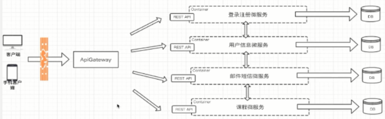

## 微服务架构的优势和不足

优势

    独立性
    敏捷性
    技术栈灵活
    高效团队
    
不足

    额外的工作(服务的拆分是一门学问)
    数据一致性(单体架构只有一个数据库, 微服务每个数据都在不同的数据库里面,带来的连表操作)
    沟通成本(修改时需要沟通成本大)
    
# 第2章 微服务带来的问题及解决方案分析

微服务架构带来的问题

## 微服务如何通讯?

### 从通讯模式角度考虑
    
    一对一还是一对多?
    同步还是异步
    
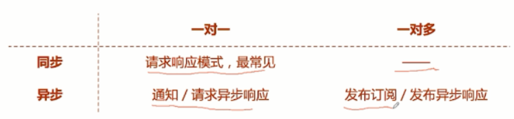

    发布订阅/发布异步响应
        比如我在叫一辆车,车主会响应,谁先响应谁派单
        
REST API
    
    在网络中客户端和服务端交互的形式
    
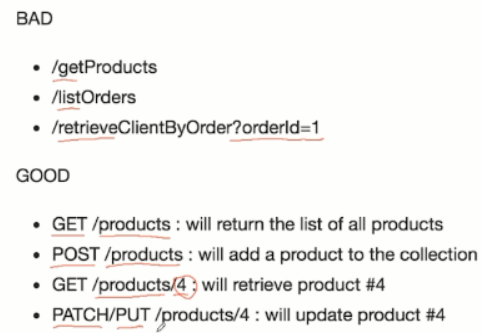

RPC

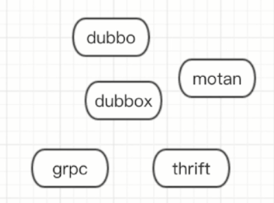

MQ

    消息队列,消息发布模式

如何选择RPC框架

    I/O ,线程调度模型 (同步io还是异步阻塞io,长连接还是短链接),单线程还是多线程
    序列化方式
    多语言支持
    服务治理(支持集群部署,集群高可用)
    
流行的RPC框架

    dubbo/dubbox(阿里开源框架,当当自己维护的框架)
    Motan(新浪微博)
    thift(阿帕奇)
    grpc(谷歌)
    
dubbo

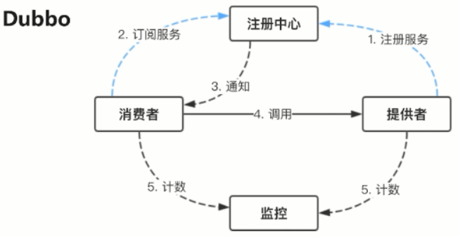

Motan


thrift

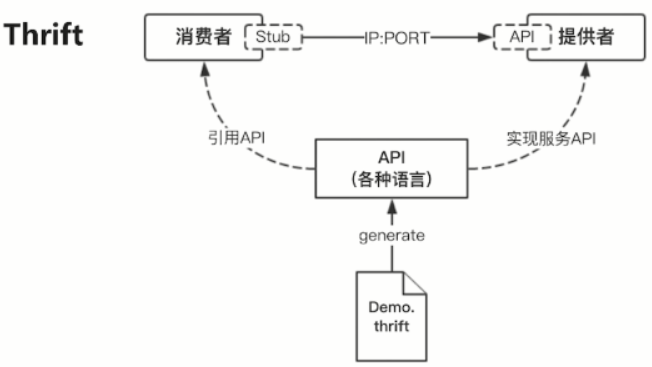

grpc

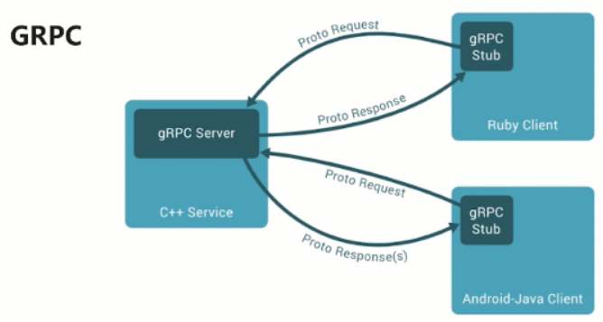

流行的RPC框架对比

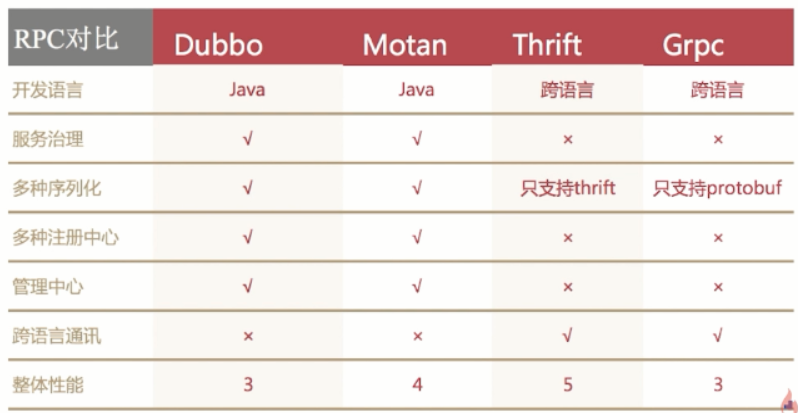
    
## 微服务如何发现彼此?

### 传统服务

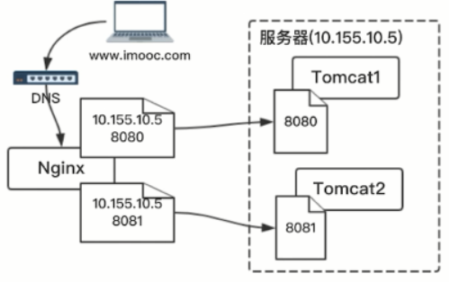

### 如何发现

客户端发现

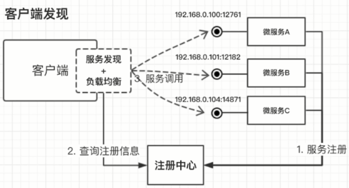

    当微服务起来后,都会把ip和端口号微服务告诉给注册中心.得到服务的列表

服务端发现

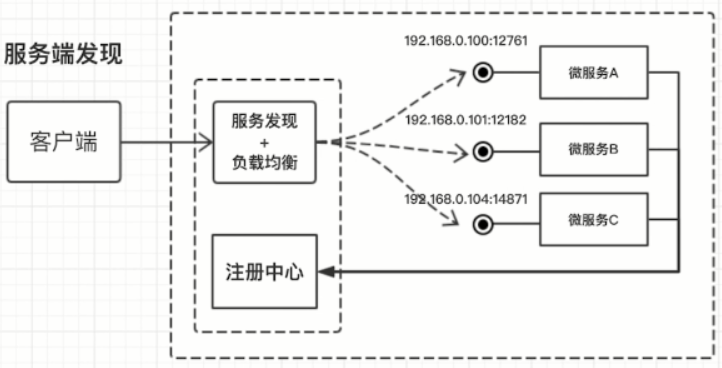

    不需要通过注册中心得到服务的列表,而是通过固定ip访问具体服务发现和负载均衡服务,在由它转发!

服务编排

    Mesos 
    Docker Swarm 
    Kubernetes
    
## springboot

    化繁琐为简
    
springboot核心功能
    
     独立运行       java -jar xxx.jar
     内嵌web服务器
     简化配置
     准生产的应用监控
     
springboot与微服务的关系

    java的润滑剂
    
## springcloud
    
springCloud的使命

    简化java的分布式系统
    
深入理解
    
    一系列框架
    简化java的分布式系统
    springboot封装
    
springcloud vs springboot

    springboot意在简化,是一种开发,配置风格
    springcloud意在简化分布式,是功能的集合,风格的统一
    
springcloud vs 微服务

    java的微服务
    侧重功能,侧重开发

springcloud 核心组件

    netflix eureka
        服务发现
    
    netflix zuul
        netflix-zuul是由netflix开源的API网关,在微服务架构下,网关作为对外的门户,实现动态路由、监控、授权、安全、调度等功能。
    
    netflix ribbon
        负载均衡
    
    Spring cloud config
        配置文件
    
    netflix hystrix
        断路器是什么? Netflix Hystrix是SOA/微服务架构中提供服务隔离、熔断、降级机制的工具/框架。
    
# 第3章 微服务开发

    我们首先假定一个业务场景，分析一下微服务的划分、每个微服务完成什么功能、它们之间的依赖关系以及它们之间如何通讯。然后从0开始，一行不落的开发完整的服务。服务的开发过程我们会用到SpringBoot，用到Dubbo，用到Thrift，用到API网关Zuul
    
## 微服务业务分析

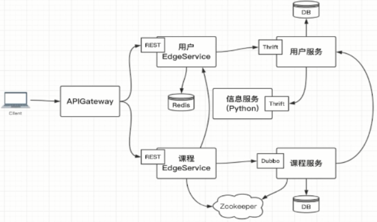

## Thirft安装和验证

首先找对其他系统依赖最小的服务,这里就找到了信息服务(python)

Thirft

    https://thrift.apache.org/
    https://www.u3v3.com/ar/1179
    
定义demo.thirft

    namespace java com.imooc.thrift.demo
    namespace py thrift.demo
    
    service DemoService {
    
        void sayHello(1:string name);
        
    }
    
1是第一参数,类型string,参数名name

测试生成python文件

    thrift --gen py demo.thrift
    ls
    
    会出现
    
    .
    ├── demo.thrift
    └── gen-py
        ├── __init__.py
        └── thrift
            ├── demo
            │   ├── constants.py
            │   ├── DemoService.py
            │   ├── DemoService-remote
            │   ├── __init__.py
            │   └── ttypes.py
            └── __init__.py

## Python开发信息服务

先定通信接口 ```message.thrift```

    namespace java com.imooc.thrift.message
    namespace py message.api
    
    service MessageService {
    
        bool sendMobileMessage(1:string mobile, 2:string message);
        
        bool sendEmailMessage(1:string email, 2:string message);
    
    }
    
定义一个sh脚步进行生成通信接口代码 ```gen-code.sh```

    #!/usr/bin/env bash
    thrift --gen py -out ../ message.thrift
    
    ├── message
    │   ├── api
    │   │   ├── constants.py
    │   │   ├── __init__.py
    │   │   ├── MessageService.py
    │   │   ├── MessageService-remote
    │   │   └── ttypes.py
    │   └── __init__.py
    
定义一个消息服务 ```message_service.py```

    class MessageServiceHandler:
    
        def sendMobileMessage(self, mobile, message):
            print("sendMobileMessage")
            return True
        
        
        def sendEmailMessage(self, email, message):
            print("sendEmailMessage")
            return True
	
怎么对接 ```thrift```

创建处理器

    from ..message.api import MessageService
    
    
    class MessageServiceHandler:
    
        def sendMobileMessage(self, mobile, message):
            print("sendMobileMessage")
            return True
        
        
        def sendEmailMessage(self, email, message):
            print("sendEmailMessage")
            return True
        
        
    if __name__ == '__main__':
        handler = MessageServiceHandler()
        processor = MessageService.Processor(handler)
        
作为服务必须监听端口,定义传输的方式,传输协议

    from message.api import MessageService
    from thrift.transport import TSocket
    from thrift.transport import TTransport
    from thrift.protocol import TBinaryProtocol
    from thrift.server import TServer
    
    
    class MessageServiceHandler:
    
        def sendMobileMessage(self, mobile, message):
            print("sendMobileMessage")
            return True
    
    
        def sendEmailMessage(self, email, message):
            print("sendEmailMessage")
            return True
    
    
    if __name__ == '__main__':
        handler = MessageServiceHandler()
        processor = MessageService.Processor(handler)
        transport = TSocket.TServerSocker("localhost", "9090") # 监听9090端口
        tfactory = TTransport.TFramedTransportFactory() # 定义传输的方式
        pfactory = TBinaryProtocol.TBinaryProtocolFactory() # 传输协议
    
        # 创建一个server
        server = TServer.TSimpleServer(processor, transport, tfactory, pfactory)
        print("python thrift server start")
        server.serve()
        print("python thrift server exit")

    


    
