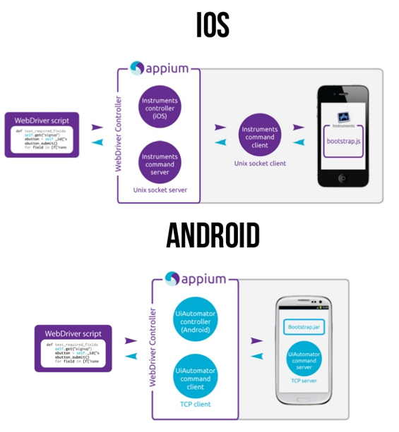

Appium是一个开源测试自动化框架，可用于原生，混合和移动Web应用程序测试。 它使用WebDriver协议驱动iOS，Android应用程序。



# appium
* appium是一个自动化测试开源工具，支持ios平台和android平台的原生应用，web应用和混合应用
* appium就封装了标准的selenium客户端类库
* appium client --》server --》移动设备
* 服务端下载：http://appium.io/
* linux客户端安装： pip3 install Appium-Python-Client
* simple：host port
* advanced：高级选项
* presets：预设选项卡

## inspector

### Desired Capability
desired capability的功能是配置Appium会话。他们告诉Appium服务器您想要自动化的平台和应用程序。

参考：https://www.cnblogs.com/caoj/p/7800065.html

* 配置Desired Capability --》 启动 start session

appPackage获取：进入aapt.exe目录(E:\pc\java\sdk\build-tools\28.0.3) --》aapt.exe dump badging C:\Users\aiyin\Desktop\kaoyanbang.apk

appActivity获取：进入aapt.exe目录 --》aapt.exe dump badging 路径 | find "launchable-activity"

```bash
{
  "platformName": "Android",
  "platformVersion": "5.1",
  "deviceName": "A1CEBNB2278J",
  "appPackage": "com.tal.kaoyan",
  "appActivity": "com.tal.kaoyan.ui.activity.SplashActivity",
  "noReset": true
}
```
* uiautomator和appium存在端口冲突

# 实战一下
1. 一台手机或者安卓模拟器
2. uiautomatorviewer
3. python
4. Appium-Python-Client 0.41文档 

https://pypi.org/project/Appium-Python-Client/

