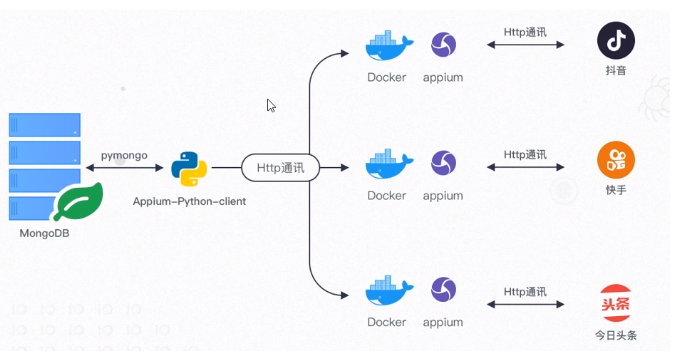
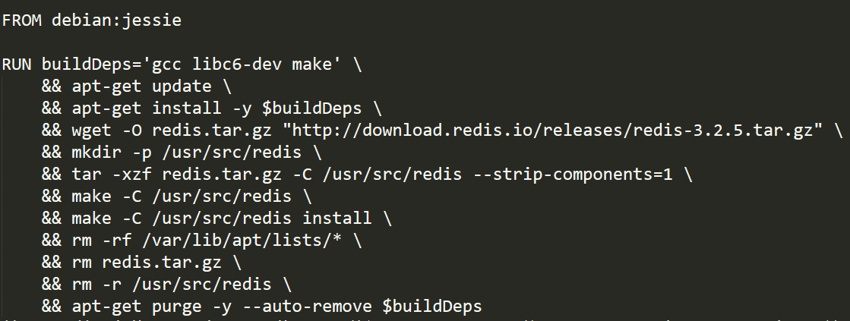

# 打造多任务端app应用数据抓取系统架构图

# docker
    docker login 登录dockerhub
    docker search ubuntu 搜索镜像
    docker images 查看镜像
    docker pull ubuntu 下载镜像
    docker run --name ubuntu-test -it ubuntu /bin/bash 创建容器并进入容器
    docker run --name ubuntu-test -d ubuntu /bin/sh -c "while true;do sleep 2;done" 创建容器守护进程启动
    docker ps -a 查看所有容器
    docker start 容器id 启动容器
    docker stop 容器id 结束容器
    docker kill 容器id 结束容器
    docker exec -t 容器id /bin/bash 进入容器终端
    docker pause 容器id 暂停容器
    docker unpause 容器id 暂停容器
    docker rm 容器id 删除容器
    docker rm -v $(docker ps -aq -f status=exited) 批量删除所有已经退出的容器
    docker rmi 删除镜像

##docker run -it centos /bin/bash 详解

按照顺序，Docker做了这些事情：

    1）拉取centos镜像: Docker检查centos镜像是否存在，如果在本地没有该镜像，Docker会从Docker Hub下载。如果镜像已经存在，Docker会使用它来创建新的容器。
    2）创建新的容器: 当Docker有了这个镜像之后，Docker会用它来创建一个新的容器。
    3）分配文件系统并且挂载一个可读写的层: 容器会在这个文件系统中创建，并且一个可读写的层被添加到镜像中。
    4）分配网络/桥接接口: 创建一个允许容器与本地主机通信的网络接口。
    5）设置一个IP地址: 从池中寻找一个可用的IP地址并且服加到容器上。
    6）运行你指定的程序: 运行指定的程序。
    7）捕获并且提供应用输出: 连接并且记录标准输出、输入和错误让你可以看到你的程序是如何运行的。

更多：http://www.yujzw.com/docker/docker-help.html

# docker部署一个web服务
    docker search httpd 
    docker run -d -p 80 httpd (-d：后台运行容器，并返回容器id，也即启动守护式容器：)
    docker run -d -p 8080:80 httpd (8080是宿主机端口，80是容器的端口)

## 在linux系统中安装appium:
纯手动安装appium

https://oxygenengine.github.io/%E6%8A%80%E6%9C%AF/2017/10/18/install-auto-test-environment-on-centos-7/

docker安装appium
    
    docker pull appium

# appium容器连接安卓模拟器
https://github.com/appium/appium-docker-android

## 创建 appium 容器
    docker run --privileged -d -p 4723:4723  -v /dev/bus/usb:/dev/bus/usb --name container-appium appium/appium
    docker run --privileged -d -p 4723:4723 --name container-appium appium/appium （不添加容器数据卷）

## 验证adb设备是否可以检测连接的Android设备
    docker exec -it container-appium adb devices

## appium容器连接手机
    先本地设置usb连接改变ip地址连接 adb -s deviceName设备名称 tcpip 5555
    
    appium容器连接手机 docker exec -it 容器名 adb connect 手机ip地址:端口
    
    查看是否连接 docker exec -it 容器名 adb devices

    断开连接 docker exec -it 容器名 adb kill-server
    
    测试脚本：
    from appium import webdriver

    cap = {
    "platformName": "Android",
    "platformVersion": "5.1",
    "deviceName": "手机ip地址:端口",
    "appPackage": "com.tal.kaoyan",
    "appActivity": "com.tal.kaoyan.ui.activity.SplashActivity",
    "noReset": True
    }

    driver = webdriver.Remote("docker的ip地址:端口/wd/hub", cap)
    
    查看appium容器日志：
    docker exec -it 容器名称 /bin/bash
    cd /var/log
    tail -f appium.log

    最后可以换成usb连接 adb usb

## docker commit 构建新的镜像（实战项目中不实用）
    docker run --name web1 -d -p 8080:80 nginx 创建nginx服务
    docker exec -it web1 /bin/bash 进入容器
    echo "hello,docker!" >/usr/share/nginx/html/index.html 重定向nginx首页
    docker diff web1 查看改动的内容
    docker commit -a="作者" -m="更新内容" web1 新镜像名:版本 创建新的镜像
    docker history 新镜像名:版本 查看做了哪些操作

## dockerfile 创建构建新的镜像（实战）
Dockerfile 是一个文本文件，其内包含了一条条的指令，每一条指令构建一层，因此每一条指令的内容，就是描述该层应当如何构建。

    touch Dockerfile 创建文件

    Dockerfile文件内容：
    FROM nginx
    //将内容写入到index.html
    RUN echo 'hello world!' > /usr/share/nginx/html/index.html

    docker build -t nginx:v3 . 构建镜像

### FROM 指定基础镜像
基础镜像是必须指定的。而 FROM 就是指定基础镜像，因此一个 Dockerfile 中 FROM 是必备的指令，并且必须是第一条指令。

### RUN指令的两种模式（注意：run是每一层的构建，不是在写sell脚本）
RUN 指令是用来执行命令行命令的。由于命令行的强大能力，RUN 指令在定制镜像时是最常用的指令之一

    shell 格式：RUN <命令>，就像直接在命令行中输入的命令一样。
    exec 格式：RUN ["可执行文件", "参数1", "参数2"]，这更像是函数调用中的格式。

良好的格式：最后有清理无关的文件

## 将镜像上传到dockerhub
    1、登录dockerhub
    2、创建仓库 crate repository
    3、查看本地是否登录 dockerhub docker info
    4、该本地镜像的标签/版本 docker tag nginx:v3 dockerhub的仓库:版本
    5、上传到仓库 docker push dockerhub的仓库:版本

## 打造多任务端app应用数据抓取系统
    1、下载mongo，appium，python环境镜像

    2、启动python镜像创建python爬虫容器 并将python代码映射到容器中
    docker run -it -v 本地文件路径:容器目录（/root/） --name python 450120127/pythonv2 /bin/bash

    3、启动python镜像创建mitmdump容器 
    docker run --rm -it -v 本地文件路径:容器目录（/root/） -p 8889:8889 --name mitmdump 450120127/pythonv2 
    docker exec -it 容器名 mitmdump -s /root/decode_data.py

    4、启动appium镜像创建appium容器
    docker run --privileged -d -p 4723:4723 --name appium_douyin appium/appium
    docker run --privileged -d -p 4725:4723 --name appium_kuaishou appium/appium
    docker run --privileged -d -p 4727:4723 --name appium_jrtt appium/appium

    5、启动mongo镜像创建mongo容器
    docker run -p 27017:27017 -v 本地文件路径:容器目录（/root/） -d --name mongodb mongo
    或者docker run --name mongo -d mongo默认会在 27017 端口启动数据库

    6、准备3个手机并且usb连接改成tcpip方式连接
    adb -s deviceName设备名称 tcpip 5555
    adb -s deviceName设备名称 tcpip 5555
    adb -s deviceName设备名称 tcpip 5555

    7、appium容器连接手机
    docker exec -it 容器名 adb connect 手机ip地址:端口
    docker exec -it 容器名 adb connect 手机ip地址:端口
    docker exec -it 容器名 adb connect 手机ip地址:端口

    8、检查相应的python代码 deviceName ，port

    9、运行python爬虫容器的爬虫文件
    docker exec -it 容器名 python 脚本.py

    
